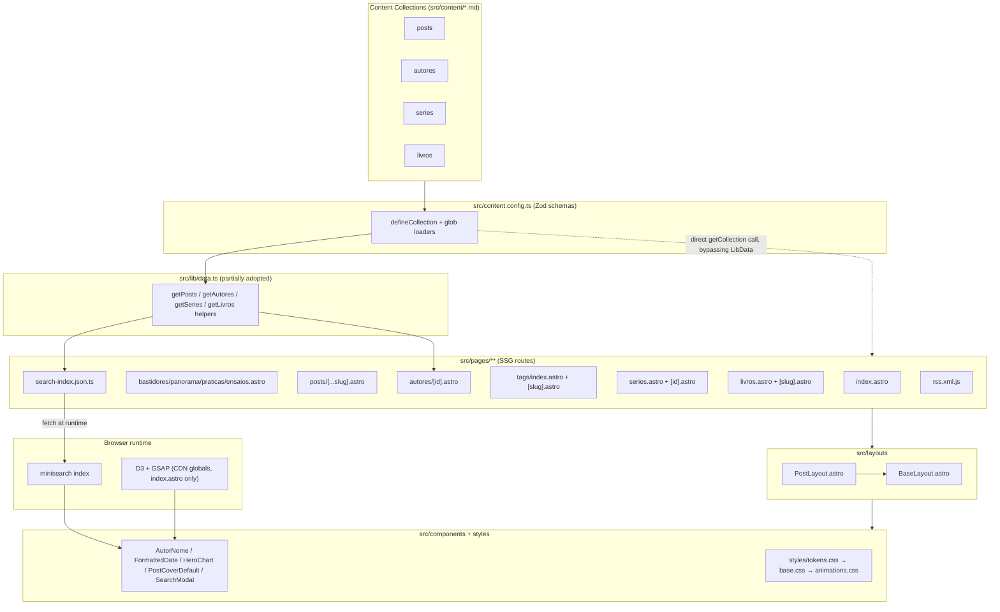
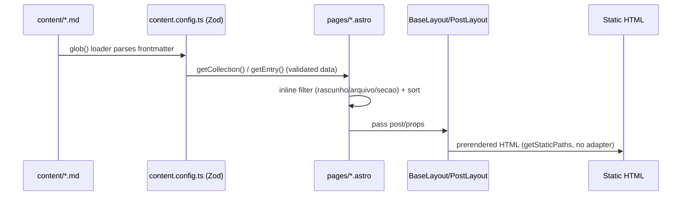
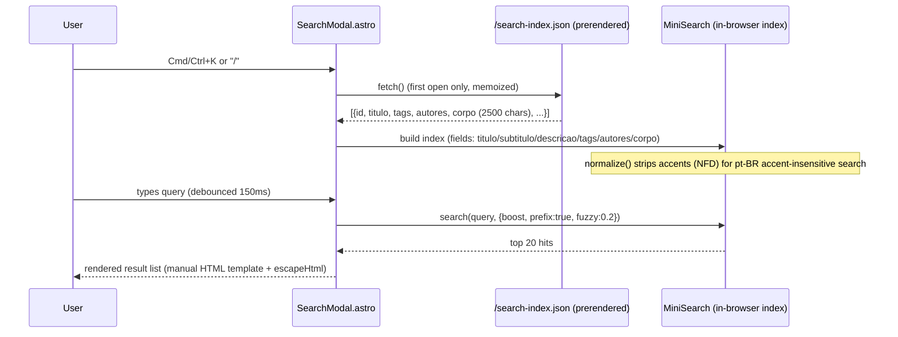
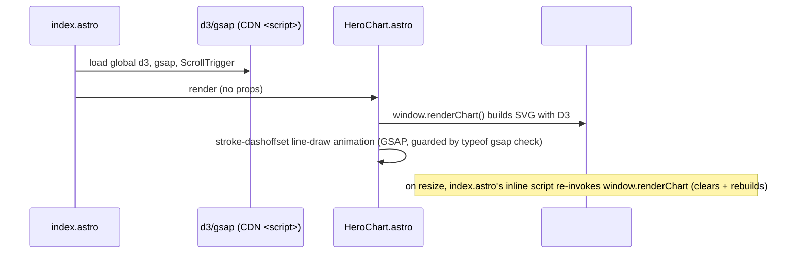

# Codebase Map

> Auto-generated by Cartographer. Last mapped: 2026-09-16T03:59:00Z

## System Overview

**datavizbr** is a fully static-generated (SSG) Astro 6 blog about data visualization, migrated from Medium (70+ posts) plus new original content. There is no server/adapter — every route is prerendered via `getStaticPaths()`, and the only "dynamic" behavior is client-side: a minisearch-powered search modal and a D3/GSAP hero chart.



**Stack**: Astro 6.2 (strict TS), Zod content schemas via the Content Layer API (`glob()` loaders), `minisearch` for client-side search, `@vercel/analytics`, Sharp installed but image optimization disabled (`noop` service). No test runner, no lint script, no server adapter — pure static output.

## Directory Structure

```
src/
  consts.ts            # SITE metadata, nav links, section labels
  content.config.ts     # Zod schemas for the 4 collections (source of truth)
  lib/data.ts            # Data-access helpers (only partially used by pages)
  content/
    posts/*.md           # 70+ blog posts (frontmatter + Markdown body)
    autores/*.md          # 33 author bios
    series/*.md            # 2 series groupings
    livros/*.md              # 1 book
    config/secoes.json        # (secondary) section metadata
  pages/
    index.astro                # Homepage (hero chart, curated lists, sections)
    bastidores|panorama|praticas|ensaios.astro   # Near-duplicate section listing pages
    arquivo.astro                 # Year-grouped archive of all posts
    posts/[...slug].astro          # Post detail (rest-param route)
    autores.astro / autores/[id].astro   # Author index + profile
    tags/index.astro / tags/[slug].astro   # Tag index + per-tag listing
    series.astro / series/[id].astro         # Series index + detail
    livros.astro / livros/[slug].astro         # Book index + detail
    sobre/{index,contato,escrever}.astro         # About/contact/write-for-us
    newsletter.astro                               # Newsletter signup page
    rss.xml.js                                       # RSS feed (only place `arquivo` is filtered)
    search-index.json.ts                               # Prerendered JSON consumed by SearchModal
  layouts/
    BaseLayout.astro     # Global HTML shell: head/nav/footer/search modal
    PostLayout.astro      # Wraps BaseLayout; post header/tags/prev-next
  components/
    AutorNome.astro        # Author name lookup by id (getEntry)
    FormattedDate.astro     # <time> element — locale hardcoded to en-us (unused/orphaned?)
    HeroChart.astro           # D3+GSAP animated chart, window.renderChart global
    PostCoverDefault.astro     # Fallback SVG cover (hardcoded hex color)
    SearchModal.astro            # minisearch client search overlay
  styles/
    tokens.css   # single source of truth for all CSS custom properties
    base.css      # reset + design-system utility classes
    animations.css # motion primitives + hero-chart SVG styling
    global.css      # ordered @import aggregator (tokens → base → animations)
  scripts/
    animations.js  # DEAD CODE — not imported anywhere; duplicated inline in index.astro
astro.config.mjs   # site URL + noop image service; no integrations registered
medium-images-manifest.json  # Migration manifest: Medium CDN URLs → local asset paths
```

## Module Guide

### Content Collections (`src/content.config.ts`)

**Purpose**: Defines the four collections via `glob({ pattern: '**/*.md' })` loaders + Zod schemas. This is the authoritative schema — more complete than any prose doc in the repo.

| Collection | Key fields |
|---|---|
| `posts` | `titulo`, `subtitulo?`, `autores[]` (ref, min 1), `publicado_em`, `atualizado_em?`, `secao` (enum: bastidores/panorama/praticas/ensaios), `serie?` (ref), `ordem_na_serie?`, `tags[]` (default `[]`), `destaque`/`destaque_na_secao` (bool, default false), `order_homepage?`, `capa?` (image), `capa_alt?`, `arquivo` (bool, default false), `medium_url_original?`, `publicado_originalmente_em?`, `rascunho` (bool, default false), `descricao?` (max 160) |
| `autores` | `nome`, `foto?` (image), `quem_e` (max 280), `trabalhando_em?`, `trabalho_favorito?`, `por_que_escreveu?`, `site?`/`twitter?`/`instagram?`/`linkedin?`/`email?`, `papel` (enum curadoria/recorrente/convidado, default convidado), `ativo` (default true), `desde?` |
| `series` | `titulo`, `descricao` (max 500), `capa?`, `status` (enum em_andamento/encerrada), `iniciada_em`, `encerrada_em?`, `cor?` (freeform string) |
| `livros` | `titulo`, `subtitulo?`, `organizadores[]` (ref, min 1), `autores_capitulos?` (ref[]), `ano`, `editora?`, `isbn?`, `paginas?`, `idioma` (enum, default pt-BR), `sinopse` (max 500), `capa` (**required**), `capa_alt` (**required**), `tipo_acesso` (enum gratuito/pago), `formato[]` (enum), `links[]`, `sumario[]?`, `posts_relacionados?` (ref) |

**Gotcha**: `destaque`/`destaque_na_secao` exist in the schema and are read by `lib/data.ts`'s `getDestaques()`, but **no page currently calls `getDestaques()`** — the homepage instead uses `order_homepage === 1` for its featured post, a parallel/uncoordinated mechanism.

**Observed-in-practice frontmatter beyond CLAUDE.md's documented list**: `descricao` (appears on every post, used as meta description), `capa_alt`, `serie`/`ordem_na_serie` (series posts), `publicado_originalmente_em` (migrated posts, alongside `medium_url_original`), `order_homepage` (new 2026 posts only, not migrated ones).

### Data Layer (`src/lib/data.ts`)

**Purpose**: Central `getCollection()` wrapper meant to be the single access point for content queries.

**Exports**: `getPosts()` (filters `!data.rascunho` **only when `import.meta.env.PROD`** — dev builds include drafts), `getPostsPorSecao`, `getPostsPorAutor`, `getPostsPorSerie` (ordena por `ordem_na_serie` only when both sides have it, else falls back to `publicado_em`), `getDestaques`, `getUltimosPosts`, `contarPostsPorAutor`, `getAllTags`, `getPostsPorTag`, `getAutores` (filters `ativo`), `getAutoresPorPapel` (buckets curadoria/recorrentes ≥3 posts/convidados), `getSeries`, `getSeriesEmDestaque` (just takes first N — no real "featured" flag), `getLivros`, `getLivrosPorAutor`, `papelNoLivro`, `porData` (shared descending date-sort helper).

**Gotcha — inconsistent adoption**: Only `src/pages/autores/[id].astro` and `src/pages/search-index.json.ts` import from `lib/data.ts`. Every other listing page (`index.astro`, `arquivo.astro`, the four section pages, `series.astro`/`[id].astro`, `tags/*.astro`, `autores.astro`) calls `getCollection()` directly and **re-implements filtering/sorting inline**, independently and non-identically (see Gotchas section below).

### Pages / Routing (`src/pages/`)

Fully static site — every route below is prerendered.

| Route | File | Notes |
|---|---|---|
| `/` | `index.astro` | Hero chart, `order_homepage===1` featured post (falls back to `posts[0]`), hardcoded `curatedPostIds` array of 8 slugs, per-section previews, `tempoLeitura()` is a stub always returning `3` |
| `/arquivo` | `arquivo.astro` | Groups posts by year; client `<script>` does DOM-based filter toggling |
| `/autores` | `autores.astro` | Filters `ativo`; hardcodes `rodrigo-medeiros` to sort first; references non-existent schema field `autor.data.redes` (dead leftover, falls through to the `||` fallback) |
| `/autores/:id` | `autores/[id].astro` | `getStaticPaths` does **not** filter `ativo` — inactive authors still get pages, inconsistent with `/autores` |
| `/bastidores`, `/panorama`, `/praticas`, `/ensaios` | 4 near-identical files | Byte-for-byte duplicated filter+sort logic, only the `secao` literal differs |
| `/posts/:slug` | `posts/[...slug].astro` (rest param) | Filters `!data.rascunho`; **re-derives the same filtered+sorted array twice** in one file (once for `getStaticPaths`, again for prev/next) |
| `/tags`, `/tags/:slug` | `tags/index.astro`, `tags/[slug].astro` | Use the loader's callback-filter style (`getCollection('posts', ({data}) => !data.rascunho)`) — a third distinct filtering style vs. section pages |
| `/series`, `/series/:id` | `series.astro`, `series/[id].astro` | `series.astro`'s per-series counts use **unfiltered** posts (drafts counted); `[id].astro` filters drafts. Ordering of `ordem_na_serie` also diverges subtly from `lib/data.ts`'s version (0-fallback vs. both-sides-required) |
| `/livros`, `/livros/:slug` | `livros.astro`, `livros/[slug].astro` | No draft-equivalent field on `livros`, so no filtering; unfiltered `getStaticPaths` |
| `/sobre`, `/sobre/contato`, `/sobre/escrever` | `sobre/*.astro` | `sobre/index.astro` filters authors by `papel === 'curadoria'` — a third distinct author-filtering approach |
| `/newsletter` | `newsletter.astro` | Static, pulls `SITE.newsletter_url` |
| `/rss.xml` | `rss.xml.js` | **Only place `arquivo` is filtered** (`!data.rascunho && !data.arquivo`) — archived posts appear everywhere else (sections, tags, search) but not in RSS |
| `/search-index.json` | `search-index.json.ts` | Uses `lib/data.ts` (prod-only draft filtering); does not filter `arquivo` — archived posts remain searchable |

### Layouts (`src/layouts/`)

- **`BaseLayout.astro`**: Root HTML shell — head/SEO meta, nav (from `NAV_PRINCIPAL`/`NAV_RODAPE` in `consts.ts`), footer, `<SearchModal/>`, `<Analytics/>`. **Gotcha**: footer's "Conteúdo"/"Publicações" link columns and copyright line are hardcoded directly in this file, not driven by `consts.ts` — a content editor must edit the layout file, not the constants module, to change them. `<SearchModal/>` and the mobile nav drawer are deliberately placed outside `<nav>` because `backdrop-filter` on `.nav` would break `position: fixed` on descendants (documented in a code comment).
- **`PostLayout.astro`**: **Wraps `BaseLayout`** (nested composition, not sibling) — supplies article header (section badge, date, title, authors), tag list, and prev/next navigation. Has its own local `formatarData` — the **third** independent date-formatting implementation in the codebase (see Gotchas).

### Components (`src/components/`)

- **`AutorNome.astro`**: `getEntry('autores', autorId)`, falls back to raw id string if missing (silent — hides content bugs).
- **`FormattedDate.astro`**: Locale hardcoded to `'en-us'` on a Portuguese-language site; appears unused (PostLayout formats dates itself instead) — worth confirming before relying on it.
- **`HeroChart.astro`**: No props; depends on **global `d3`/`gsap`** loaded via CDN `<script>` tags in `index.astro` only (not npm imports, not in `package.json`). Exposes `window.renderChart` as a global entry point so resize handlers can re-invoke it; falls back to a hardcoded 2016–2026 dataset if `window.chartData` isn't set. Silently no-ops (`console.warn`) if D3 hasn't loaded yet.
- **`PostCoverDefault.astro`**: Fallback SVG cover; background `#552b7b` is a **hardcoded hex**, not the `--dvb-purple` token — must be updated manually if the brand color changes. Logo path is a hand-traced copy of `/public/logo-branco.svg`.
- **`SearchModal.astro`**: See Data Flow below for the full search mechanism.

### Styles (`src/styles/`)

Cascade is fixed and documented in `global.css` itself ("Importa na ordem certa. Não adicione estilos aqui."):
```
tokens.css (variables + fonts) → base.css (reset + design-system classes) → animations.css (motion + chart SVG classes)
```
- **`tokens.css`** is the single source of truth for all visual values: brand colors (`--dvb-orange*`/`--dvb-purple*` 5-step scales), semantic role tokens (`--color-primary*`, `--fg-*`, `--bg-*`) that make `[data-theme="roxo"]`/`[data-theme="roxo-dark"]` re-skinning possible (used by `BaseLayout`'s footer), spacing (8px scale), typography scale, radii, elevation.
- **`base.css`**: reset, `.t-*` type-scale utilities, `.btn`/`.card`/`.badge` (incl. per-section `badge-bastidores/panorama/praticas/ensaios` and `badge-serie/livro/arquivo/gratuito`), `.container` (uses `--max-width`/`--padding-x`).
- **`animations.css`**: `.scroll-progress`/`.reveal`/`.stagger-children` primitives, all `.hero-chart *` SVG styling consumed by `HeroChart.astro`, `prefers-reduced-motion` override.

### Scripts (`src/scripts/animations.js`)

**Dead code.** Exports `initScrollProgress`, `initNavScroll`, `initRevealAnimations`, `initSplitWords`, `initChartResize`, `initAnimations` — but a repo-wide grep found **no import of this file anywhere**. `index.astro` instead duplicates this logic verbatim as its own inline `<script is:inline>` block. The two copies will drift if only one is edited. Additionally, both copies target `#scrollProgress`/`#nav` element ids that don't exist in `BaseLayout.astro` — so `initScrollProgress`/`initNavScroll` silently no-op on every real page.

### `medium-images-manifest.json`

Migration artifact (~2520 entries, ~39K tokens) mapping original Medium CDN image URLs to their downloaded local paths under `src/assets/blog/<slug>/NN.ext`. Not read by any runtime code — a one-time migration record, not a build input.

## Data Flow

### Static build (every page)



### Client-side search



### Hero chart (homepage only)



## Conventions

- **Author ID convention**: kebab-case slug matching the filename in `src/content/autores/<id>.md`, referenced from posts/livros via Zod `reference('autores')`.
- **Series linkage**: one-directional — `posts` frontmatter has `serie: <series-slug>` + `ordem_na_serie: N`; the series file itself does not list member posts.
- **Post body images**: ``, sequentially numbered, mixed extensions. Cover images (`capa`) point to the same directory. Newer original posts (non-migrated) pair every image with an italicized caption line (`*Fonte: ...*`).
- **Migrated Medium posts** end with a standardized italic attribution footer + `---` rule; some open with an italic byline naming co-authors even when only one `autores` slug is set.
- **Headings**: post bodies rarely use `#`/`##` — section breaks are done with bold standalone lines instead.
- **CSS**: never hardcode a color/spacing value outside `tokens.css`; reference semantic tokens (`--color-primary`, `--fg-*`) rather than raw brand colors so `data-theme` re-skinning keeps working.
- **No MDX despite `@astrojs/mdx` being installed** — all content is plain `.md`; the integration is never registered in `astro.config.mjs` and zero `.mdx` files exist.

## Gotchas

1. **Draft (`rascunho`) filtering is duplicated ~10+ times with subtle differences**, rather than centralized in `lib/data.ts`: hardcoded-unconditional in most section/listing pages, but **prod-only** (`import.meta.env.PROD` gate) inside `lib/data.ts`'s `getPosts()` (used by `autores/[id].astro` and `search-index.json.ts`). This means dev-mode search/author pages show drafts while dev-mode section pages do not.
2. **`arquivo` (archived) filtering is applied in exactly one place**: `rss.xml.js`. Archived posts still appear on `/arquivo`, section pages, tag pages, and in search — only excluded from the RSS feed. Confirm this is intentional before changing RSS behavior.
3. **Date-sort lambda duplicated verbatim across 9 files** even though `lib/data.ts` already exports `porData()` for exactly this purpose (only used internally, never imported by pages).
4. **Author "active" filtering is inconsistent across 3 pages**: `autores.astro` filters `ativo`; `autores/[id].astro`'s `getStaticPaths` does not (inactive authors still get profile pages); `sobre/index.astro` filters by `papel === 'curadoria'` instead — three different notions of "which authors show where."
5. **`autores.astro` references a non-existent schema field** (`autor.data.redes`) in a conditional — dead code that happens to fall through harmlessly to the real fallback.
6. **`src/scripts/animations.js` is dead code** — not imported anywhere; `index.astro` maintains an independent inline duplicate. Editing one will not update the other. Both also target DOM ids (`#scrollProgress`, `#nav`) that don't exist in `BaseLayout.astro`.
7. **`@astrojs/mdx` and `@astrojs/sitemap` are installed but never registered** in `astro.config.mjs` — no sitemap is generated despite the dependency being present.
8. **Three independent date-formatting implementations** exist: `FormattedDate.astro` (locale hardcoded `en-us`, likely unused), `PostLayout.astro`'s local `formatarData` (pt-BR), and `SearchModal.astro`'s own formatter (pt-BR).
9. **`destaque`/`destaque_na_secao` schema fields and `lib/data.ts`'s `getDestaques()` are unused** by any current page — the homepage's featured-post logic uses the unrelated `order_homepage === 1` field instead.
10. **`tempoLeitura()` in `index.astro` is a stub** that always returns `3` regardless of actual content length — labeled as a placeholder in a comment.
11. **`index.astro` hardcodes a `curatedPostIds` array of 8 slugs** for "Indicados da comunidade" — renaming or deleting one of those posts silently drops it from the list (`.filter(Boolean)` swallows the miss).
12. **Image optimization is disabled** (`noop` service in `astro.config.mjs`) because some migrated GIFs exceed Sharp's pixel limits; this is consistent with pages using raw `` rather than Astro's `<Image>` component, but means no responsive/optimized images are ever generated.
13. **`CLAUDE.md` and `AGENTS.md` have diverged** — both describe the project but contain different, sometimes outdated details (e.g., CLAUDE.md still references component names and a "Known State" from the Medium-migration era; AGENTS.md is the more current technical reference). Check both when documentation conflicts with observed code.
14. **`PLANEJAMENTO.md`** is a dated (2026-06-18) audit/roadmap doc, not a reference doc — it already lists several of the same issues found here (e.g., missing `--radius-pill`, non-functional newsletter form, static `HeroChart` data) plus additional ones; worth reading before starting cleanup work to avoid duplicating that analysis.
15. **`README.md` is vestigial** — generic Astro-blog-starter boilerplate, not updated for this project's actual content model.

## Navigation Guide

- **To add or edit a blog post**: create/edit a `.md` file in `src/content/posts/`, following the frontmatter shape documented above; place body images in `src/assets/blog/<slug>/`. Run `npm run build` and check for `ImageNotFound` errors.
- **To change which posts a section/listing page shows**: the filter logic is duplicated per page — you likely need to edit `src/pages/<secao>.astro` directly (not `lib/data.ts`, which most pages don't use). If fixing a systemic filtering bug, consider migrating pages onto `lib/data.ts` rather than patching each file.
- **To change nav links or footer**: `NAV_PRINCIPAL`/`NAV_RODAPE` in `src/consts.ts` drive the header nav, but the footer's link columns and legal text are hardcoded in `src/layouts/BaseLayout.astro` — edit both if changing site-wide navigation.
- **To change brand colors, spacing, or type scale**: edit only `src/styles/tokens.css`; never hardcode values elsewhere (see `PostCoverDefault.astro`'s hardcoded hex for a violation to avoid repeating).
- **To modify search behavior**: `src/components/SearchModal.astro` owns the client-side MiniSearch config (fields/boost/fuzzy); the indexed payload shape is controlled by `src/pages/search-index.json.ts`.
- **To modify the hero chart**: `src/components/HeroChart.astro` (D3/GSAP rendering) plus the CDN `<script>` tags in `src/pages/index.astro` (chart libraries are not npm dependencies).
- **To add a new content collection field**: edit the Zod schema in `src/content.config.ts` first — it is the authoritative source, ahead of any prose documentation.
- **Before trusting CLAUDE.md/AGENTS.md on a specific field or component name**: verify against `src/content.config.ts` and the actual file, since the two docs have drifted from each other and from the current code.
