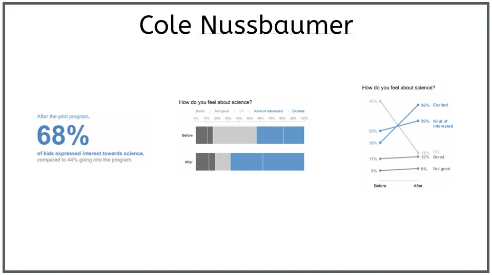

Fui convidado para uma palestra no Share 2016 — Edição Porto Alegre. Falei sobre visualização de dados e técnicas de apresentação para profissionais de monitoramento e métricas. O nome da palestra foi Relatórios: Extreme Makeover, e a experiência foi bem legal. Para fazer essa apresentação reli três livros, comprei dois novos, fiz um curso de oratória e aprendi muito!

Muita gente gostou da palestra e veio falar comigo na hora do café. Fiquei feliz de ouvir de algumas pessoas que genuinamente demonstraram a intenção de mudar seus relatórios com base nas recomendações que dei sobre os tipos de gráficos, uso de KPI's e até dicas simples de como entregar informações.

Mas nem todo mundo gostou. Como fiquei um pouco nervoso no começo (me empolguei contando a história de Carlúcio, um analista de monitoramento que se dá mal em uma reunião) acabei estourando o tempo e tive que correr com uma parte da apresentação.

Isso deixou algumas pessoas reclamando que o conteúdo principal poderia ter sido abordado melhor. E outras esperando motivos mais sólidos para tomar essa decisão importante: abandonar definitivamente o uso desregrado dos gráficos de pizza e similares em relatórios.

Não é a primeira vez que recebo respostas negativas quando insisto que gráficos de pizza são terríveis e devem ser abolidos. Até entendo alguns motivos para a resistência: é bem prático para quem faz relatórios continuar usando um recurso que está facilmente disponível em todas as ferramentas de analytics e sai em dois cliques no excel.

Resolvi então aprofundar um pouco mais e explicar os três motivos simples para você evitar usar gráficos de pizza:

**Agora, antes de continuar, tente responder: qual é o aumento percentual de pessoas mais interessadas em ciência após o programa?**

.

.

.

.

Possivelmente você demorou cerca de 4 segundos. E isso é muito! O problema dos gráficos de pizza são algumas limitações de design que ficam óbvias se você prestar atenção:

**1. São terríveis com valores pequenos**
Quando você tem muitas categorias, as que tem valores abaixo de 5% ficam literalmente escondidas.

**2. Dependem do uso de cor**
Quando você tem muitas categorias, você precisa de cores para salientar essas diferenças. Só que é difícil escolher cores de forma eficiente por conta do posicionamento das categorias no gráfico. E um fato importante: 8% da população masculina é daltônica ou sofre de algum tipo de dificuldade em perceber cores. Você vai arriscar usar um gráfico que depende tanto assim de cores?

**3. Dificultam a comparação direta**
Perceber rapidamente a diferença entre valores próximos (ex.: 38% vs 33%) é bem complicado num gráfico de pizza. Faça um teste: remova os labels de um gráfico de pizza e tente adivinhar o percentual. E fica pior quando você quer comparar dados de muitas categorias em momentos diferentes.

Se você ainda não está convencido, veja com carinho o redesign abaixo, proposto pela Cole Nussbaumer em seu novo livro, Storytelling with Data. São os mesmos dados do gráfico anterior, apresentados de três maneiras diferentes: somente texto, barras e slopegraph:

Lembre-se que o objetivo principal de um relatório deve ser comunicar os dados e facilitar com que a informação apresentada vire conhecimento na cabeça do cliente — a pessoa que vai tomar realmente a decisão.

Não é uma questão de poder usar, ou de gostar, é puro bom senso. Segundo Bertin, um cartógrafo francês que estudou os fundamentos da semiologia gráfica, e Edward Tufte, um dos pais da visualização de dados, o gráfico de pizza não funciona bem quando é usado para representar várias categorias. **Se você pode usar algo melhor, tão simples de fazer e mais belo, que motivo você tem para insistir no erro e prejudicar a compreensão das informações que você está entregando?**

**Para saber mais:**
- Semiology of Graphics — Jacques Bertin
- death to pie charts (Cole Nussbaumer)
- 3 reasons pie charts suck (2013)

Fique à vontade para fazer suas questões nos comentários ou converse comigo no twitter. Se tiver um tempinho, responda a pesquisa sobre como seus clientes entendem os gráficos e visualizações de dados que você cria.