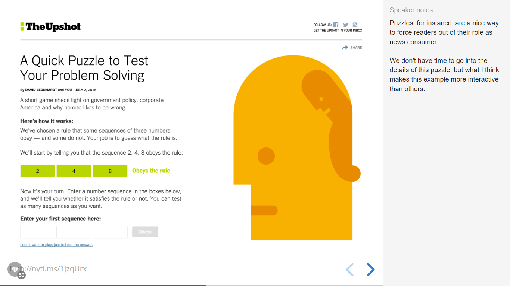
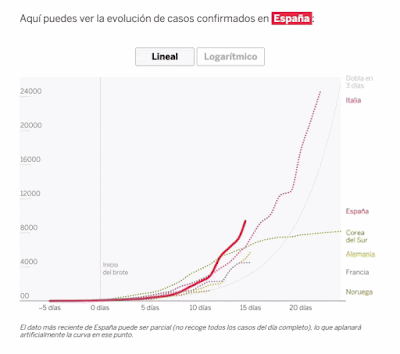
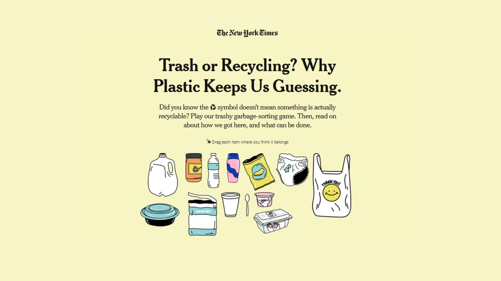
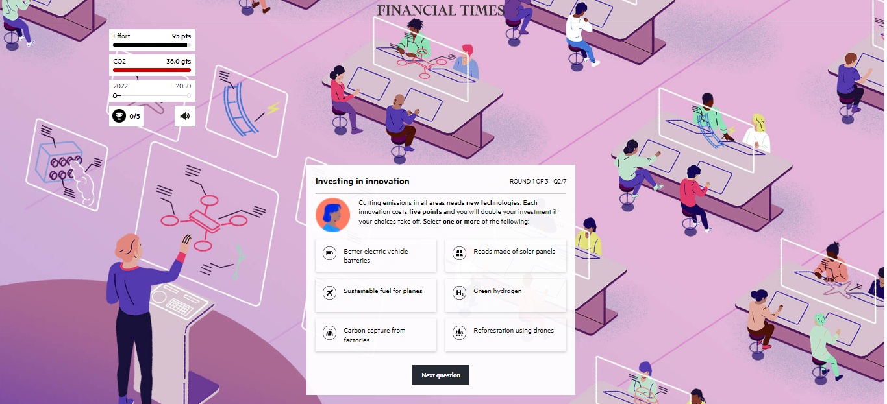

Uma pergunta que sempre paira sobre quem produz ou se interessa por estudar visualizações de dados interativas, aquelas do tipo que você pede aos leitores para escolher/clicar/fazer algo, é: todo gráfico precisa ser interativo? Óbvio que não, precisar não precisa. Mas gostaria de examinar nesse texto algumas situações em que aplicar a interação em um projeto pode ajudar nossa audiência a entender melhor o que queremos mostrar usando dados.

Entre os marcos da consolidação do jornalismo de dados como modalidade em ascensão está o lançamento em 2014 do site Upshot, braço do New York Times dedicado à reportagens exploratórias e visualizações de dados em formatos experimentais. Dois anos depois o vice-presidente da subdivisão de gráficos do veículo, Archie Tse, fez a apresentação "Why We Are Doing Fewer Interactives" na 24ª edição do Malofiej Infographics World Summit.

Ali o editor delineou os fatores que levaram o veículo a alterar a forma de usar elementos interativos em suas produções digitais. Segundo avaliação interna da empresa sobre comportamento dos usuários, os elementos que demandavam que os leitores passassem o cursor do mouse sobre mapas e outros gráficos eram pouco utilizados, o que poderia ocultar informações importantes.

Gregor Aisch participou da conferência NICAR do mesmo ano, com uma fala que rebatia alguns dos argumentos de Tse, sugerindo que as formas mais comuns de interação usuário/conteúdo são geralmente tediosas e estão aquém do potencial do meio online. Aisch propôs que modalidades alternativas de input deviam ser melhor desenhadas para que o jornalismo explorasse novas potencialidades do que entendemos por interação:

"O ponto é, os leitores podem fazer muito mais do que apenas acionar o controle de rolarem ou clicar nos botões! Eles podem conversar, escrever, desenhar, resolver quebra-cabeças, jogar, etc."

*Slide da apresentação The Future of Interactive News (O Futuro das notícias interativas) de Gregor Aisch no NICAR 2016*

Atualmente, por diversos motivos, o mais comum é ver o que antigamente seria uma única visualização interativa sendo "desmembrada" em gráficos diferentes que aparecem no decorrer de uma narrativa de dados, com aplicações bem pontuais da interação em casos específicos.

*Alternância entre escalas linear e logarítmica por meio da interação em matéria do El País de 2020. Fonte: The Functional Art*

O que a autora chama de formato de teste (quiz) de conhecimento simples são modelos que usam o minigame como ponto de introdução ao tema. Já um teste preditivo pode ser usado quando a intenção é acionar as percepções ou o conhecimento prévio dos leitores sobre um assunto, pedindo que eles façam previsões sobre o desenho de um gráfico.

*Interativo Trash or Recycling? Why Plastic Keep Us Guessing (Lixo ou Reciclagem? Por que o plástico nos mantém em dúvida). Fonte: The New York Times*

*Modelo de palpite em NHS at 70: how well do you know the health service? (NHS aos 70: quão bem você conhece o serviço de saúde?) de 2018. Fonte: The Guardian*

O grupo das simulações é um que pode ajudar os leitores a entender o "peso" de certas variáveis sobre cenários complexos. O jogo People of the Pandemic, um "jogo de simulação cooperativa hiperlocal" buscou comunicar o impacto do auto-isolamento sobre a transmissão da COVID-19. Estratégia semelhante foi aplicada em 2022 no Climate Game do jornal Financial Times.

*Interface do simulador Climate Game (Jogo do Clima) de 2022. Fonte: Financial Times*

*Personalização em How much hotter is your hometown than when you were born? (Quão mais quente está cidade natal desde que você nasceu?) de 2018. Fonte: The New York Times*

De modo geral, esses modelos de artigos interativos com propósitos de personalização podem auxiliar os leitores a navegar questões complexas a partir de uma escala mais direcionada ou adaptada ao nível de interesse de diferentes leitores.

Olga Lopes — Mestra em jornalismo pela UFSC, é pesquisadora do Núcleo de Estudos e Produção Hipermídia Aplicados ao Jornalismo (Nephi-Jor) e atua como bolsista do CNPq na área de Gestão da Informação e Popularização da Ciência do Instituto Nacional do Semiárido (INSA/MCTI).

---

*Esse post foi originalmente postado no [Medium do datavizbr](https://medium.com/datavizbr/a-interação-está-morta-vida-longa-à-interação-f11ace12fc75) e pode ser encontrado no link acima.*