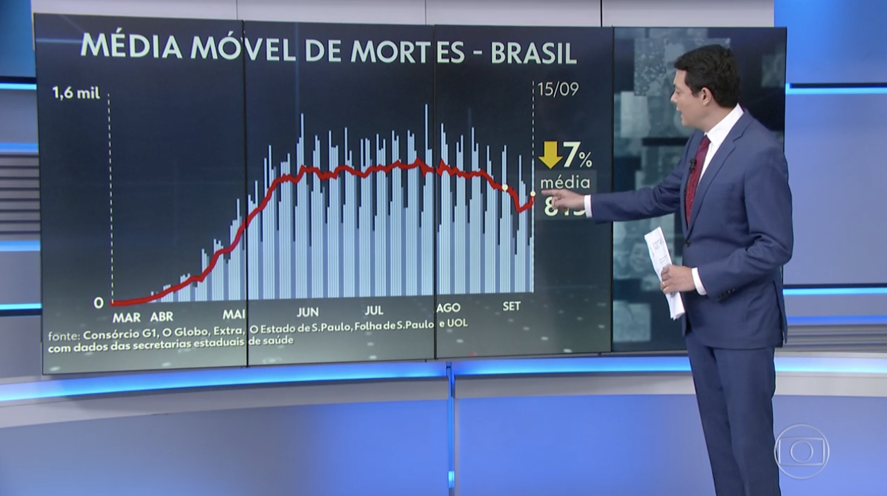
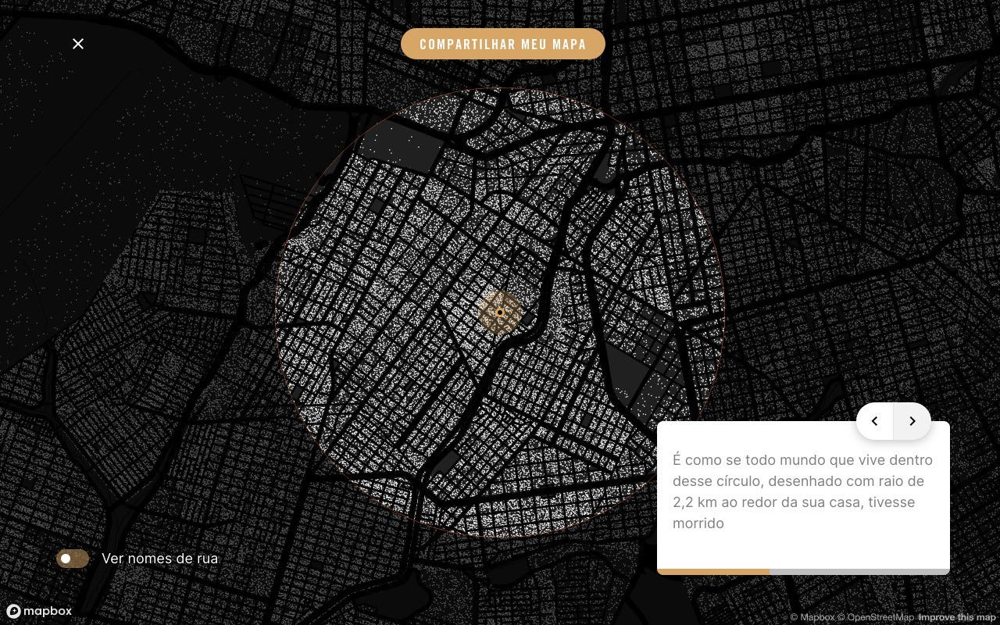
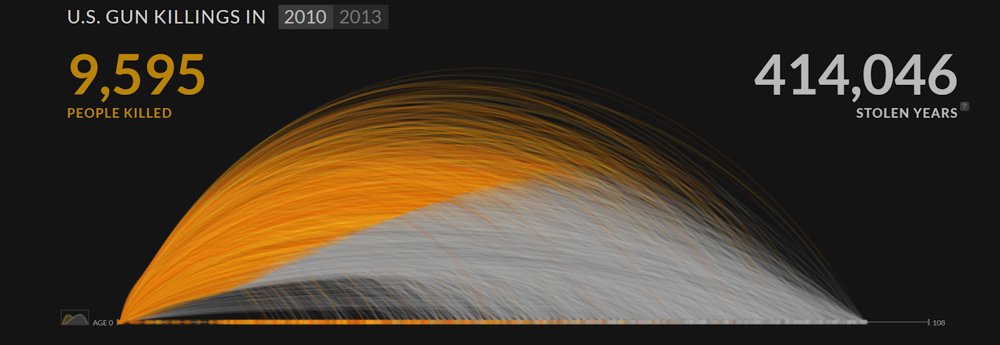
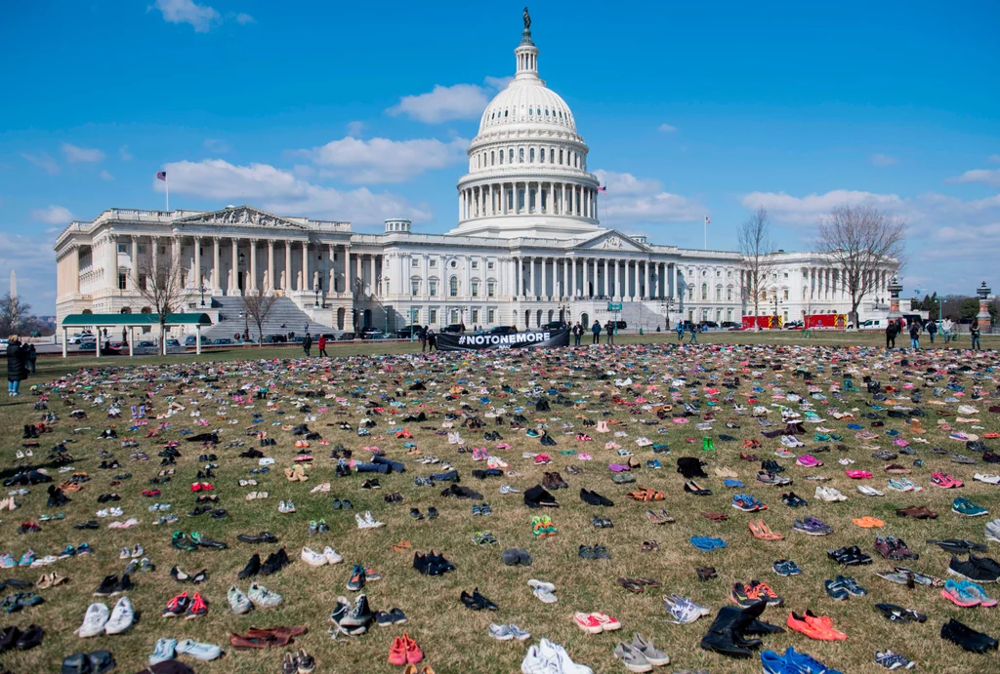
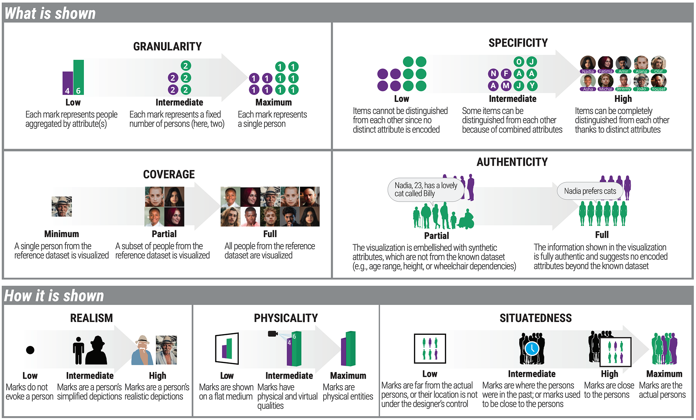
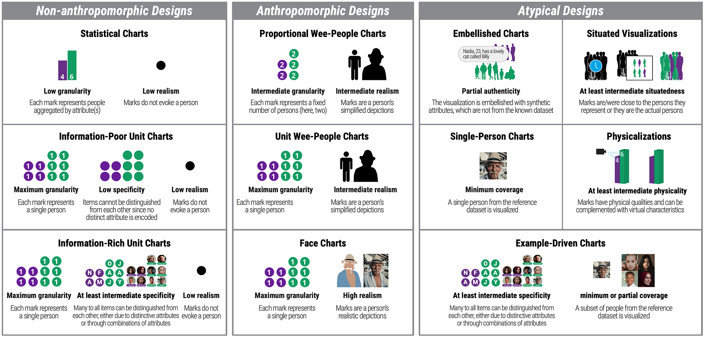

Durante a pandemia você já deve ter visto em jornais ou na Internet visualizações que mostram os casos de mortes por COVID-19. O que muitas destas visualizações têm em comum é o fato delas serem projetadas com o objetivo de mostrar a informação da maneira mais eficiente possível. Embora este seja o papel central de toda visualização, existem casos em que os gráficos mostram dados que vão além de meros números: mostram vidas humanas. Neste contexto, é necessário levar em consideração como representar estas pessoas que estão por trás dos dados de uma maneira mais humanizada. Foi a partir disso que surgiram os antropográficos.

*Fonte: G1. Média móvel de mortes por covid no Brasil. A quantidade de mortos é agregada em barras.*

Antropográficos são visualizações sobre pessoas nas quais são empregadas estratégias de design para aproximar os leitores aos dados. O intuito de criar este tipo de visualização é permitir tanto informar os leitores sobre dados de tragédias ou outros temas sensíveis quanto gerar compaixão pelas pessoas representadas nos dados. Todas as estratégias utilizadas pelos designers ao criarem antropográficos têm o objetivo de mostrar aos leitores que as pessoas por trás dos dados não são meras estatísticas, elas têm (ou tiveram) uma vida e uma história.

> Antropográficos são visualizações de dados sobre pessoas projetadas com o intuito de promover compaixão pelos indivíduos representados nos dados.

Há anos profissionais vêm criando visualizações com o intuito de gerar sentimentos nos leitores, porém, o termo *anthropographics* só surgiu em 2017, a partir do trabalho de Jeremy Boy e colegas. Neste trabalho, eles definiram um espaço de design do que seria um antropográfico e realizaram uma série de estudos para investigar se esse tipo de visualização realmente gera empatia nas pessoas. Os resultados desses estudos não foram conclusivos, mas abriram um leque de oportunidades para a área de antropográficos.

Ultimamente, em decorrência da pandemia, os antropográficos se tornaram bastante frequentes em meios de comunicação como jornais. Um dos melhores exemplos recentes desse tipo de visualização é o **No Epicentro**, que simula como seria se todas as vítimas de corona vírus fossem seus vizinhos. Além de mostrar as vítimas individualmente por meio de pontos, os designers tiveram a genial ideia de trazer os dados para um contexto familiar ao leitor: sua vizinhança/cidade. Se quiser saber mais sobre este projeto, os autores escreveram um post aqui no DataVizBr.

Um outro exemplo de antropográfico que fez bastante sucesso quando foi lançado é o **US Gun Deaths**, da Periscopic. Essa visualização mostra a uma timeline com a história de todos os mortos por arma de fogo nos Estados Unidos em 2013. Cada vítima é representada por um arco, que começa amarelo e termina cinza, mostrando os anos vividos e os anos roubados, respectivamente. Os arcos também possuem anotações com o nome da vítima, sua idade e onde ela foi morta. É inegável perceber que a visualização mostra muito mais que números, ela tenta tocar o leitor com as histórias de cada pessoa.

Mas os antropográficos não se limitam à tela de um computador. Um exemplo fantástico de *fisicalização* (ou visualização física) foi o protesto em que ativistas colocaram 7 mil pares de sapatos em frente ao Capitólio para representar crianças mortas por arma de fogo nos Estados Unidos. Ao materializar os dados, os autores puderam mostrar em uma dimensão mais perceptível aos seres humanos quantas crianças tinham morrido. Essa estratégia pode ter um peso bem maior que mostrar apenas um mero número.

Os antropográficos também não são usados exclusivamente para representar mortes. Um dos antropográficos que criei em meu doutorado representa mulheres que foram assediadas num ponto turístico de Campina Grande, Paraíba. Cada pingente das **Plantas de Assédio** (*Harassment Plants*) representa a história de um assédio. As pessoas poderiam decifrar a história ao explorar os pingentes com o auxílio de uma legenda.

Outro exemplo de antropográfico é uma visualização do **Estadão** que aborda a demora na adoção de crianças no Brasil. Nesta visualização interativa, cada criança é representada por uma flor, que possui comprimento e forma diferentes de acordo com as características da criança. O leitor pode acompanhar uma simulação que mostra quem são as crianças que são adotadas mais rápido e quais demoram mais tempo para serem escolhidas.

Você também pode ver outros exemplos de antropográficos nesta lista interativa.

## Espaço de design

Recentemente, eu e alguns colegas publicamos um artigo no qual mapeamos o espaço de design dos antropográficos. Nós identificamos 7 dimensões que podem influenciar os leitores a se sentirem mais conectados às pessoas por trás dos dados.

**Granularidade** se refere ao quanto as pessoas são representadas como marcas individuais ou de forma agregada. Um gráfico de barras que mostra a quantidade de mortos numa tragédia, por exemplo, possui baixa granularidade já que várias pessoas são representadas por uma única marca. A visualização do Estadão sobre adoção, por outro lado, possui máxima granularidade já que cada flor/marca representa uma única criança.

**Especificidade** corresponde a quão distintas são as pessoas (ou grupos) representadas por meio de seus atributos de dados. Por exemplo, não há como distinguir as crianças representadas pelos pares de sapatos na visualização física que mostra as mortes por arma de fogo nos Estados Unidos porque não existem atributos de dados sendo representados além da contagem das crianças. Por outro lado, uma visualização de alta especificidade como a apresentada pela Periscopic possui atributos como o nome e a idade da vítima, o que permite o leitor distinguir cada pessoa.

**Cobertura** corresponde a quantas pessoas da base de dados original são mostradas na visualização. Uma visualização de cobertura mínima, por exemplo, mostra a história de um único indivíduo, geralmente por meio de uma narrativa. Existem também visualizações de cobertura parcial, que mostram dados de um subconjunto de pessoas, como é o caso das Plantas de Assédio apresentadas acima, que são histórias de 28 mulheres que foram assediadas.

**Autenticidade** diz respeito a se a visualização possui ou não atributos sintéticos. Designers às vezes embelezam a visualização com informação que não vem dos dados como silhuetas humanas de diferentes gêneros e idade, ou inventando nomes para as pessoas. Uma visualização que é completamente autêntica possui apenas atributos oriundos dos dados.

**Realismo** representa o quão parecidas com seres humanos as marcas são. Visualizações com alto realismo geralmente possuem marcas como fotos ou desenhos realistas das vítimas. Por outro lado, visualizações com baixo realismo possuem marcas com formas geométricas (como pontos, linhas ou áreas) ou representações metafóricas como as flores ou chinelos mostrados nos exemplos anteriores.

**Fisicalidade** define o grau em que as marcas da visualização são embarcadas em meios físicos. Uma visualização com baixa fisicalidade geralmente é exibida na tela de um computador ou num papel. Visualizações com alta fisicalidade representam pessoas por meio de objetos físicos ou as marcas podem ser as próprias pessoas que são representadas.

**Situabilidade** corresponde a quão perto estão as marcas das pessoas que elas representam. Numa visualização não situada, as marcas são exibidas longe das pessoas que elas representam. Por outro lado, em visualizações situadas, as marcas são exibidas perto ou são as próprias pessoas representadas pelos dados.

A combinação dos níveis destas dimensões gera diferentes tipos de antropográficos, que podem ser agrupados em famílias.

## Famílias de antropográficos

Os antropográficos podem ser organizados em 3 famílias.

**Designs não antropomórficos** são aqueles nos quais as marcas possuem baixo realismo, isto é, não se assemelham a formas humanas. Esta família inclui visualizações estatísticas e gráficos unitários (onde cada pessoa é representada por uma marca diferente).

**Designs antropomórficos** correspondem a visualizações com alta granularidade e que possuem marcas que se assemelham a formas humanas. As marcas podem ser representadas por ícones, silhuetas humanas, fotos, ou qualquer outro símbolo que lembre um ser humano.

**Designs atípicos** são aqueles que ainda são pouco explorados por profissionais. Estes incluem visualizações situadas, físicas, com autenticidade parcial, ou cobertura parcial.

Hoje percebemos que em alguns casos apenas informar não é suficiente ao criarmos visualizações de dados. Às vezes é preciso criar visualizações mais humanizadas, que façam os leitores perceberem as histórias que existem por trás dos dados. Neste sentido, aprender sobre antropográficos é essencial.

A área de estudo é nova e ainda estamos tentando entender o potencial dos antropográficos. Se quiser aprender mais sobre o espaço de design desse tipo de visualização e suas famílias, sugiro o artigo *Showing Data about People: A Design Space of Anthropographics*. Outra fonte para entender melhor sobre o tema é minha tese de doutorado.

*Luiz Morais é doutor em Ciência da Computação pela Universidade Federal de Campina Grande e atualmente é pós-doutorando pela Inria, França. Ele é um dos pioneiros no estudo de antropográficos e também se interessa por visualizações situadas e físicas.*

*Atualização 07/06/2024: Luiz Morais atualmente é professor do Centro de Informática da UFPE.*
---

*Esse post foi originalmente postado no [Medium do datavizbr](https://medium.com/datavizbr/antropográficos-visualizando-dados-sobre-pessoas-com-o-objetivo-de-gerar-compaixão-e311fa815768) e pode ser encontrado no link acima.*