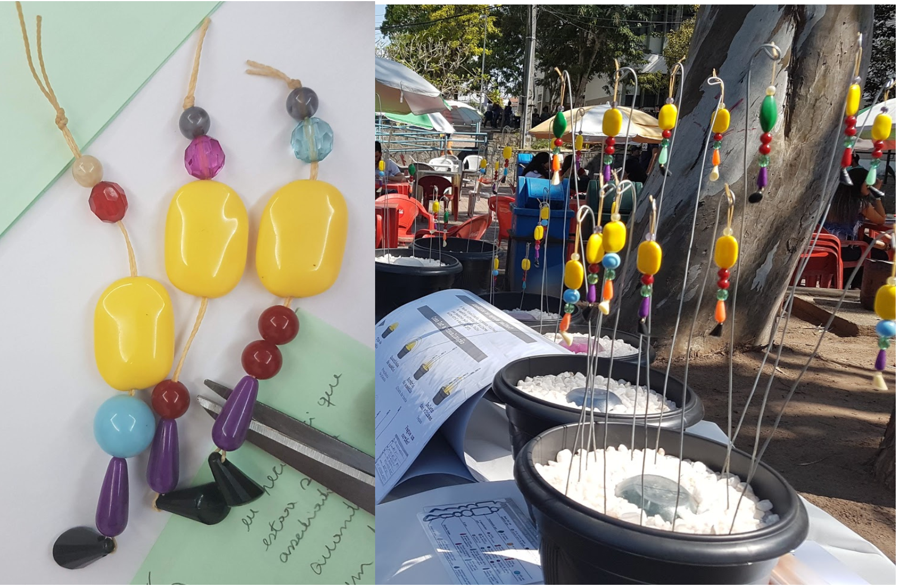
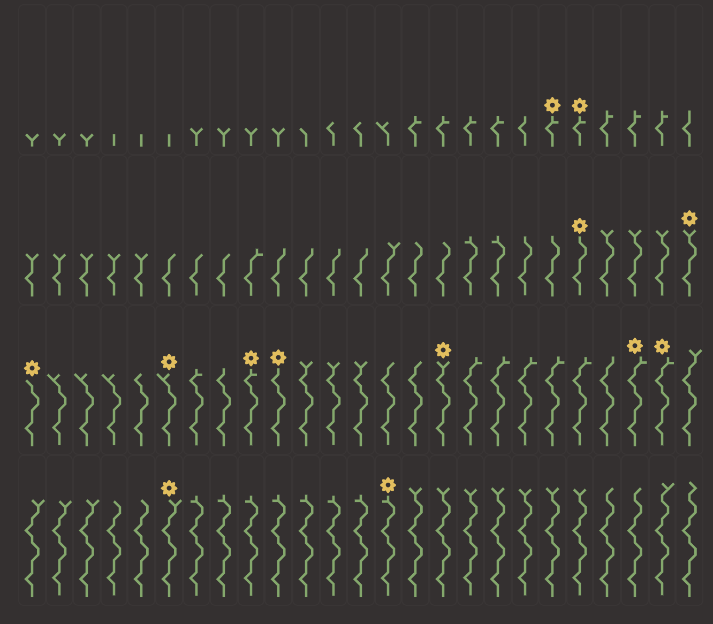

Durante a pandemia você já deve ter visto visualizações que mostram os casos de mortes por COVID-19. O que muitas destas visualizações têm em comum é o fato delas serem projetadas com o objetivo de mostrar a informação da maneira mais eficiente possível. Embora este seja o papel central de toda visualização, existem casos em que os gráficos mostram dados que vão além de meros números: mostram vidas humanas.

**Antropográficos** são visualizações sobre pessoas nas quais são empregadas estratégias de design para aproximar os leitores aos dados. O intuito é permitir tanto informar os leitores sobre dados de tragédias ou outros temas sensíveis quanto gerar compaixão pelas pessoas representadas nos dados.

O termo "anthropographics" surgiu em 2017, a partir do trabalho de Jeremy Boy e colegas.

**Exemplos de antropográficos**

- **No Epicentro** (Agência Lupa + Google News Initiative): simula como seria se todas as vítimas de coronavírus fossem seus vizinhos.

- **US Gun Deaths** (Periscopic): timeline com a história de todos os mortos por arma de fogo nos EUA em 2013. Cada vítima é representada por um arco que mostra os anos vividos e os anos roubados.

- **7 mil pares de sapatos** no Capitólio: fisicalização que representou crianças mortas por arma de fogo nos EUA.

- **Plantas de Assédio** (Luiz Morais): visualização física que representa mulheres que foram assediadas num ponto turístico de Campina Grande, Paraíba.

- **Simulação de adoção** (Estadão): cada criança é representada por uma flor com comprimento e forma diferentes de acordo com suas características.

**Espaço de design — 7 dimensões**

1. **Granularidade**: quanto as pessoas são representadas como marcas individuais ou de forma agregada.
2. **Especificidade**: quão distintas são as pessoas representadas por meio de seus atributos de dados.
3. **Cobertura**: quantas pessoas da base de dados original são mostradas na visualização.
4. **Autenticidade**: se a visualização possui ou não atributos sintéticos (inventados pelo designer).
5. **Realismo**: quão parecidas com seres humanos as marcas são.
6. **Fisicalidade**: grau em que as marcas da visualização são embarcadas em meios físicos.
7. **Situabilidade**: quão perto estão as marcas das pessoas que elas representam.

**Famílias de antropográficos**

- **Designs não antropomórficos**: marcas com baixo realismo, como formas geométricas. Inclui visualizações estatísticas e gráficos unitários.
- **Designs antropomórficos**: alta granularidade com marcas que se assemelham a formas humanas (ícones, silhuetas, fotos).
- **Designs atípicos**: pouco explorados, incluem visualizações situadas, físicas, com autenticidade parcial, ou cobertura parcial.

Hoje percebemos que em alguns casos apenas informar não é suficiente ao criarmos visualizações de dados. Às vezes é preciso criar visualizações mais humanizadas, que façam os leitores perceberem as histórias que existem por trás dos dados.

*Luiz Morais é doutor em Ciência da Computação pela Universidade Federal de Campina Grande e atualmente é pós-doutorando pela Inria, França. Ele é um dos pioneiros no estudo de antropográficos.*

---

*Esse post foi originalmente postado no [Medium do datavizbr](https://medium.com/datavizbr/antropográficos-visualizando-dados-sobre-pessoas-com-o-objetivo-de-gerar-compaixão-e311fa815768) e pode ser encontrado no link acima.*