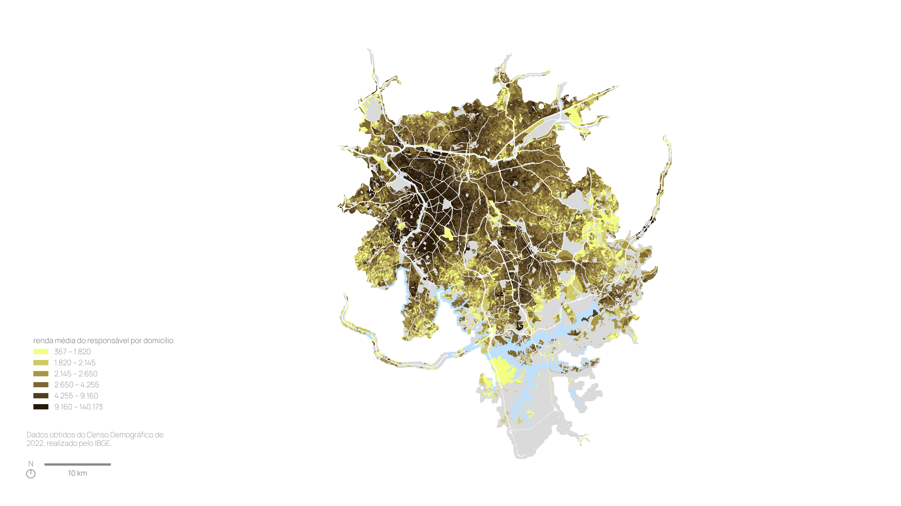
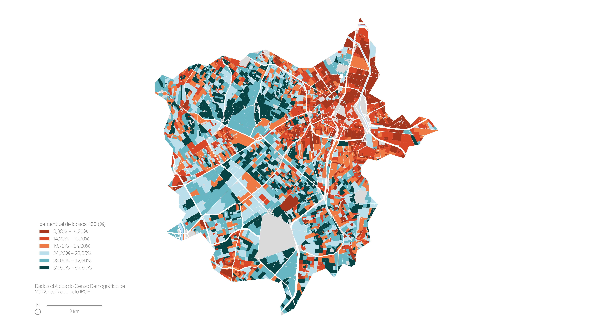
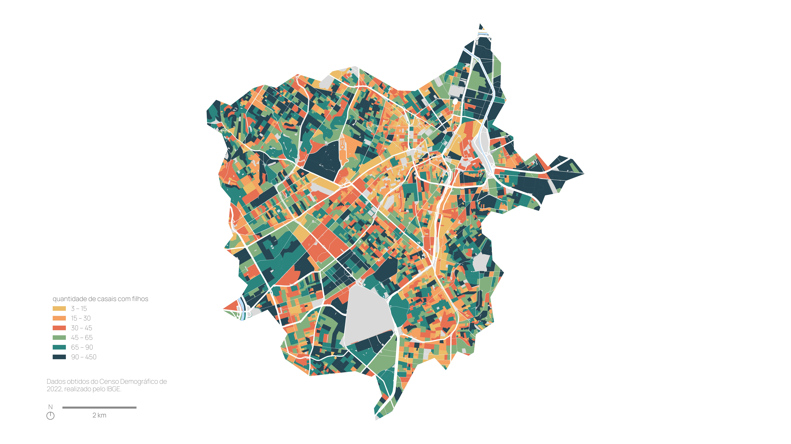
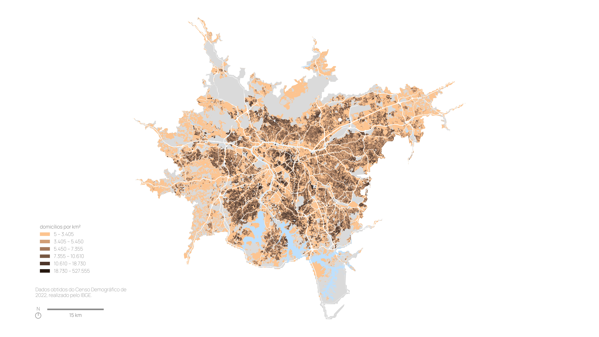
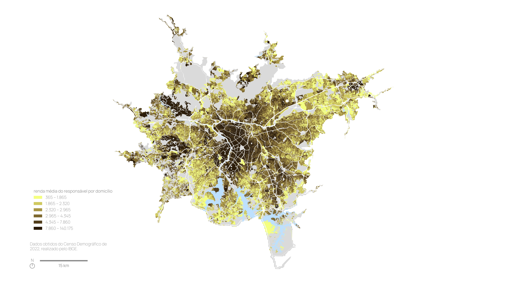

Os dois mapas abaixo são bem parecidos e isso não é por acaso. Apesar de ambos serem mapas de São Paulo, eles foram gerados por um script de Python que recebe um par de coordenadas como parâmetro, verifica qual a área alcançável em até 1 hora de carro a partir desse ponto e gera o mapa de renda média por setor censitário conforme dados do IBGE para esse recorte especial. Tudo nas duas imagens foi gerado pelo Python com a supervisão do Claude Code, por isso a semelhança de cores, posição de legenda e tudo mais nos dois mapas.

No caso, a empresa em que trabalho faz projetos em que precisamos coletar rapidamente dados sobre perfil populacional, mercado imobiliário e equipamentos urbanos, tratá-los e transformá-los em mapas ou gráficos. Até março deste ano, fazíamos isso por meio de um processo “semiautomático”, composto por dezenas de Jupyter Notebooks, cada um responsável por uma pequena etapa de um grande pipeline. O responsável pela execução do projeto rodava os notebooks em ordem, concatenando a saída de um com a entrada do outro.

A necessidade desses múltiplos notebooks vinha das variações que o processo podia ter: seja porque alterávamos as bases de uma cidade para outra (o que nos obrigava a rodar notebooks diferentes em cada caso), seja porque o fim de cada notebook era um momento que exigia uma conferência manual dos resultados. Esse segundo ponto era importante porque, se descobríssemos lá no final do pipeline que um erro havia ocorrido em etapas anteriores, teríamos o retrabalho de rastrear qual notebook era o culpado e refazer tudo a partir dali.

Além disso, tínhamos grande dificuldade em automatizar por completo a etapa da geração do mapa em si. Primeiro, porque era difícil produzir um código que deixasse a legenda, a escala gráfica e o símbolo de norte sempre na posição correta, independentemente do tipo de valor ou de geometria que ela representava. Em segundo lugar, havia a definição da paleta de cores a ser usada e da classificação dos resultados numéricos em intervalos, algo difícil de estabelecer plenamente de antemão. Pode parecer pouca coisa, mas esses três pontos, sozinhos, exigem um número de linhas de Python muito maior do que se esperaria para elementos que, no fim, ficam ali no canto da página. Por fim, havia ainda o nosso preciosismo de sempre olhar o mapa final e querer mudar alguma coisa. 

Por tudo isso, depois de rodar os tais notebooks de coleta e formatação dos dados, a parte da geração dos mapas era realizada manualmente no QGIS. Funcionava razoavelmente bem.

Foi ali por fevereiro que ouvi, pela primeira vez, que o Claude tinha sido atualizado, com suas capacidades tendo sido ampliadas expressivamente. Desconfiei da notícia, pois, até então, com o ChatGPT, eu tinha tido boa ajuda na elaboração dos códigos dos notebooks, mas não conseguia avançar na automação das partes manuais do processo. Ao testar a tal atualização do Claude, porém, logo percebi que, para o terror do meu espírito pessimista, aquilo de fato tinha potencial de ajudar bastante.

A primeira coisa que me surpreendeu foi que, ao criar um arquivo YAML descrevendo a sequência de notebooks que rodávamos, foi possível fazer com que o próprio Claude concatenasse as saídas e entradas de cada um, avisando caso surgisse algo estranho, como um arquivo vazio. Quem antes ficava responsável por executar as células podia agora se dedicar a tarefas mais difíceis.

O segundo ponto foi somar a isso a rapidez de editar os códigos dentro do próprio repositório. Sei que o Copilot e o Codex já faziam isso antes, eu é que nunca havia testado direito. De todo modo, depois de tentar explicar ao Claude as posições de legenda, escala e norte que queríamos (além de todas as complexidades que o manuseio dessas coisas traz), conseguimos, depois de dezenas e dezenas de iterações, gerar um código que deixava tudo mais ou menos no lugar certo.

No meio do caminho, o YAML virou apenas um repositório de parâmetros e a lógica de funcionamento desse pipeline passou a morar em uma skill do Claude. Nessa estrutura, hoje, basta definirmos as coordenadas do terreno de análise e pôr o algoritmo para rodar. Ele primeiro consulta a API do Mapbox para obter os polígonos que delimitam nossas áreas de análise: por exemplo, o alcance de 15 minutos de carro a partir das coordenadas informadas. Com base nesse recorte, puxa do OpenStreetMap (via API do OverPass) as geometrias que servem de base para os mapas: sistema viário, vegetação e hidrografia. Complementamos esse mapa base com os polígonos das edificações do Google Open Buildings (no OSM, há poucas cidades que têm esse dado).

Os dados principais dos mapas vêm de fontes diversas. Aqueles produzidos pelo IBGE são coletados do servidor FTP da própria instituição; já arquivos mais pesados, como as bases da RAIS do Ministério do Trabalho, são baixados de antemão e lidos de um diretório no computador de cada um que executa o algoritmo. Outros vêm de bibliotecas e APIs específicas: os comércios, por exemplo, saem da API do Google Places.

Em termos de ferramentas, os mapas não têm muito segredo, sendo apenas uma longa sequência de plots do Matplotlib, empilhando camadas de fontes diferentes. O que talvez os diferencie sejam os estilos que definimos como nossos padrões, descritos como variáveis em um arquivo .py específico, carregado pelo próprio script de geração dos mapas. Esses estilos foram criados e aperfeiçoados por nós ao longo de anos de geração de mapas, mostrando a importância da tentativa e erro nesse processo de criar visualizações interessantes. O que talvez tenha para ser compartilhado a respeito disso é que geralmente buscamos novas paletas de cores desse site aleatório aqui ou do Coolors.

Esse processo todo é executado automaticamente na primeira execução via Claude. Só que o tal preciosismo que mencionei sempre reaparece quando os mapas ficam prontos. Por isso, o pipeline foi estruturado de modo que é possível executar uma etapa específica do processo como um script de python, sem precisar gastar tokens no Claude novamente. Assim, quando queremos ajustar algo - seja num mapa específico ou em todos - alteramos os estilos ou o que for preciso e rodamos apenas o script de geração de mapas novamente. Se a mudança vale para todos os mapas, ele reprocessa o conjunto; se for só um, passamos como parâmetro qual é, e ele faz a edição individual.

Um teste que fiz recentemente foi o de gerar mapas passando como parâmetro um ponto aleatório na avenida Paulista em São Paulo e foi desse teste que saíram os mapas mostrados abaixo. A execução foi feita para os raios de 15 minutos e também 1 hora de carro a partir desse ponto central, por isso a diferença de abrangência. Os dados que eles mostram são aqueles fornecidos pelo IBGE e que geralmente utilizamos em nossos projetos, mas poderiam ser outros, seria só inserí-los na lógica do algoritmo.

Ainda que essa automação tenha acelerado meu trabalho, tenho constantemente identificado possíveis melhorias no código que descreve o processo, de modo que esse pipeline ainda é um trabalho em desenvolvimento. Mas, estou fazendo essas edições sabendo que a qualquer momento pode vir uma outra novidade que vai modificar todo esse processo novamente. Nessa era das IAs em que vivemos, está sendo difícil para um pessimista como eu saber lidar com o futuro.

