*por Rodrigo Menegat, Tiago Maranhão e Vinicius Sueiro*

Se todos os mortos pela Covid-19 no Brasil fossem seus vizinhos, seu bairro provavelmente desapareceria do mapa. É possível que até a sua cidade inteira sumisse.

Uma parceria entre o Google News Initiative e a Agência Lupa mostra na prática como seria essa realidade. Usando a localização do usuário, dados do Censo de 2010 e mapas de rua, esta reportagem interativa mostra qual seria o raio da devastação caso o epicentro da epidemia no Brasil fosse a casa do leitor.

**Conceito: Uma tragédia invisível**

No momento em que começamos a escrever esse texto, 58.390 brasileiros haviam morrido vítimas do novo coronavírus. A realidade, porém, independe de onde você mora: os mortos estão dentro de hospitais espalhados por todo o território nacional, mas não os vemos.

Esse projeto surgiu da seguinte indagação: como fazer para que as pessoas passem a enxergar esses mortos?

**Referências familiares**

60 mil pessoas mortas. É como se um Estádio do Arruda lotado, no Recife, desaparecesse. A lógica vale para quem está em qualquer lugar: quanto mais familiar a unidade de medida, mais fácil compreender a dimensão da epidemia.

A ideia fundamental deste projeto é fazer com que as vítimas da Covid-19 se tornem, subitamente, íntimas do usuário.

**Inspirações**

- Um projeto do The New York Times que apaga regiões dos EUA de acordo com resultados eleitorais

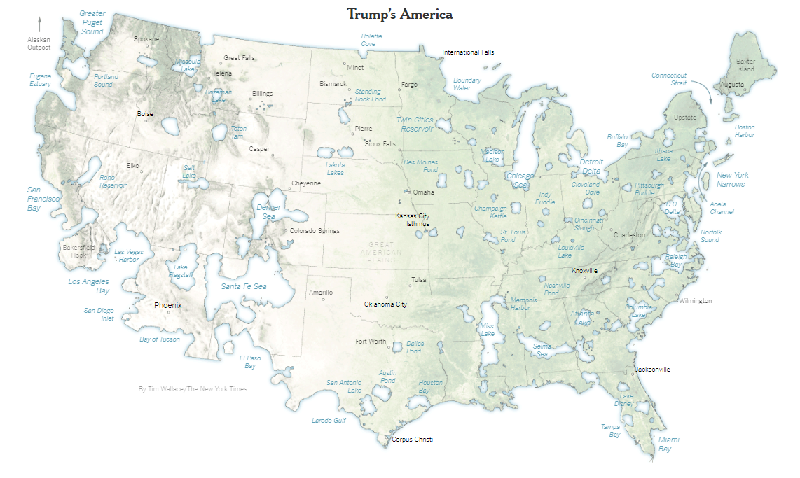

*Mapa que apaga as áreas dos Estado Unidos onde Donald Trump teve mais votos que Hillary Clinton*

- O projeto "Aqui não mora ninguém" da Plano C, mostrando áreas desabitadas do Brasil

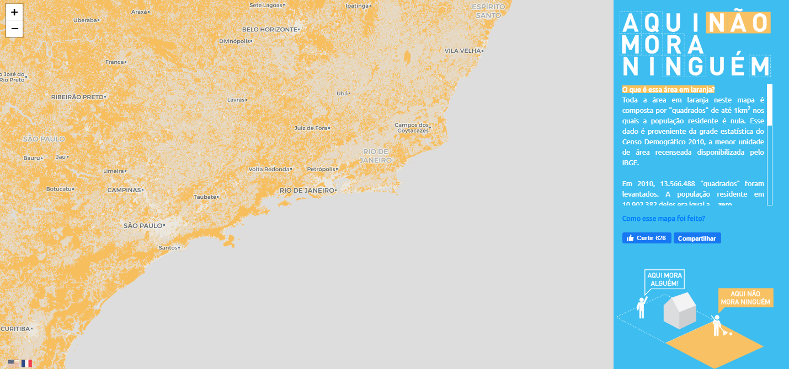

*As áreas laranja representam regiões desabitadas do Brasil*

*Mapa de densidade populacional produzida pela empresa americana de jornalismo de dados The Pudding*

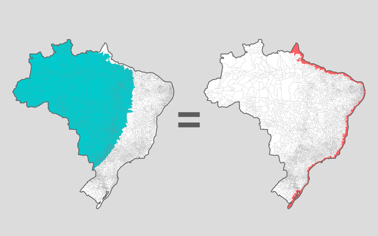

*A mesma quantidade de pessoas mora na área azul e na área vermelha*

- O Racial Dot Map (Universidade de Virgínia), onde cada ponto representa uma pessoa

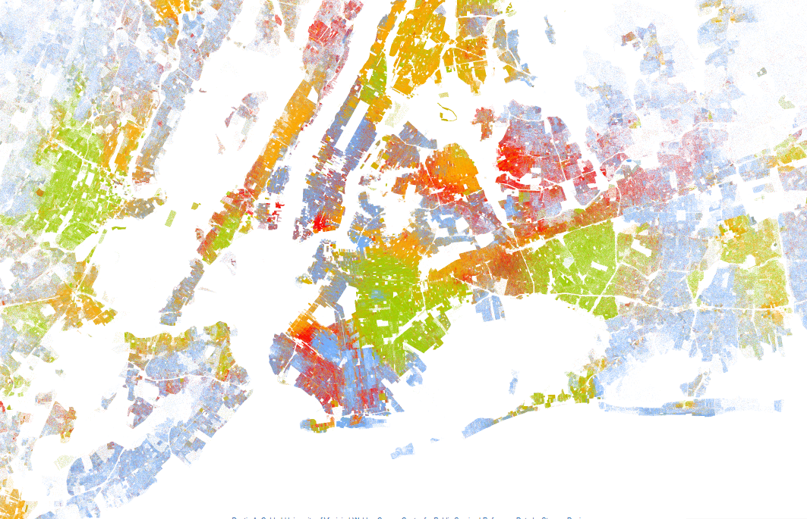

*Cada ponto representa uma pessoa. Cada cor, uma raça.*

- Reportagens personalizadas do NYTimes sobre temperatura e poluição na cidade do leitor

*Gráfico personalizado mostra o crescimento da temperatura na cidade natal do leitor*

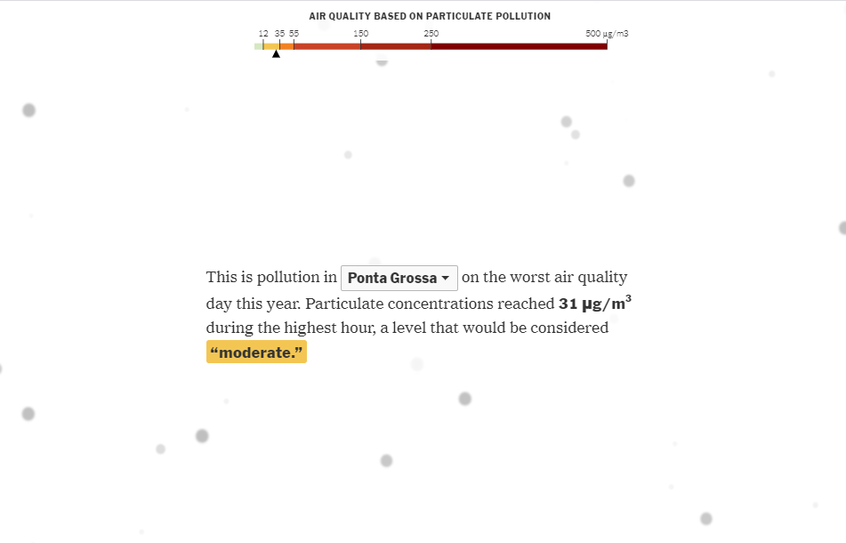

*A quantidade de micropartículas de poluição no ar da cidade onde o usuário mora é representada por pequenos círculos*

*Covas abertas em São Paulo. Foto: José Antonio de Moraes/Anadolu Agency/Getty*

*Projeto reúne obituários de vítimas da Covid-19 no Brasil*

**Brainstorming**

Foram listadas 11 propostas diferentes, incluindo realidade aumentada, modelos 3D, cemitérios em espaços públicos e distribuição de pontos. No final, foram escolhidos elementos de múltiplas propostas.

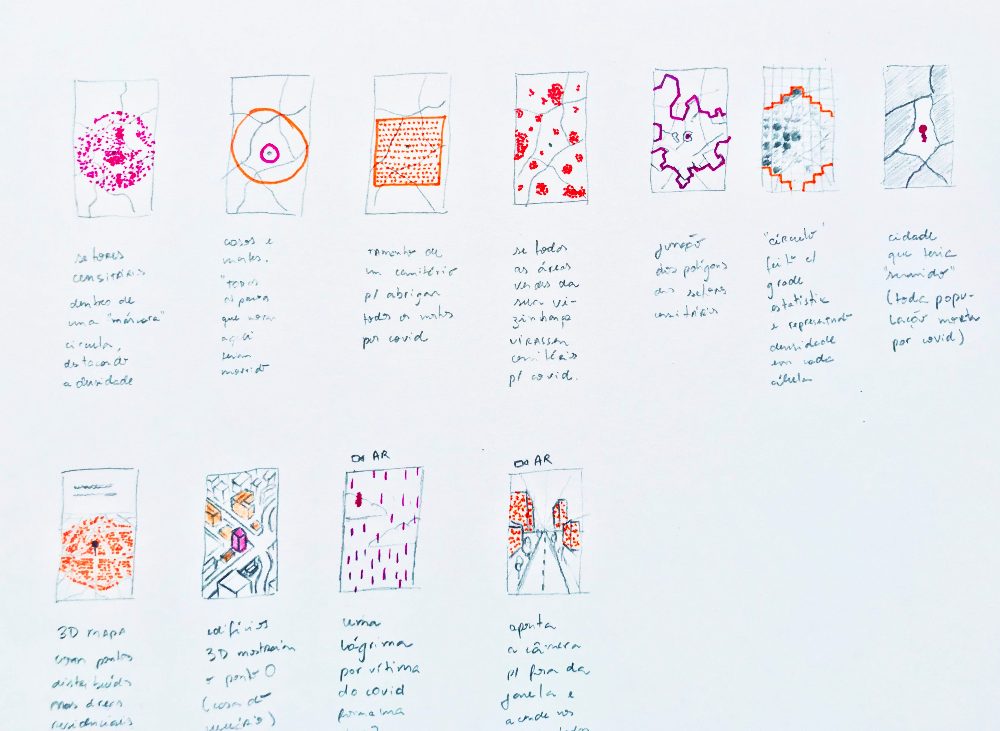

*Esboço que lista onze projetos que consideramos antes de escolher o formato final*

**Algoritmo**

O algoritmo final calcula um círculo ao redor das coordenadas do usuário, aumentando o raio progressivamente até que a população dentro do círculo alcance entre 90% e 110% do total de mortos por Covid-19 no Brasil. A população foi calculada a partir dos setores censitários do IBGE.

*Cada retângulo na imagem acima é um item da grade estatística do IBGE. Quanto mais escuro, mais pessoas moram naquela área.*

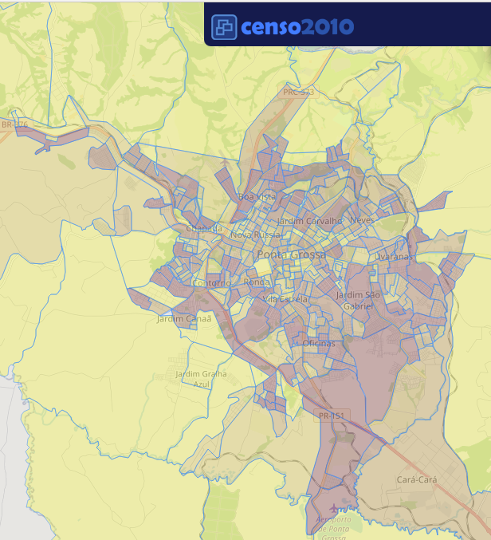

*Os setores censitários costumam ser menores em áreas muito povoadas e maiores em áreas com menor densidade demográfica.*

*Representação visual do algoritmo: de vizinho em vizinho, tentávamos chegar ao total de mortos*

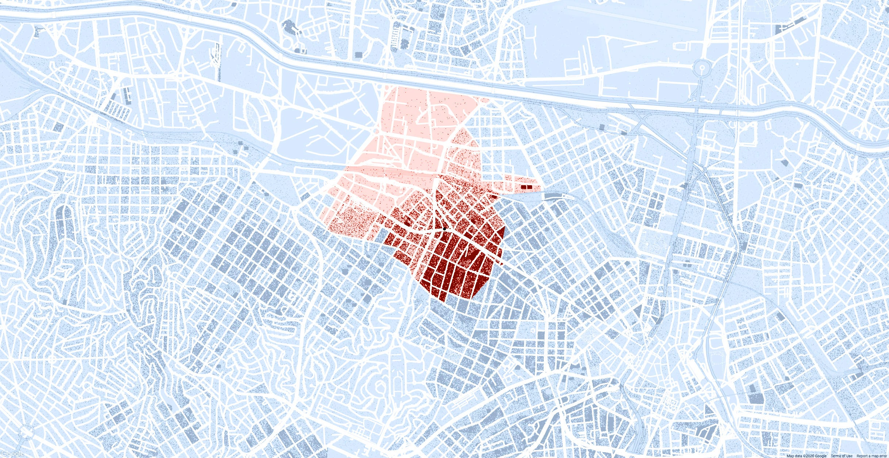

*Resultado do algoritmo no bairro da Barra Funda, em São Paulo: como explicar para o leitor qual é o sentido dessa área vermelha estranha?*

*O raio de mortes a partir do Centro Histórico de Recife. O formato circular passa a mensagem de forma mais efetiva do que no exemplo anterior.*

**Desafios de performance**

O tempo de execução inicial era de 30 segundos. Com otimizações usando as bibliotecas Feather (leitura rápida de arquivos), PyGEOS (operações vetorizadas geométricas) e Rtree (índices espaciais), o tempo caiu para menos de 3 segundos.

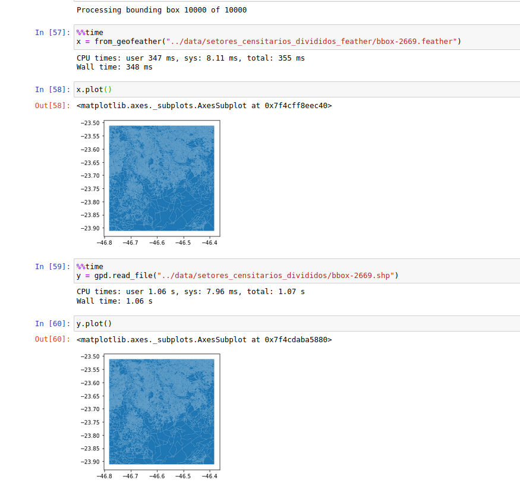

*Comparação entre o tempo necessário para ler um arquivo no formato shapefile e no formato feather: o último é quase três vezes mais rápido.*

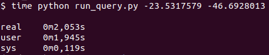

*Um tipo específico de índice espacial chamado r-tree. Veja como os polígonos menores, vermelhos, são encapsulados por polígonos maiores*

*Depois de toda a otimização, o tempo de execução do código caiu de meio minuto para menos de três segundos*

**200 milhões de pontos**

Em vez de gerar apenas pontos dentro do círculo, a equipe gerou previamente uma camada com 190 milhões de pontos — um para cada habitante do Brasil em 2010 — processados a partir dos setores censitários do IBGE. Os dados resultantes (cerca de 23 gigabytes) foram convertidos para tilesets usando o tippecanoe do Mapbox.

*Decidir como implementar a interface visual do projeto não foi simples*

*Quais as chances de o ponto vermelho cair na região azul ou na região amarela?*

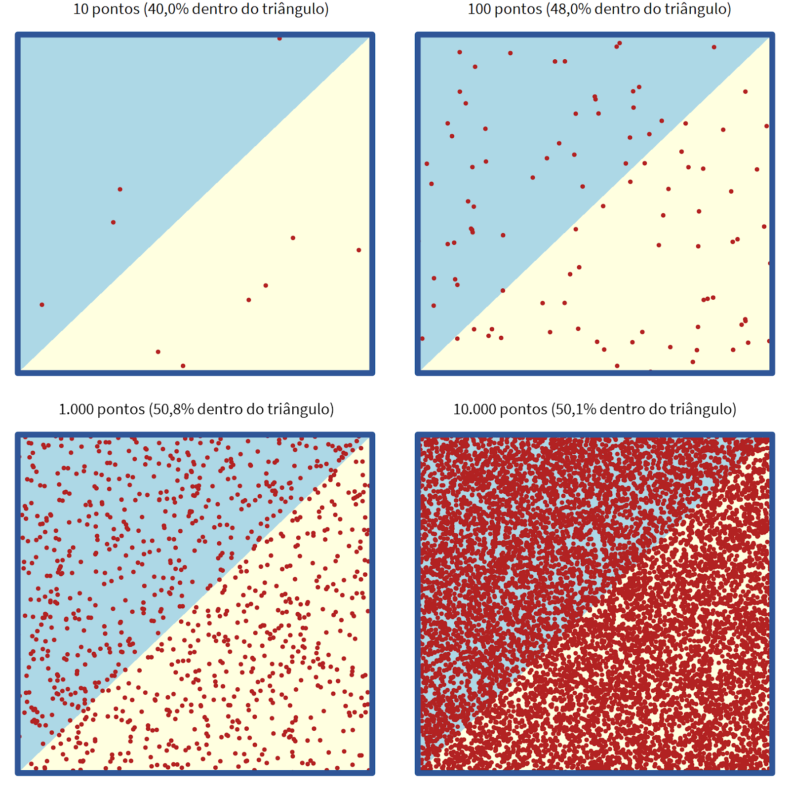

*Quanto mais pontos gerados, mais próxima a distribuição fica da probabilidade teórica*

*Note como o valor de pontos dentro do setor ficou próximo do real: de 866 pontos esperados, 862 caíram dentro.*

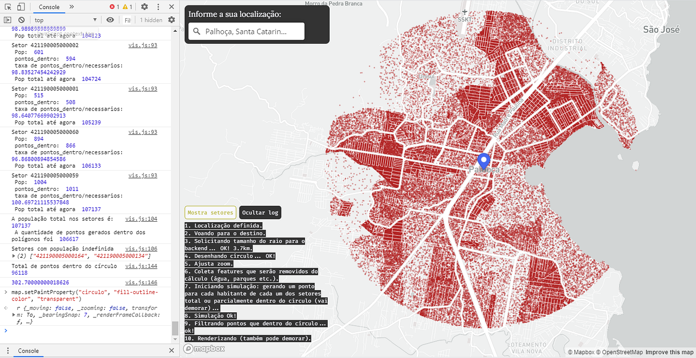

*Um dos primeiros protótipos, destacando as mortes em torno de um ponto no município de Palhoça, SC*

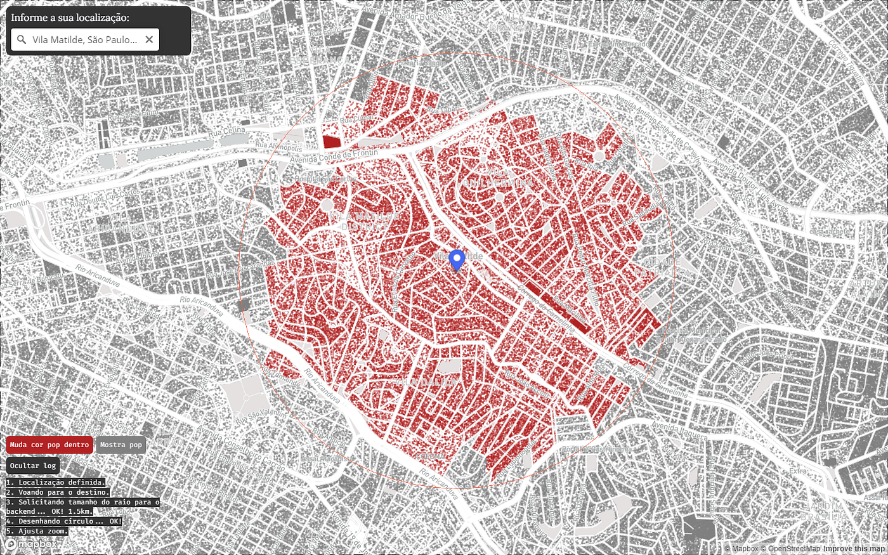

*Protótipo de mapa com que exibe um ponto para cada habitante do Brasil, em vez de exibir apenas um ponto para cada vítima da Covid-19*

*Um cooler feito de peças de Lego evitou que esse pobre computador entrasse em combustão*

**Lições aprendidas**

1. Especializar tarefas, mas coletivizar debates: divisão rigorosa do trabalho, mas com liberdade para sugestões sobre tópicos alheios.

2. Brainstorming eterno: manter um ambiente de ideação constante com referências, sugestões e debates ao longo de todo o processo.

*A mídia compartilhada no grupo de WhatsApp: referências, testes, memes, cursos e árvores secas*

3. Aprender no processo: disposição para mergulhar em temas novos rapidamente. O grupo se autodenominou "Irresponsáveis Motivados". Como disse a equipe: "Feito é melhor que perfeito."

Os dados de mortes vieram do Brasil.io, mantido por Álvaro Justen e voluntários. O código-fonte do projeto é aberto.

---

*Esse post foi originalmente postado no [Medium do datavizbr](https://medium.com/datavizbr/como-fizemos-o-mapa-interativo-que-te-coloca-no-epicentro-da-epidemia-de-covid-19-no-brasil-4ce949a9183b) e pode ser encontrado no link acima.*
