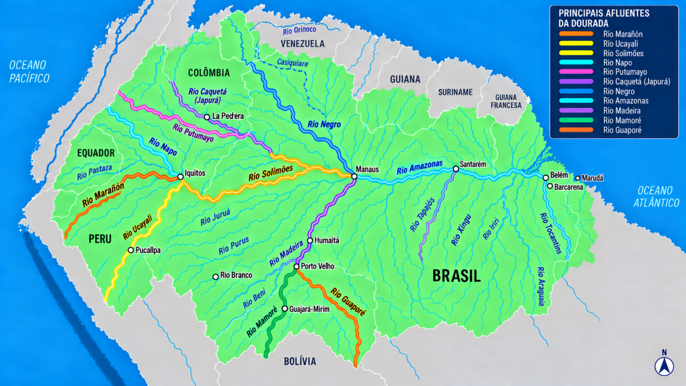
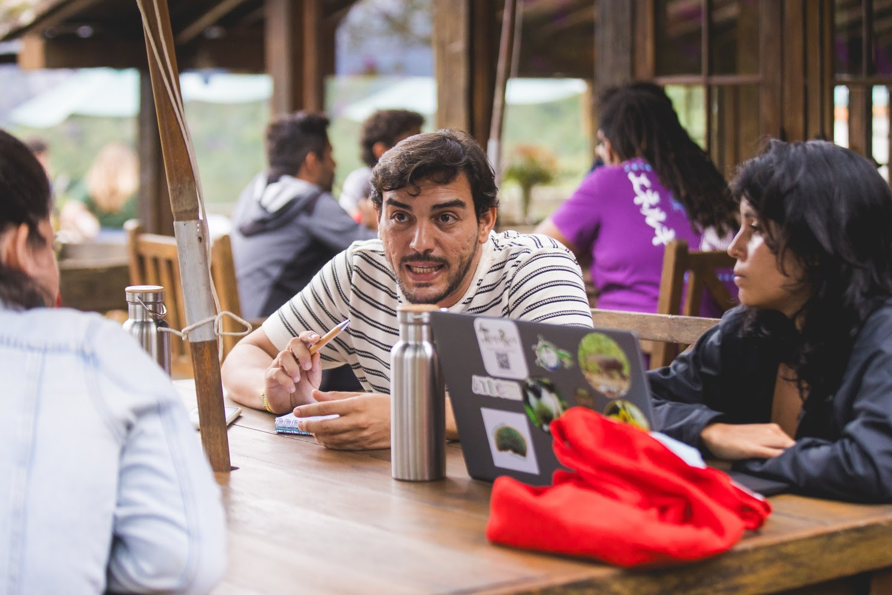
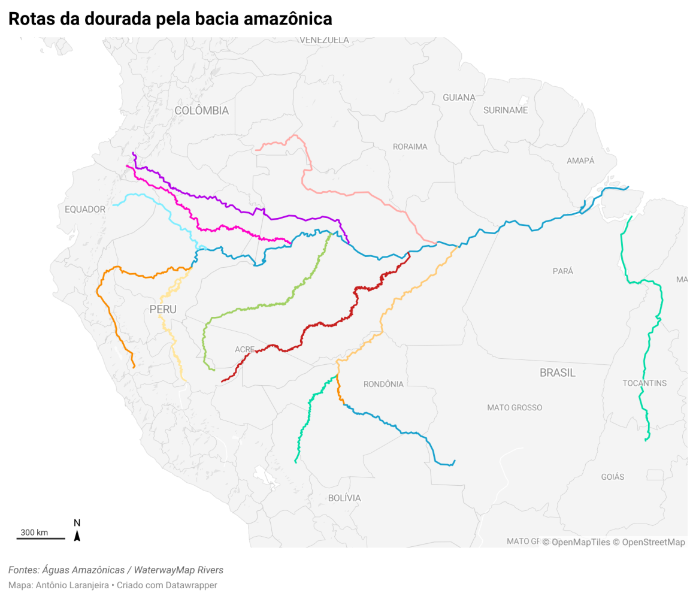

Durante alguns dias tentei fazer com inteligência artificial (ChatGPT 5.5) um mapa dos rios da Amazônia para uma reportagem sobre a dourada, peixe migratório que percorre milhares de quilômetros e cuja sobrevivência depende de uma rede hidrográfica que atravessa fronteiras. A tarefa parecia adequada para um momento em que quase todo problema tecnológico começa com a mesma pergunta: será que a IA consegue fazer?

Consegui produzir imagens muito boas, algumas delas bonitas o suficiente para parecer que o trabalho estava praticamente resolvido. O problema começou quando deixei de olhar apenas para a imagem e passamos a olhar para o mapa.

Eu tinha referências cartográficas, sabia quais rios precisavam aparecer e tinha uma ideia relativamente clara de como queria organizar aquela informação. Forneci mapas, indiquei posições, corrigi traçados, retirei elementos, acrescentei outros e repeti o processo algumas vezes, sempre com a sensação de que a próxima versão finalmente resolveria o problema. As imagens melhoravam, mas os rios nem sempre, conforme o mapa a seguir.

*Criado com ChatGPT 5.5 — contém erros geoespaciais na comparação com a cartografia técnica e não apenas ilustrativa.*

Foi o olhar de outras pessoas especialistas envolvidas na reportagem que tornou isso mais evidente. Os questionamentos não eram sobre cor, tipografia ou composição, mas sobre aquilo que deveria ser mais elementar em um mapa: se aquele rio realmente passava por ali, se um afluente estava conectado ao curso correto ou se uma hidrelétrica estava de fato localizada naquele ponto da rede hidrográfica.

A imagem estava ficando melhor justamente quando comecei a confiar menos nela. Essa contradição ficou ainda mais interessante porque a reportagem não surgiu de um processo isolado de produção, mas de uma experiência desenhada desde o início para colocar diferentes formas de conhecimento em contato.

**Um laboratório entre ciência e jornalismo**

A reportagem sobre a dourada começou a ser desenvolvida no [Laboratório Colaborativo de Comunicação e Ciência](https://serrapilheira.org/ano/chamada-publica-para-laboratorio-colaborativo-de-comunicacao-e-ciencia), promovido pelo Instituto Serrapilheira e pelo Centro Latinoamericano de Investigación Periodística, o CLIP. Fui um dos 12 profissionais selecionados na América do Sul, representando a Agência Carta Amazônia, para trabalhar em histórias relacionadas à água como serviço ecossistêmico e às conexões entre os diferentes biomas do continente.

A proposta do laboratório já carregava uma ideia que acabaria sendo importante também para os mapas: jornalistas e cientistas não deveriam trabalhar em etapas separadas. Houve formação prévia, uma imersão presencial e depois meses de desenvolvimento das investigações, com acompanhamento editorial do CLIP e científico do Serrapilheira, além das trocas entre profissionais de diferentes países e formações.

O próprio ponto de partida era geográfico. A água que percorre os rios amazônicos atravessa limites políticos, conecta Andes, floresta e Atlântico e ajuda a mostrar como aquilo que acontece em um ponto pode produzir consequências muito longe dali. O laboratório foi pensado justamente para contar essas conexões sem reduzir o conhecimento científico a uma declaração de especialista encaixada posteriormente na reportagem.

> A dourada se encaixa muito bem nessa perspectiva. É impossível contar a história desse peixe sem acompanhar seus deslocamentos pelos rios e sem perceber que fronteiras administrativas explicam muito pouco sobre uma espécie cuja geografia é definida pelas águas.

Talvez por isso os erros do mapa tenham ficado tão evidentes no processo colaborativo. Havia gente olhando para a história a partir da ciência, do jornalismo, dos dados e dos diferentes territórios, e bastava mudar o olhar para que uma imagem aparentemente resolvida voltasse a ser uma pergunta.

No fundo, o laboratório estava fazendo com a reportagem aquilo que eu esperava que a inteligência artificial fizesse com o mapa: reunir informação suficiente para construir uma representação confiável. A diferença é que, entre humanos, dúvida e discordância também faziam parte do método.

*Foto: Diego Padilha*

**A Amazônia que parecia correta**

No caso da dourada, os rios não poderiam funcionar apenas como cenário. Madeira, Solimões, Amazonas, Tocantins e outros cursos d'água precisavam manter relações reconhecíveis porque o argumento da reportagem dependia dessas conexões, assim como dependia das áreas de pesca e das hidrelétricas distribuídas pela bacia.

> Uma linha graficamente bonita podia estar no lugar errado, assim como uma rede hidrográfica podia parecer perfeitamente amazônica sem corresponder suficientemente à Amazônia. Esse é um problema diferente de produzir uma ilustração, porque no mapa a posição também comunica.

Quando colocamos um ponto em determinado lugar, afirmamos que algo está ali. Quando duas linhas se encontram, também afirmamos uma relação, mesmo que nenhuma palavra tenha sido escrita para explicá-la.

Foi nesse momento que a experiência da reportagem encontrou uma questão que venho perseguindo também na minha [pesquisa de doutorado](https://revistas.unisinos.br/index.php/questoes/article/view/26630) sobre cartografia jornalística. Um mapa não se torna confiável porque possui aparência cartográfica, assim como precisão não se resume à capacidade de desenhar objetos com grande detalhamento.

Precisão passa também pelas relações que permanecem preservadas. Proximidade não é apenas distância física, mas a possibilidade de aproximar o leitor de um fenômeno e permitir que ele compreenda escalas, conexões e diferenças que o texto, sozinho, nem sempre consegue mostrar.

Isso me interessa especialmente nos mapas jornalísticos digitais porque eles podem fazer mais do que localizar. Podem organizar a leitura de uma investigação, permitir comparações e carregar outros elementos da narrativa em pontos, linhas e áreas que continuam vinculados aos dados que lhes deram origem.

> Foi justamente isso que a IA não conseguia me entregar naquele momento. Eu conseguia produzir a aparência de um mapa, mas não necessariamente a estrutura informacional do mapa que a reportagem precisava.

**Voltar aos dados: o caminho mais curto**

Depois de muitas correções, voltei para um caminho que já conhecia. Procurei as geometrias, trabalhei com dados do OpenStreetMap, organizei pontos e informações em tabelas e levei o material para o Datawrapper.

Para minha surpresa, foi mais rápido do que continuar fazendo o mapa com inteligência artificial. Também foi mais fácil saber exatamente o que eu estava representando e voltar à fonte quando surgia alguma dúvida.

> A experiência contrariou uma ideia que acabou se naturalizando com a popularização da IA: a de que usar inteligência artificial é necessariamente economizar tempo. Às vezes colocamos uma nova tecnologia entre nós e a informação e chamamos isso de atalho, mesmo quando o caminho anterior era menor.

Uma boa geometria elimina dezenas de prompts tentando explicar por onde um rio deve passar. Uma coordenada verificável resolve uma discussão sobre onde um ponto deveria aparecer, e uma base estruturada permite corrigir a informação sem precisar reconstruir toda a representação visual.

Isso não significa que OpenStreetMap ou qualquer outra base seja uma espécie de território sem erros. Bases também possuem lacunas, escolhas, diferenças de escala e problemas que precisam ser verificados, mas esse tipo de incerteza pode ser investigado de outra maneira porque há dados, atributos e fontes com os quais trabalhar.

No Datawrapper, o rio continuava sendo uma geometria e uma hidrelétrica continuava sendo um ponto associado a informações. O leitor poderia explorar esses elementos, abrir dados adicionais e estabelecer relações entre partes da história, enquanto uma imagem produzida por GenIA conseguia, no máximo, reproduzir visualmente a aparência desse tipo de experiência.

Esse talvez tenha sido meu principal aprendizado: uma imagem de mapa e um mapa digital não são necessariamente a mesma coisa. A diferença aparece justamente quando queremos saber o que existe atrás da superfície.

**O que a IA (ainda) não aprendeu**

Não concluo dessa experiência que inteligência artificial e cartografia não combinam. A IA já amplia possibilidades muito mais interessantes quando trabalha diretamente com imagens de satélite, reconhecimento de padrões, análise espacial, geolocalização e grandes volumes de dados vinculados ao território.

O problema seria imaginar que acrescentar IA à geografia elimina a necessidade de conhecimento geográfico. Um modelo também depende da qualidade dos dados, da escala, dos critérios de classificação e das decisões tomadas por quem constrói ou utiliza aquele sistema.

> Nesse sentido, talvez a IA ainda tenha muito a aprender com os humanos que fazem mapas. Não apenas cartógrafos, mas cientistas, jornalistas, programadores e principalmente pessoas capazes de olhar para uma representação e perceber que algo não faz sentido naquele território.

Foi exatamente o que aconteceu dentro de uma reportagem produzida em um laboratório criado para aproximar comunicação e ciência. O mapa melhorou quando circulou, foi questionado e precisou responder a outros conhecimentos, não quando simplesmente recebeu mais instruções.

Há algo importante nessa experiência porque a confiabilidade não apareceu como uma propriedade de uma ferramenta. Ela foi construída no percurso entre fontes, dados, conhecimento científico, representação e revisão.

Talvez seja essa também uma maneira menos apressada de pensar a geração de visualização de dados no jornalismo. Não precisamos perguntar primeiro o que podemos fazer com IA, mas qual é o problema que precisamos resolver e onde estão os dados capazes de nos aproximar dele. No caso da dourada, passei horas tentando ensinar uma inteligência artificial a desenhar os rios da Amazônia. Quando voltei aos dados, percebi que os rios já sabiam o caminho.
