Tutorial para criar um mapa artístico de malha urbana

Eu sempre gostei de mapas. Mapas antigos, mapas técnicos, mapas analíticos, mapas fictícios, enfim — qualquer forma de representação geográfica me interessa. E como uma boa mapgeek, sempre gosto de testar novos estilos e ferramentas.

Quando postei alguns mapas artísticos que comecei a produzir no LinkedIn, a repercussão foi muito maior do que eu esperava! Por isso, atendendo a pedidos, resolvi fazer um tutorial desse estilo de mapa no QGIS. Como exemplo, vou fazer o mapa de Brasília.

**1º Passo: Instalando plugins no QGIS**

Para esse tipo de mapa mostrando a malha urbana, precisamos de dois plugins: o Quick Map Services e o OSM Downloader (OSM é a sigla de Open Street Maps).

Clique em 'Plugins', depois em 'Manage and install plugins'. Procure por 'OSM' e instale o 'QuickMapServices' e o 'OSM Downloader'.

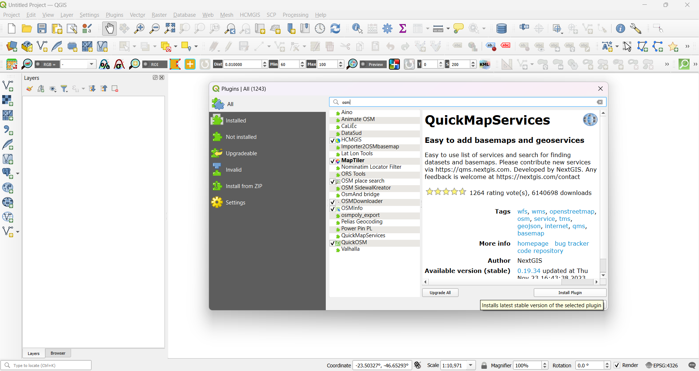

*É só clicar em instalar plugin, caso você ainda não tenha instalado.*

**2º Passo: Encontrando sua cidade**

Com os plugins instalados, habilite o layer do OSM: vá em 'Web' > 'QuickMapServices' > 'OSM' > 'OSM Standard'. O mapa vai carregar na sua tela, e agora é só dar um zoom na cidade ou região que você preferir.

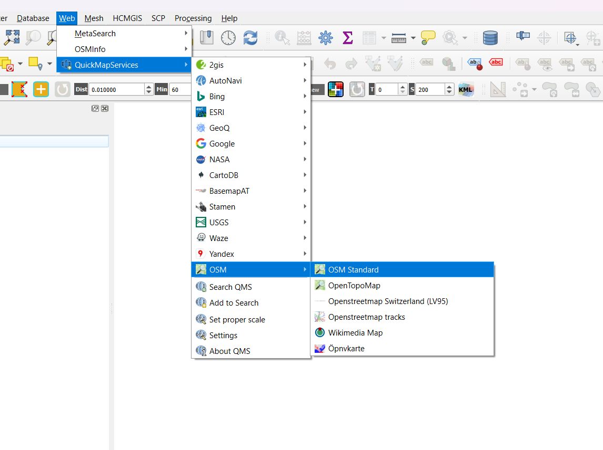

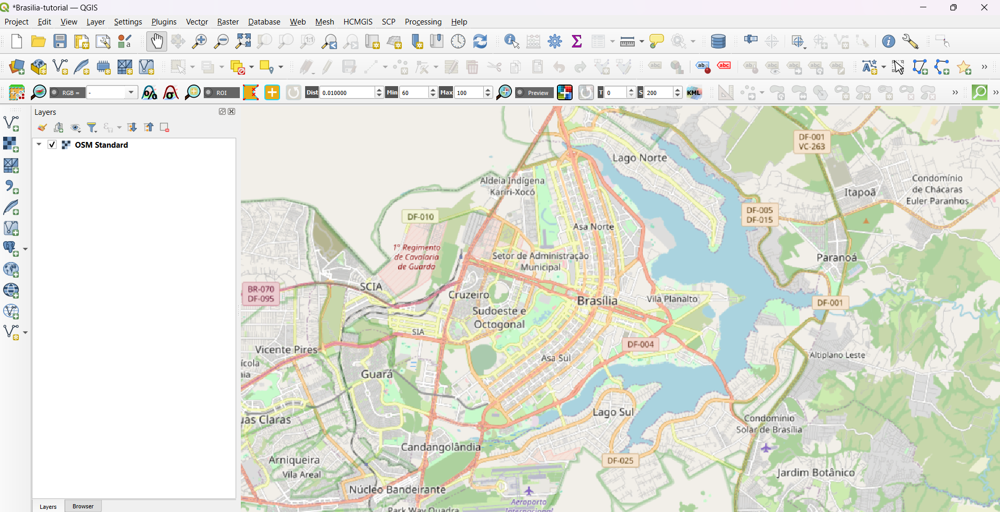

*Localizando Brasília no basemap do OSM.*

**3º Passo: Download**

Com a área foco do projeto posicionada na tela, faça o download dos dados usando o OSM Downloader. Ao clicar, vai aparecer uma cruzinha para desenhar um retângulo delimitando a área de interesse. Crie seu retângulo, escolha um lugar para salvar o arquivo, dê um tick em 'load file after download' e depois OK.

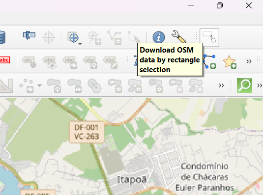

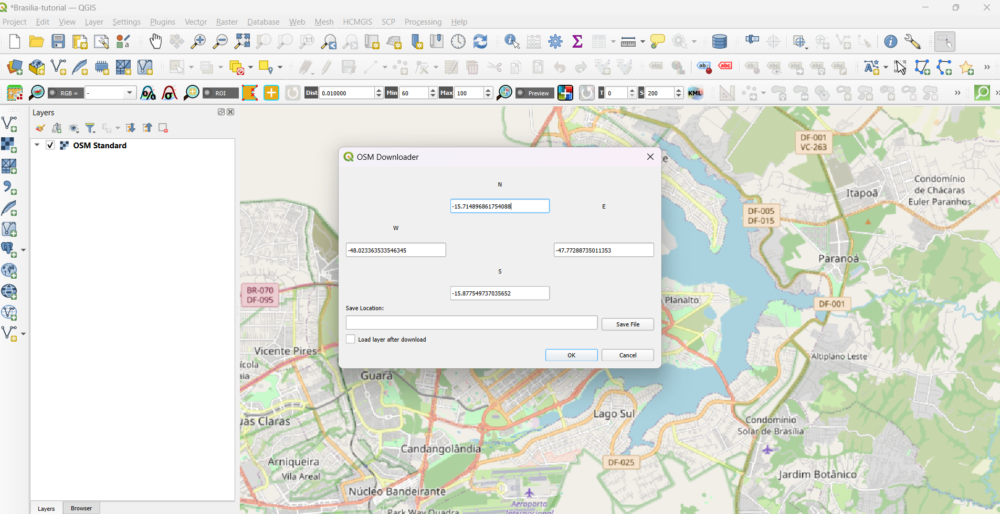

*(lembre de 'desclicar' para sumir a cruzinha)*

**4º Passo: Selecionar os layers**

Depois de carregado, vão aparecer muitos layers. Habilite apenas as camadas que vão ficar bem no mapa — particularmente as linhas do traçado das ruas ou dos prédios. É uma questão de testar o que você acha que vai ficar legal no seu mapa. Uma boa opção é deixar as ruas e corpos hídricos.

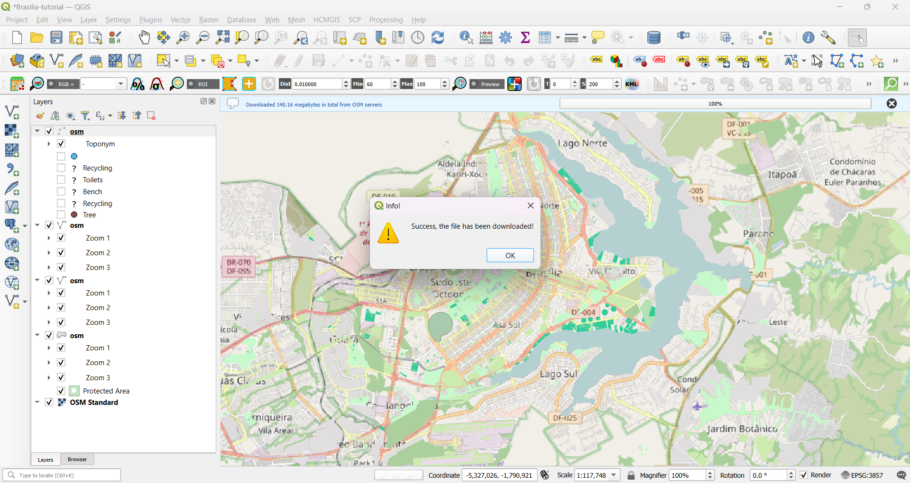

*Aqui dá pra ver as várias camadas que o OSM disponibiliza, para zooms diferentes.*

**5º Passo: Cores!**

Por se tratar de um mapa artístico, a escolha de cores é crucial — e também bastante pessoal. Se você desabilitar o layer original do OSM (seu basemap), vão ficar apenas os corpos hídricos e as linhas/polígonos escolhidos em um fundo branco. Vá em Projeto > Propriedades > Geral para alterar o esquema de cores do fundo do seu mapa.

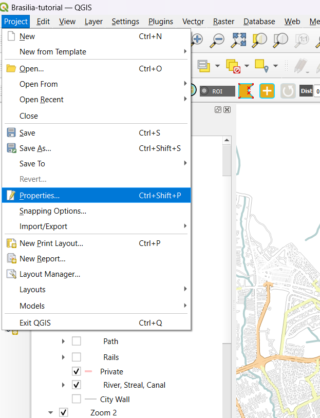

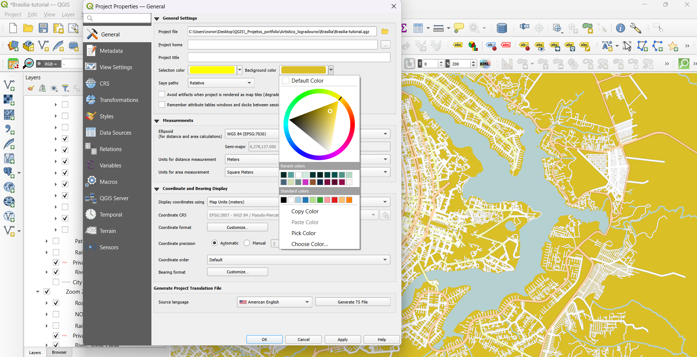

*Primeiro eu tinha escolhido o fundo mostarda, mas depois mudei de ideia. É questão de teste!*

Além da cor do fundo, você precisa escolher as cores que vai deixar no traçado das ruas e outros elementos. Para o mapa de Brasília, foram usadas as cores de um painel do designer Athos Bulcão, que criou várias obras características da cidade.

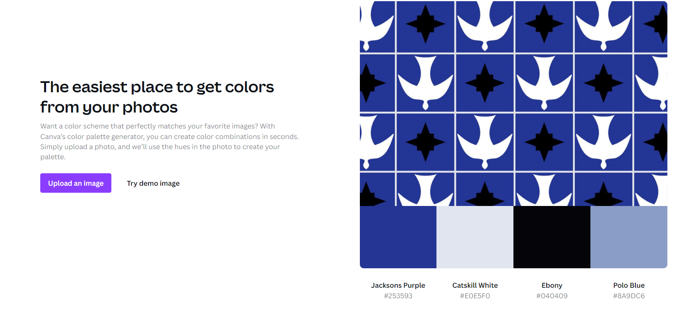

**6º Passo: Layout de impressão**

Crie um novo layout de impressão com uma tela nova — use um tamanho A4 ou A3 com orientação retrato. Para criar bordas, adicione as guias horizontais e verticais a 8 ou 10 mm de distância do limite.

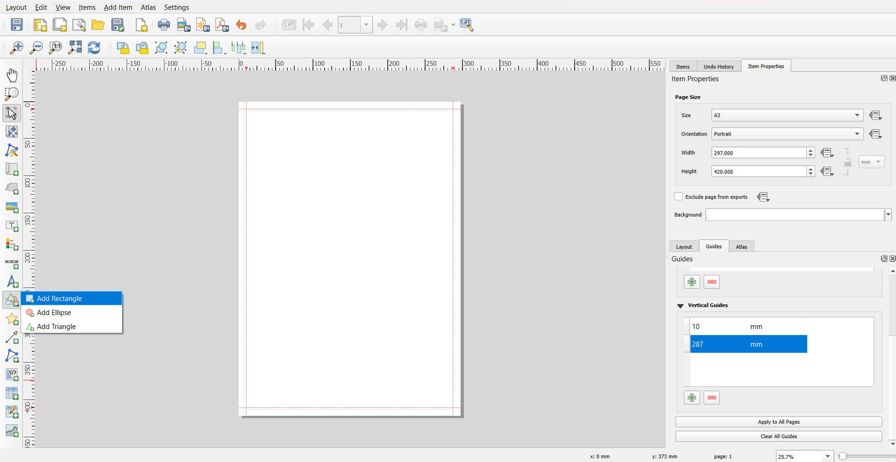

*Página A3 com guias delimitando o quadro que será eu mapa*

Adicione um retângulo grande, que vai ser o frame de todos os elementos do mapa; adicione o mapa e enquadre nesse frame. Depois de posicionado o mapa, adicione mais um retângulo na parte inferior para a legenda. Dentro do retângulo, adicione três caixas de texto: para o nome da cidade, o país e as coordenadas.

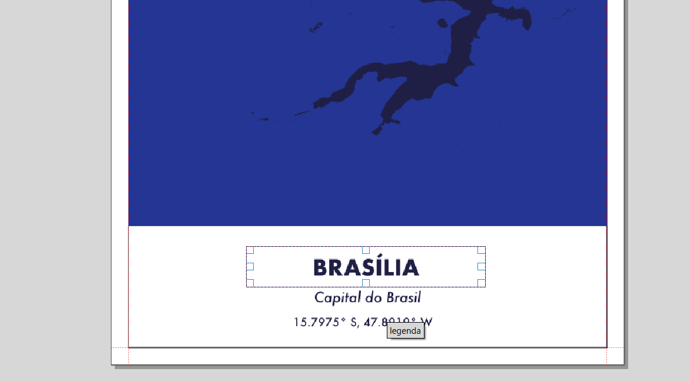

*Aqui o mapa ainda não tinha renderizado as ruas, mas estou configurando o retângulo com minha legenda*

Ajuste e alinhe os textos — escolha o tamanho da fonte, o distanciamento entre os textos e uma fonte bacana (como a Futura, para um clima modernista). Troque também a cor da fonte.

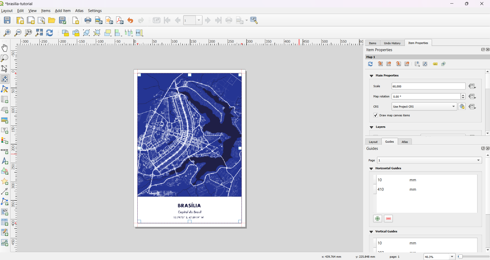

*Esse poderia ser o resultado final, mas ainda vale dar alguns retoques pra criar um estilo próprio, como adicionar algumas bordas e linhas na legenda.*

**Passo bônus: Degradê**

Selecione o retângulo da legenda, vá nas propriedades do item, e clique em estilo. Troque o tipo de preenchimento de 'Simple Fill' para 'Gradient Fill'. Na configuração do gradiente, coloque uma cor branca e a outra completamente transparente. É isso que dá o efeito do branco ficando cada vez mais transparente até sumir.

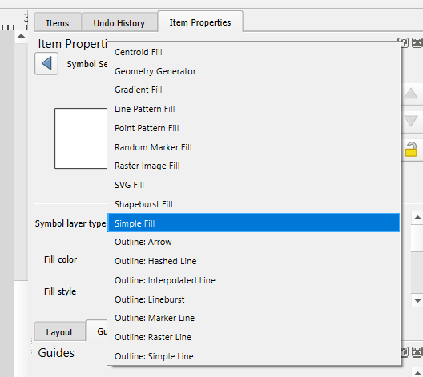

*Aqui estou trocando de 'Simple Fill' (preenchimento simples) para Gradient Fill (preenchimento em gradiente)*

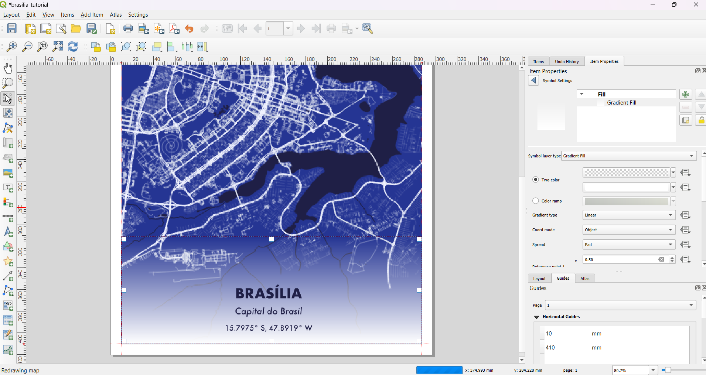

*'Two color' — do branco para o transparente*

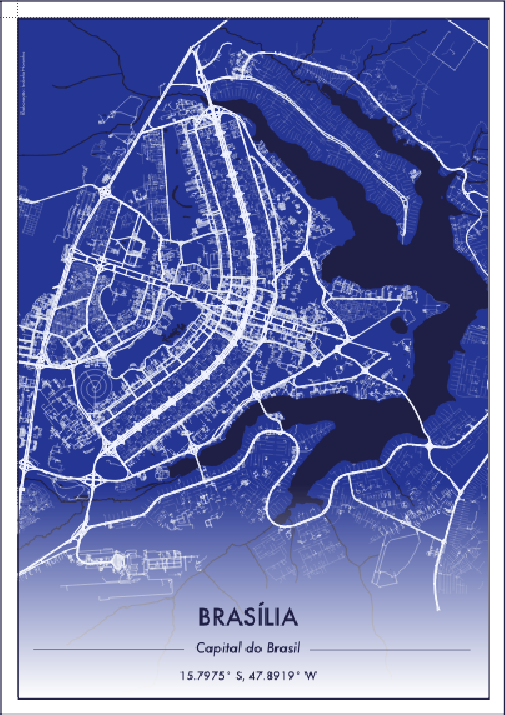

Se for colocar em prática, marque a autora no LinkedIn, ela adora ver as derivações que cada pessoa cria!
