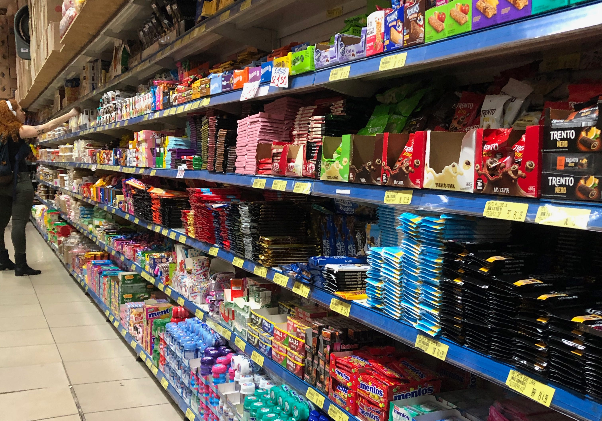
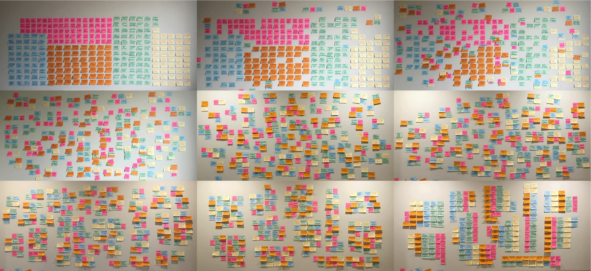
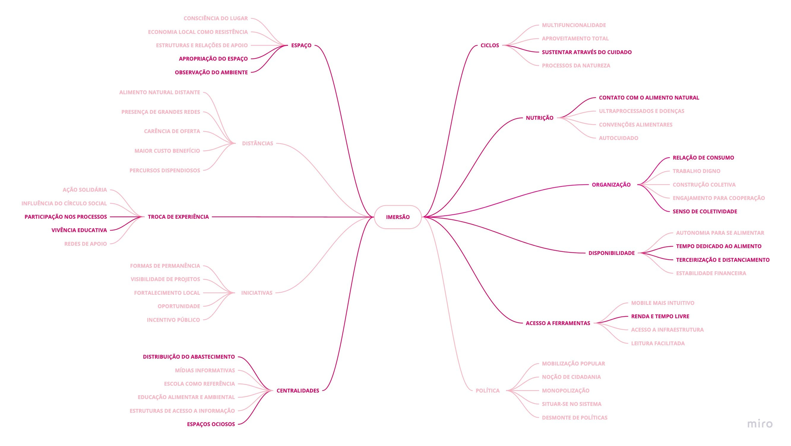
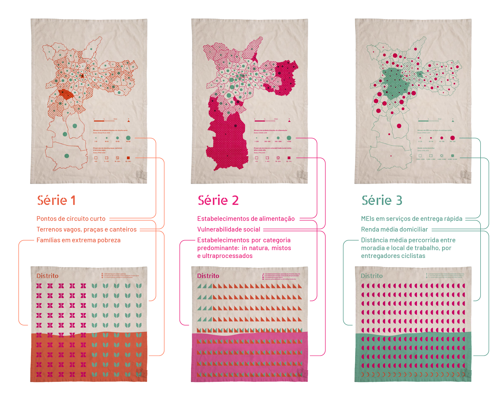
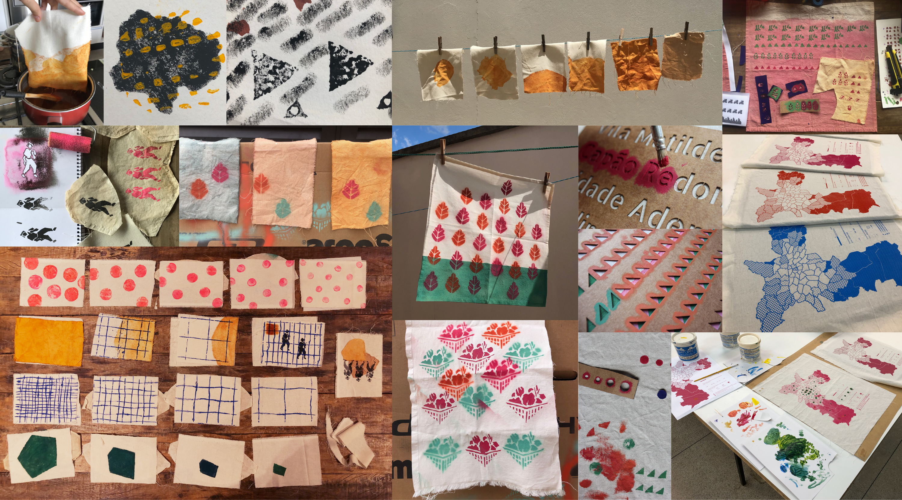
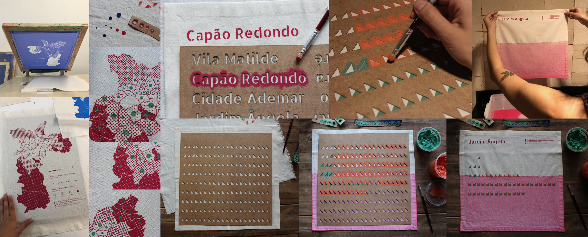
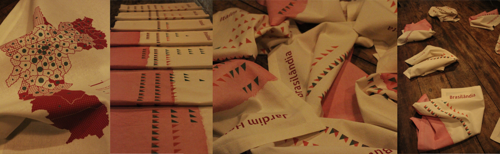
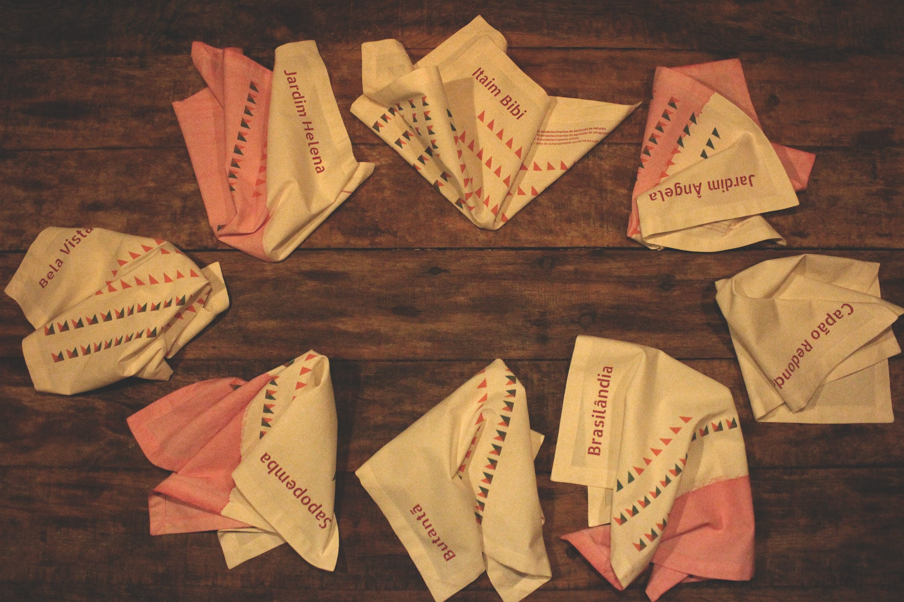

Acredito que para começar um projeto de design da informação seja necessário o envolvimento com múltiplos campos do conhecimento. Desde que tenho discutido sobre segurança alimentar com pessoas à minha volta, não conheço alguém que não tenha se inspirado diante da ideia de transmitir e visibilizar dados relacionados ao tema, pelas mais diversas motivações: planejamento de políticas públicas, conscientização para o consumo responsável, mobilização política, articulação de ações sociais, entre outras possibilidades.

Dados à Mesa é um trabalho final de graduação apresentado em 2020 na Faculdade de Arquitetura e Urbanismo da USP, orientado pelo Prof. Dr. Leandro Velloso. A partir de metodologias do Design da Informação (DI), da Design Research e do Design Centrado no Humano (DCH), foi elaborada uma coleção de estamparia para guardanapos e panos de prato, baseada em dados relacionados ao sistema alimentar na cidade de São Paulo. O objetivo principal era criar uma experiência de contato do cidadão paulistano com a informação disponível em dados abertos.

*Imagem produzida pela autora*

O projeto foi, desde o princípio, orientado pelo DI. O desenho da pesquisa incluiu uma fase preliminar de revisão exploratória de fontes e de imersão no universo do usuário. Desta introdução, seguiu-se para uma modelagem de dados e visualizações. Estas fontes — a análise exploratória de dados e a pesquisa de usuário — alimentaram a etapa de ideação, cuja sequência foi dada pela prototipagem das alternativas geradas.

O contexto que mobilizou as primeiras pesquisas bibliográficas é dado pelo cenário de oferta e consumo em São Paulo. Estar em contato com projetos de desenvolvimento sustentável para a cidade, ao mesmo tempo vivenciando um centro urbano onde a predominância de ultraprocessados é ostensiva diante da classe trabalhadora, suscitou o interesse pela visualização de informação sobre o ambiente alimentar que se estabelece no território e as condições sociais que se relacionam a isso.

*Imagem produzida pela autora*

Em uma abordagem inicial com a visualização de dados, foi realizada uma análise exploratória de dados abertos, coletados de plataformas de instituições públicas e de órgãos independentes que disponibilizaram informações recentes relacionadas ao sistema alimentar — infraestrutura de abastecimento, estabelecimentos comerciais, mercado de trabalho, cobertura vegetal, unidades de produção agrícola, entre outros dados.

Com o objetivo de criar um projeto de DI que se comunicasse com o cidadão paulistano, foi essencial adotar metodologias do DCH. Dessa forma, a etapa de imersão consistiu na realização de entrevistas com usuários que, de diferentes perspectivas, estavam envolvidos com a cadeia da alimentação na cidade de São Paulo. As conversas foram semiestruturadas a fim de observar relações que essas pessoas estabeleciam entre o espaço e a alimentação.

*Diagrama de Afinidades: método de processamento e análise da pesquisa de usuário*

Da imersão resultaram oito categorias temáticas que orientaram um exercício de geração de soluções. As visualizações se estruturam da seguinte forma: três séries temáticas compostas por um mapa municipal e 96 combinações de gráficos que representam cada distrito de São Paulo.

- **Série 1:** apresenta a proporção de terrenos vagos e áreas livres, comparada à quantidade de estabelecimentos em que se pode consumir alimentos no modelo de circuito curto, e ainda à quantidade de famílias em extrema pobreza.
- **Série 2:** apresenta o cenário da oferta no mercado formal de alimentos, comparando estabelecimentos de oferta de ultraprocessados, in natura ou mistos, a áreas em vulnerabilidade social.
- **Série 3:** com um olhar sobre o mercado de trabalho informal, tem-se a renda média domiciliar comparada ao número de microempreendedores individuais na categoria de entrega rápida, e a distância diária percorrida entre moradia e local de trabalho de entregadores ciclistas de aplicativo.

*Categorias resultantes do Diagrama de Afinidades*

*Geração de alternativas por meio de esboços manuais*

Como resultado da ideação tivemos também a definição do suporte. A escolha por um projeto de estamparia se deve a um processo de análise das categorias temáticas, na qual se considerou o pano de prato e os guardanapos como potenciais veículos para a informação, uma vez que o artefato têxtil pode se ambientar em locais de consumo alimentar.

*Experimentação com técnicas de estamparia*

A produção dos protótipos foi imbuída de caráter experimental. No entanto, a prototipagem artesanal provou-se possível e interessante à medida em que institui uma dinâmica de cuidado e sensibilização para com os dados. O tempo que se leva para estampar cada ponto de dado no tecido pode ser entendido como uma dimensão da experiência sensorial para além da visualização.

*Produção de protótipos de alta fidelidade em serigrafia, imersão e stencil*

Uma das reflexões que este trabalho suscita é a de que visualizar dados pressupõe não apenas um sujeito, mas uma interface, e portanto, escolhas de projeto que poderão interferir em sua ambientação. A visualização da informação na estamparia busca trazer à mesa novas camadas de percepção acerca do lugar e do sistema em que um ato cotidiano se situa.

*Imagens produzidas pela autora*

---

*Esse post foi originalmente postado no [Medium do datavizbr](https://medium.com/datavizbr/dados-à-mesa-visualizando-o-sistema-alimentar-da-cidade-de-são-paulo-d4e898049f5) e pode ser encontrado no link acima.*