Este projeto foi feito para a conclusão do curso de design da UNIVATES (Universidade do Vale do Taquari), e como alguns dos trabalhos de conclusão de curso, gostaria que ele fosse utilizado para revelar um pouco das ambições, vontades e preferências do autor, pois a bagagem emocional e física que alguém carrega inevitavelmente influencia, consciente ou inconscientemente, o que esse indivíduo produz, portanto, ninguém faz design sozinho. No caso deste TCC, embora tenha sido concebido de forma consciente, seus aspectos mais humanos e significativos emergem do inconsciente, refletindo meu histórico pessoal com as cheias do Vale do Taquari, no Rio Grande do Sul. Minha avó, meus pais e minhas irmãs vivenciaram inúmeras enchentes até conseguirem se mudar, e, ao contrário do que muitos imaginam, essas ocorrências na região são quase anuais, mas, por terem proporções menores e afetarem menos pessoas, raramente ganham destaque na mídia.

Por isso, optei por criar um trabalho que extrapolasse os limites da infografia tradicional, integrando dimensões cognitivas, afetivas e socioculturais, contribuindo tanto para o campo acadêmico quanto para o debate público sobre gestão de risco, memória coletiva e justiça climática. Adotei a metodologia proposta por Medeiros (2021), que combina princípios da infografia tradicional com o desenvolvimento de produtos digitais, escolhida por sua adequação à prototipação no Figma e à natureza digital da proposta, inspirada em projetos de nomes de referência na visualização de dados como Vinicius Sueiro, Café.art e Odd Studio.

O projeto começou com a pesquisa documental (desk research), na qual houve a coleta, análise e organização de dados preexistentes de fontes secundárias, como relatórios, artigos, notícias, dados governamentais e bases estatísticas, sendo essencial para compreender o contexto de forma rápida e com baixo custo. Para o trabalho, foram utilizadas quatro fontes principais, que reúnem dados georreferenciados e mapas interativos sobre os impactos das enchentes de maio de 2024, integrando informações físicas, territoriais, sociais e institucionais, além de registros visuais e dados sobre infraestrutura e abrigos. Incluem também documentos técnicos com estimativas de população afetada, perdas econômicas, impactos no setor agropecuário e análises setoriais, bem como estudos abrangentes que mensuram danos físicos, econômicos, sociais e ambientais.
Após a desk research, seguiu-se com a Matriz CSD (Certezas, Suposições e Dúvidas) para organizar conhecimentos, hipóteses e lacunas de informação em contextos complexos, como pode ser visto na figura 1.

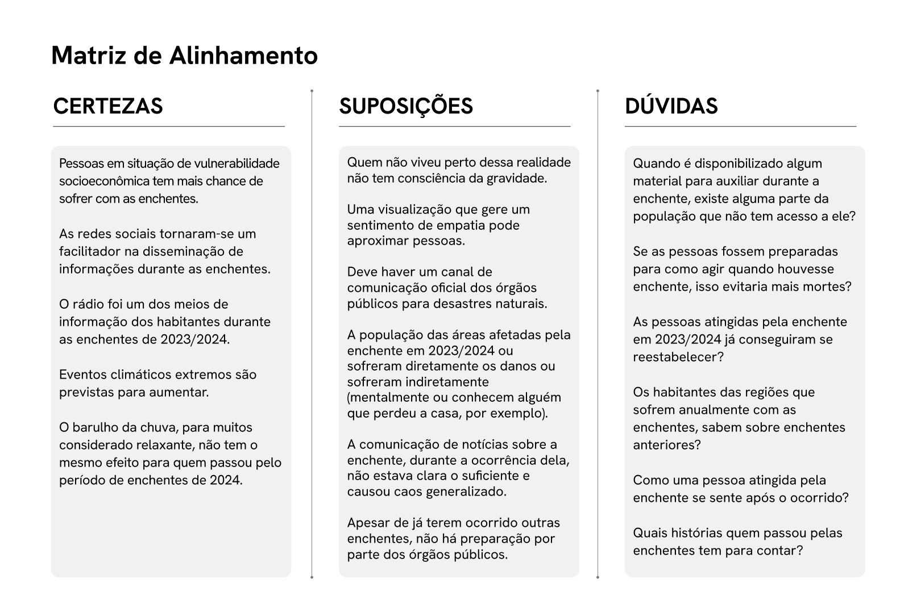
*Figura 1: Matriz de Alinhamento CSD. Fonte: A autora.*

Conforme a metodologia de Medeiros (2021) para entendimento do contexto do trabalho também foi produzido um Mapa de Atores (Figura 2), sendo que a aplicação do mapa permitiu identificar claramente os envolvidos no contexto das enchentes e serviu como base para a criação das Personas do projeto.

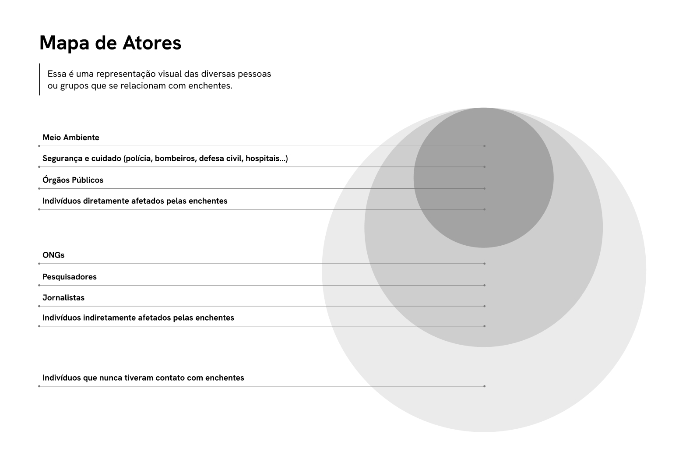
*Figura 2: Mapa de Atores. Fonte: A autora.*

Partindo do Mapa de Atores, surgiram as Personas, que representam os públicos potenciais do projeto e suas diferentes vivências oferecem perspectivas diversas sobre as enchentes, influenciando a forma como os dados são percebidos e interpretados. Foram criadas duas Personas: Ester (Figura 3), jovem diretamente afetada, que enfrenta perdas materiais e emocionais, instabilidade nos estudos e nas finanças, e busca por apoio institucional. Ela representa a fragilidade de jovens que precisam conciliar trauma e continuidade da vida, ressaltando a importância do amparo psicossocial, da comunicação eficiente com órgãos públicos e da segurança habitacional. Michel (Figura 4), por outro lado, vive fora da área de risco e foi sensibilizado pela mídia, mas enfrenta desinformação, desconfiança em campanhas de doação e falta de canais oficiais unificados. Ele evidencia a necessidade de mais transparência e acesso à informação, além do potencial de engajamento da sociedade civil.

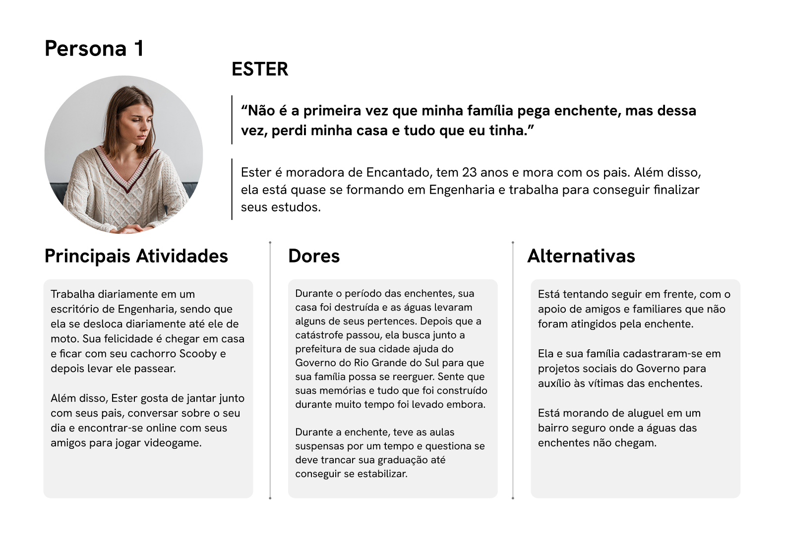
*Figura 3: Persona 1. Fonte: A autora.*

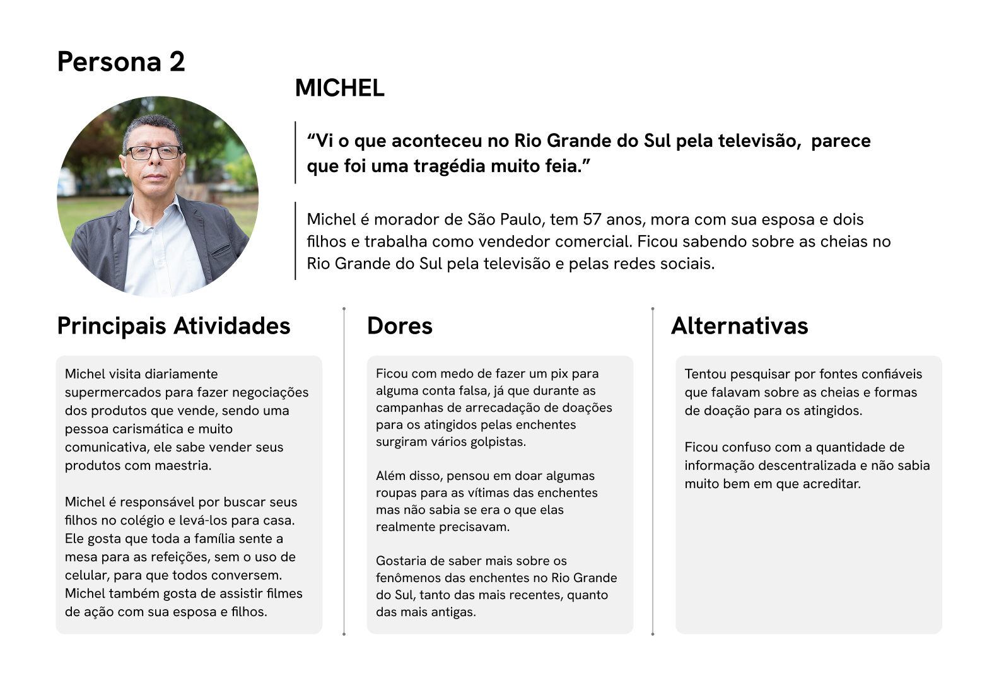
*Figura 4: Persona 2. Fonte: A autora.*

A Análise de Similares também foi utilizada na etapa de pesquisa pois foram investigadas plataformas ou experiências semelhantes ao projeto em desenvolvimento, com o objetivo de identificar boas práticas, padrões de interação eficazes, recursos visuais impactantes e lacunas a serem melhoradas. No trabalho, foram estudadas três experiências digitais, Paths in Education (2025), Simulação mostra quais crianças são adotadas (e quais não são) no Brasil (2019) e Afghanistan20 (2025), para entender como apresentar dados complexos de forma acessível, empática e funcional. Essas plataformas utilizam metáforas visuais e depoimentos reais para aumentar o engajamento e aprofundar a compreensão. Também aplicam recursos interativos coerentes com suas narrativas, como mapas comparativos, simulações e infográficos temporais, garantindo compreensão ativa e navegação fluida. A partir disso, retomou-se a Desk Research, selecionando informações relevantes de diferentes fontes para serem tratadas junto à produção do protótipo.

No trabalho, seguindo a metodologia de Medeiros (2021), foram aplicados dois tipos complementares: o Moodboard de Referências Visuais e o Moodboard de Referências Simbólicas. O primeiro (Figura 5) reuniu elementos formais, tipográficos e gráficos ligados à visualização de dados, arquivos documentais, estética digital retrô e camadas de informação, servindo de base para o estilo visual, definição de paleta, uso de grids, hierarquia tipográfica e layout. Essas referências ajudaram a construir uma linguagem voltada a temas como memória, burocracia e sobreposição de vozes.

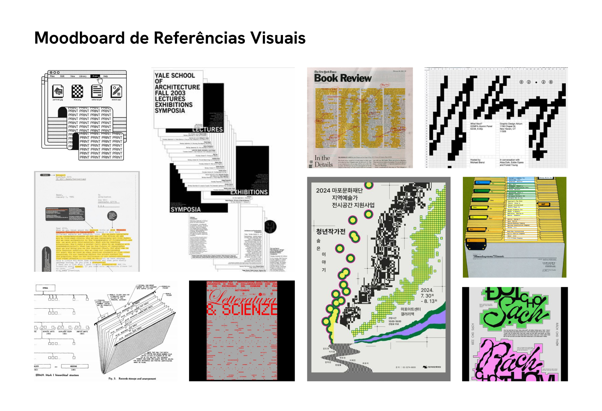
*Figura 5: Moodboard de Referências Visuais. Fonte: A autora.*

O Moodboard de Referências Simbólicas (Figura 6), de caráter mais conceitual e narrativo, apresentou imagens relacionadas a cartografia, seccionamentos geológicos, diagramas científicos e visualizações topográficas históricas. Esses elementos exploram ideias de tempo, profundidade e estratificação, representando vivências humanas, traumas e impactos socioambientais.

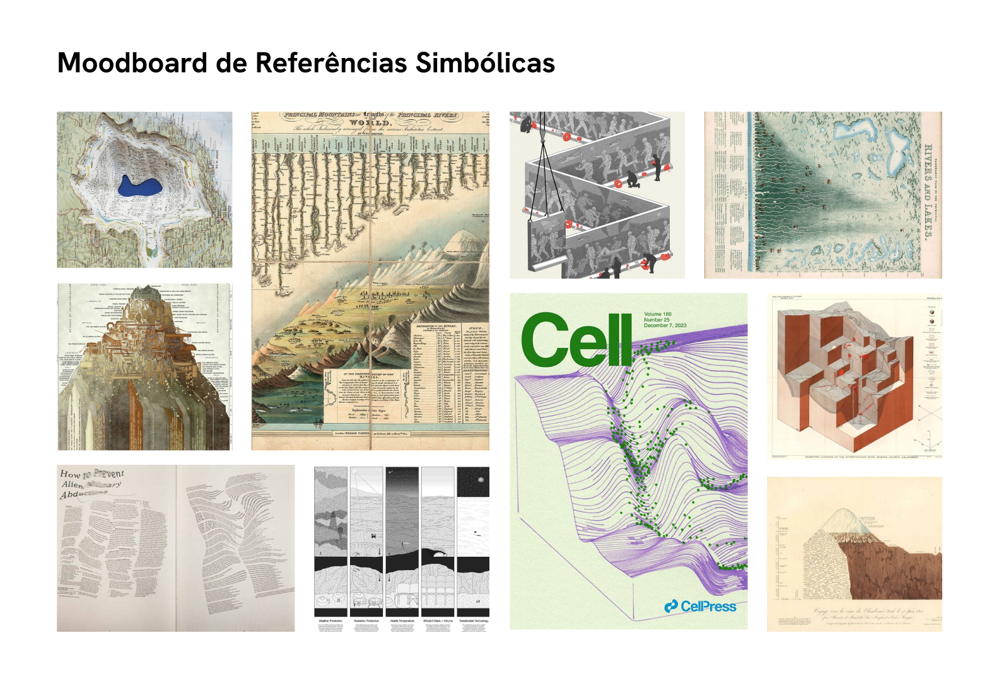
*Figura 6: Moodboard de Referências Simbólicas. Fonte: A autora.*

Com dois ricos Moodboards produzidos, iniciou-se a identidade visual (Figura 7)l, que foi desenvolvida para expressar clareza informacional, sensibilidade estética e coerência temática, alinhando forma e conteúdo ao objetivo de representar dados sensíveis sobre as enchentes no Rio Grande do Sul com empatia, acessibilidade e engajamento crítico. Isso pode ser visto na  paleta cromática parte de uma base neutra, fundo cinza claro e texto preto, para garantir conforto e limpeza visual. As cores, semelhantes às de marca-texto fluorescente, remetem intencionalmente ao visual de arquivos e documentos.

A tipografia sans-serif garante legibilidade e modernidade, com títulos grandes, pesados e, em caixa alta, para hierarquia e destaque. Textos corridos usam peso regular e alinhamento à esquerda para fluidez. Em trechos históricos, fontes monoespaçadas ou datilografadas remetem a documentos antigos, reforçando o caráter de arquivo e memória.

Nos elementos gráficos, a simplicidade se une à simbologia: infográficos modulares representam dados quantitativos; blocos isométricos expressam impactos físicos; carimbos e selos evocam censura, urgência e reconstrução. As metáforas visuais, derivadas do Moodboard de Símbolos, traduzem conceitos abstratos como dor, deslocamento e resistência em formas reconhecíveis, fissuras, rachaduras, manchas e carimbos, conectando dados objetivos às experiências subjetivas.

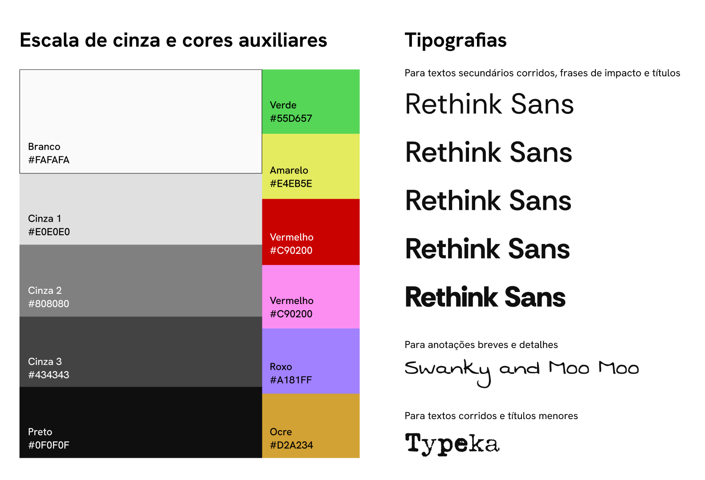
*Figura 7: Identidade Visual. Fonte: A autora.*

Após os elementos da identidade visual serem pensados, iniciou-se a produção do Guia de Estilo no Figma para gráficos, que foi elaborado para assegurar coesão estética, clareza informativa e alinhamento conceitual à identidade visual do projeto, traduzindo os princípios definidos no moodboard em um sistema visual unificado. Mas antes de iniciar, de fato, a prototipação no campo digital, optou-se pela prototipação em papel, como pode ser visto nas Figuras 8, 9 e 10, uma etapa inicial fundamental no desenvolvimento de produtos. Essa prática possibilita transformar ideias abstratas em representações rápidas e acessíveis, facilitando discussões e ajustes ainda nas fases conceituais do projeto.

Mais do que um exercício estético, o desenho desempenha um papel estratégico no raciocínio projetual, como destaca Giorgia Lupi (2016), ao afirmar que o ato de desenhar se torna design quando organiza visualmente pensamentos, ajuda a estruturar soluções e apoia o planejamento e as escolhas feitas durante o desenvolvimento.

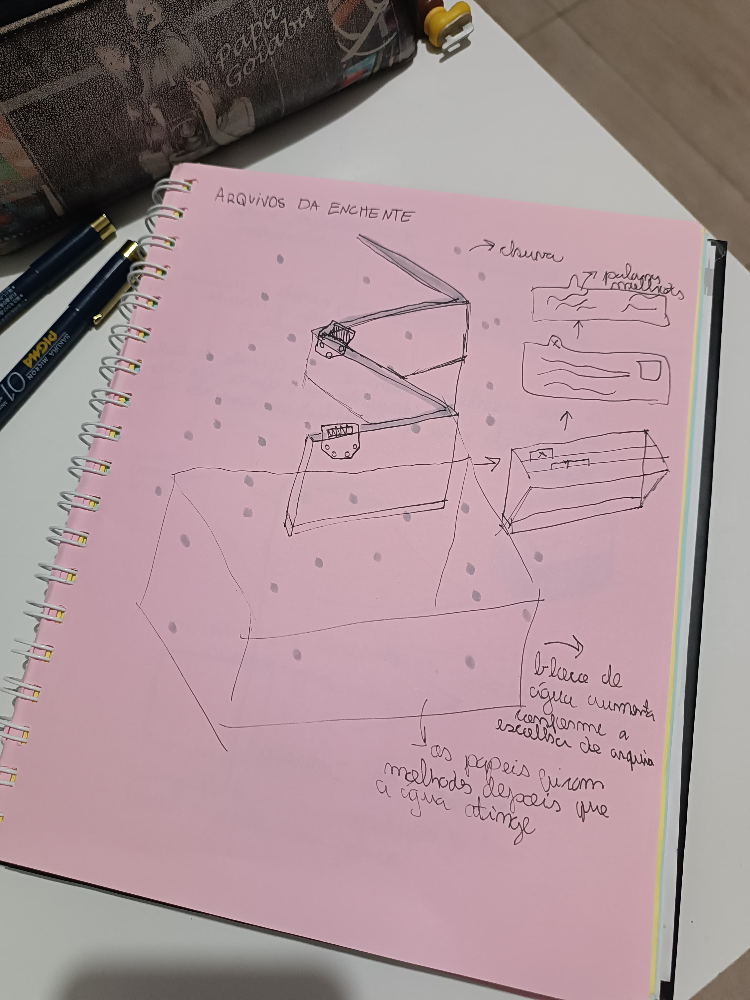
*Figura 8: Prototipação em papel. Fonte: A autora.*

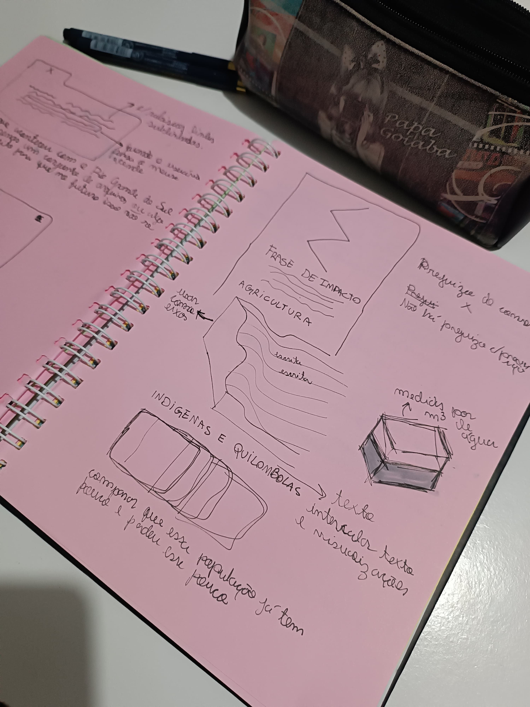
*Figura 9: Prototipação em papel. Fonte: A autora.*

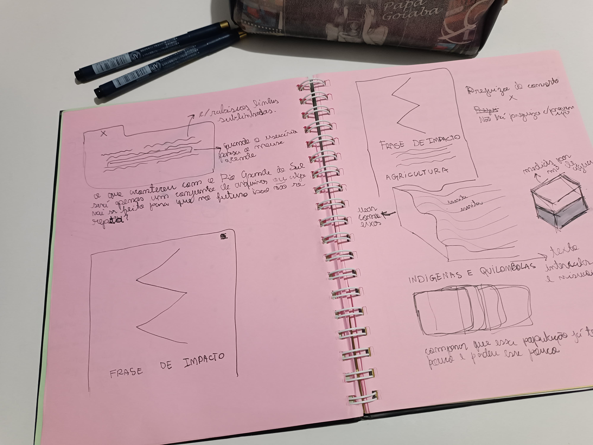
*Figura 10: Prototipação em papel. Fonte: A autora.*

Finalmente, com as informações julgadas importantes e o protótipo em papel feito, foram retomados os documentos trabalhados nas fases de brainstorming, investigação e análise de dados, a partir dos quais foram definidas as principais temáticas: histórico de cheias no Rio Grande do Sul, cronologia das enchentes de 2024, recorte de gênero nos abrigos, povos originários e quilombolas, e meio ambiente. Essa fase marcou a transformação dos dados brutos em narrativas visuais e informativas, tornando-os mais acessíveis, emocionalmente significativos e alinhados à proposta do projeto.

Na sequência, foi desenvolvido o Wireframe no Figma, protótipo visual de baixa fidelidade que define a estrutura, hierarquia informacional, localização de componentes e fluxos de navegação, sem detalhar a identidade visual. No projeto, ele foi essencial para antecipar a navegação e organização dos infográficos, adotando navegação horizontal para favorecer a narrativa e fluidez do storytelling. A última etapa do projeto foi o protótipo funcional, feito no Figma, como pode ser visto nas figuras 11 a 19, com as telas produzidas.

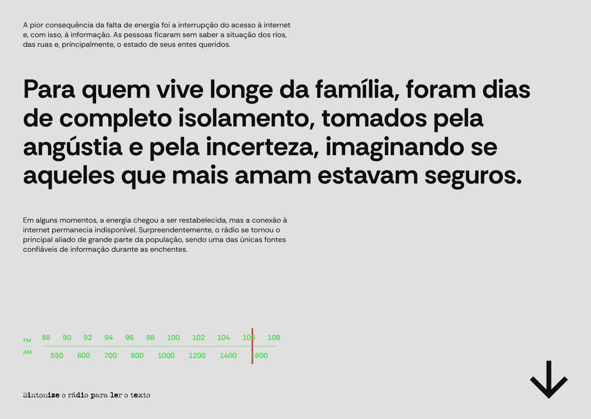
*Figura 11: Tela que faz alusão ao único ponto de contato de muitas pessoas, durante as enchentes de 2024, ser o radio. Fonte: A autora.*

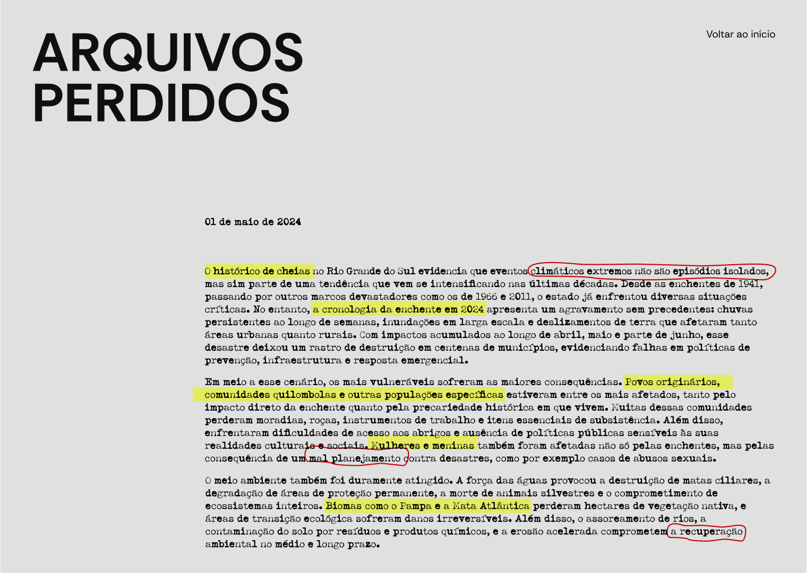
*Figura 12: Menu. Fonte: A autora.*

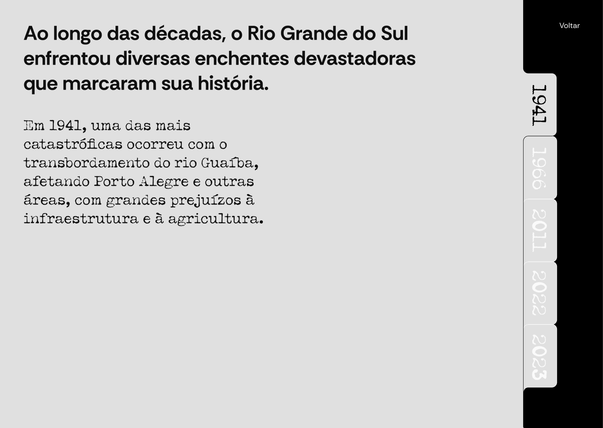
*Figura 13: Cronologia das maiores enchentes do Rio Grande do Sul. Fonte: A autora.*

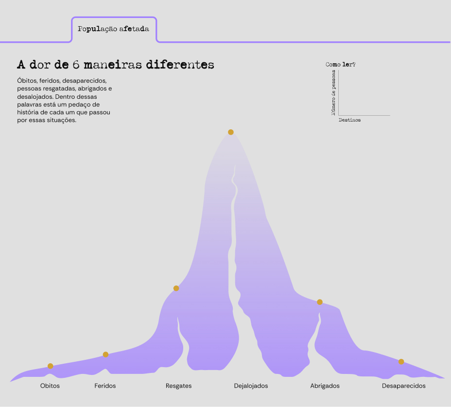
*Figura 14: Gráfico que mostra como a população foi afetada. Fonte: A autora.*

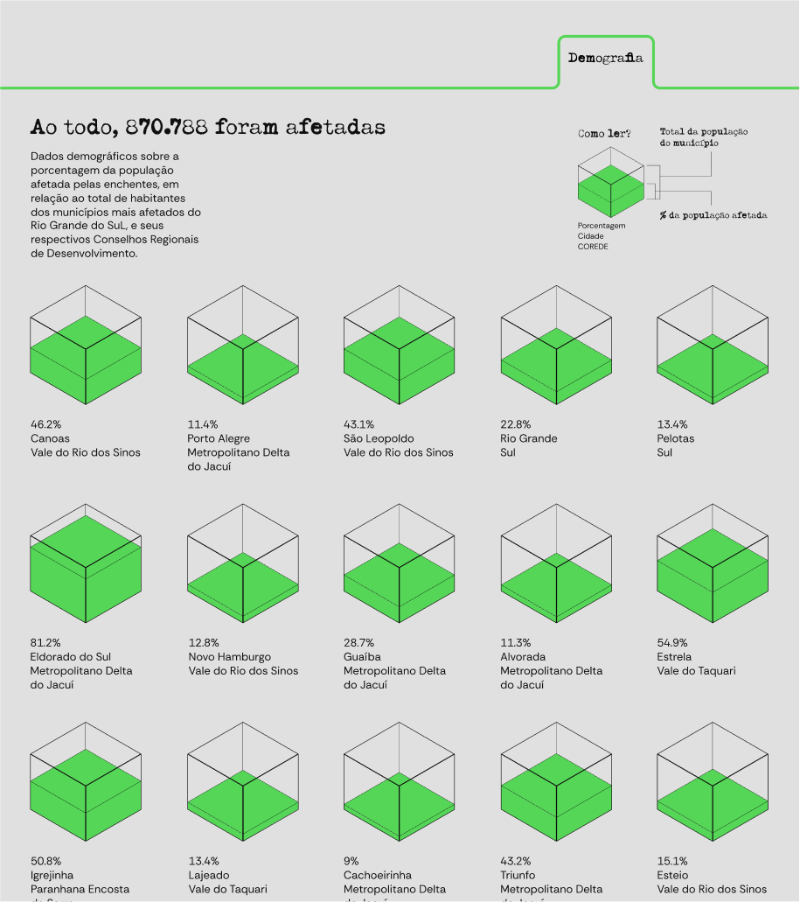
*Figura 15: Gráfico das cidades mais atingidas. Fonte: A autora.*

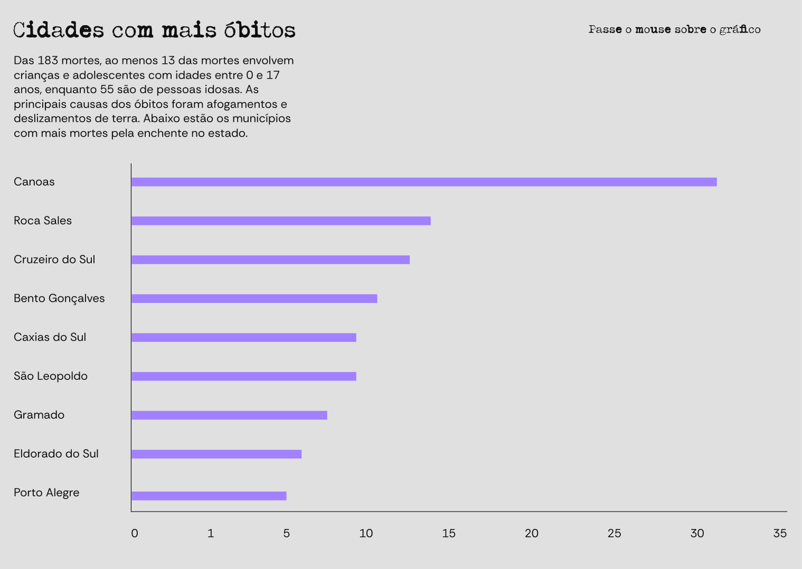
*Figura 16: Gráfico das cidades com mais óbitos. Fonte: A autora.*

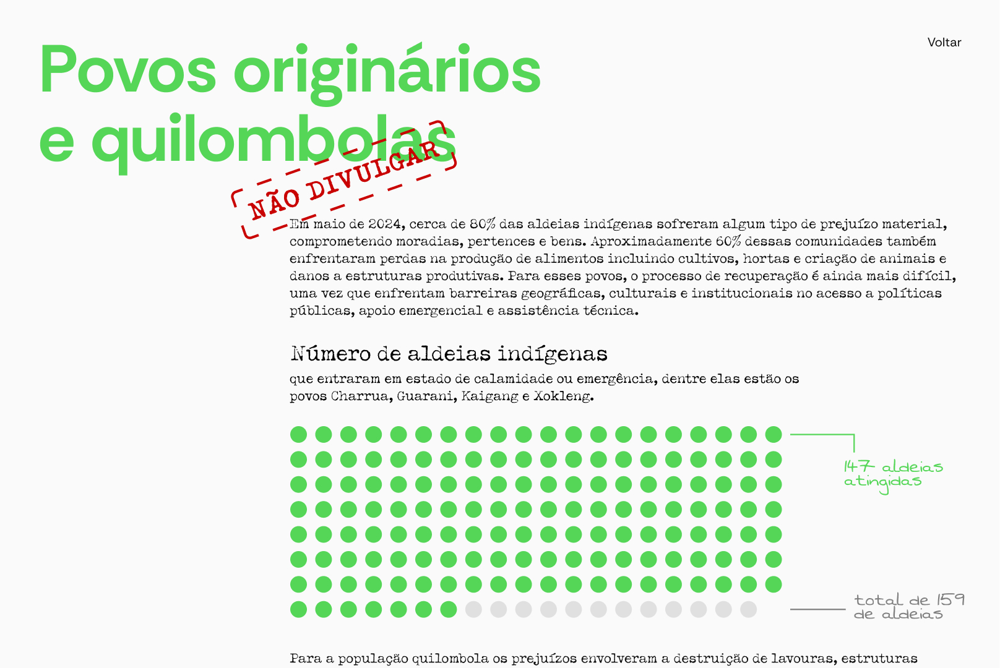
*Figura 17: Tela designada para povos originários e quilombolas. Fonte: A autora.*

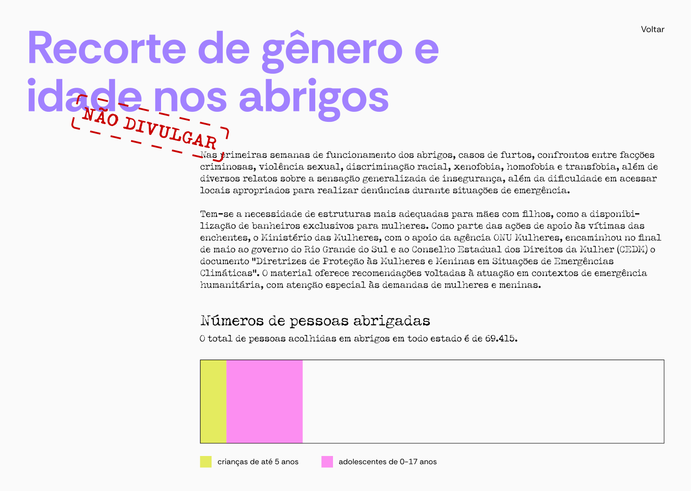
*Figura 18: Tela designada para recorte de gênero. Fonte: A autora.*

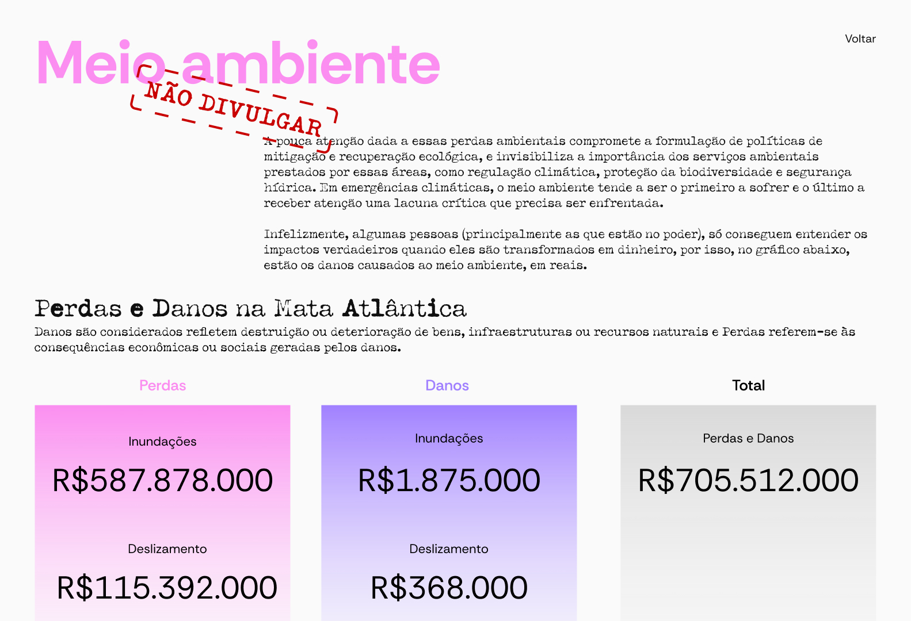
*Figura 19: Tela designada para questões relacionadas ao meio ambiente. Fonte: A autora.*

Como experiência futura, planeja-se levar este trabalho de conclusão de curso também para meios físicos, como revistas e jornais, a fim de testar a representação de dados deste tópico em outras mídias. Além disso, como mencionado anteriormente, acredito que ninguém faz design sozinho e embora desafiador, o desejo de continuar transbordando dados com propósito e sensibilidade permanece sendo o fio condutor dessa jornada.

*Referências*
- BECKER, Marina Sartori. Dados que transbordam: Design de informação aplicado à representação visual das enchentes. Trabalho de Conclusão de Curso II - Curso de Design, Universidade do Vale do Taquari, Lajeado/RS, Brasil.
- EMERGENCY. Afghanistan20: Twenty Years of War. EMERGENCY, [s.l.], [s.d.]. Disponível em: https://afghanistan20.emergency.it/en/#victims-the-worst-place-to-be-a-child. Acesso em: 5 abr. 2025.
- LAGO, Paula. Paths in Education. Shorthand Stories, 2023. Disponível em: https://paths-in-education.shorthandstories.com/3d7629a5-8b32-4c77-9532-7ea48135ced7/. Acesso em: 5 abr. 2025.
- MARQUES, Júlia; CUNHA, Mariana; SUEIRO, Vinicius. Simulação mostra quais crianças são adotadas (e quais não são) no Brasil. Estadão, São Paulo, 10 ago. 2019. Disponível em: https://arte.estadao.com.br/brasil/adocao/criancas/. Acesso em: 5 abr. 2025.
- MEDEIROS, Rodrigo Pessoa. Proposta metodológica para disciplinas de projeto de visualização de dados. In: Giannella, Júlia Rabbetti; Medeiros, Rodrigo Pessoa (org.). Dataviz em perspectiva: ensino e prática profissional da visualização de dados no design brasileiro. Rio de Janeiro: Rio Books, 2023, p. 109-130.