*Nem todo mundo enxerga as cores da mesma maneira e é preciso levar isso em conta na hora de criar gráficos, tabelas e mapas.*

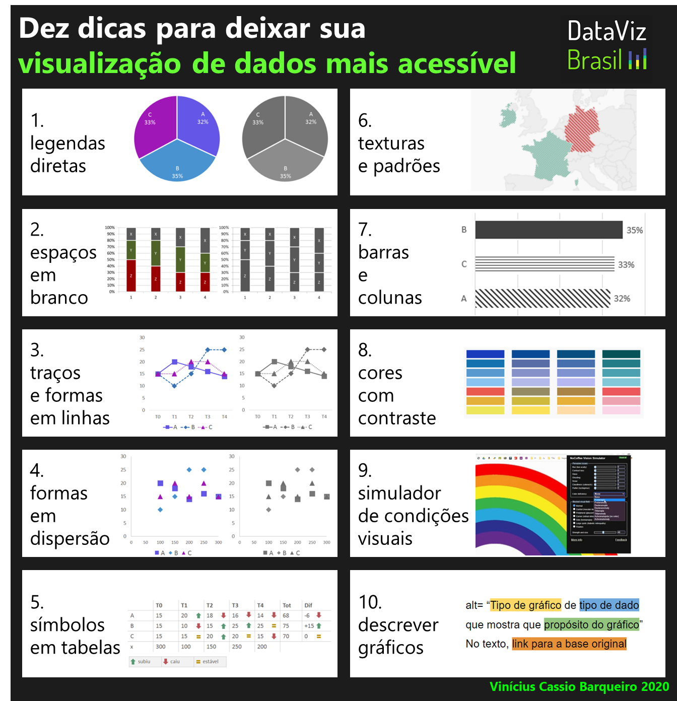

*Descrição: infográfico que resume as dez dicas apresentadas no artigo.*

Nem todo mundo enxerga as cores da mesma maneira e é preciso levar isso em conta na hora de criar visualizações de dados, como gráficos, tabelas e mapas. Um motivo são os diferentes tipos de daltonismo — dificuldade em distinguir cores que pode se apresentar em um a cada 12 homens (8%) e uma a cada 200 mulheres (0,5%).

**1. Faça legendas diretas**

Em gráficos, costumamos distinguir séries por meio de cores e legenda à parte. Com legendas diretas, conseguimos perceber as informações independentemente das cores.

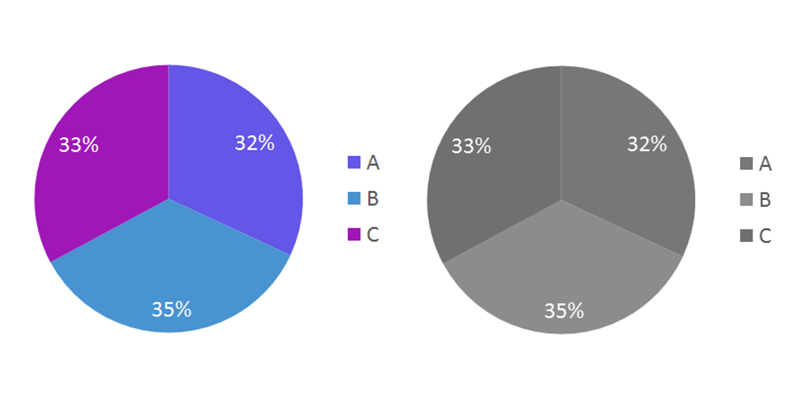

*Descrição: À esquerda, um gráfico de pizza com três séries representadas com cores parecidas e legendas à parte. À direta, no mesmo gráfico em preto e branco, fica difícil associar a legenda às cores do gráfico. Autoria própria.*

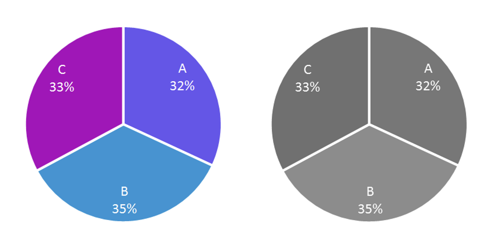

*Descrição: À esquerda, um gráfico de pizza com três séries representadas com cores parecidas e legendas diretas. À direta, no mesmo gráfico em preto e branco, as legendas diretas permitem distinguir as séries. Autoria própria.*

**2. Use espaços em branco**

Mesmo com legendas diretas, nem sempre é possível perceber a diferença entre as séries. Podemos incluir espaços em branco entre as séries para facilitar a distinção.

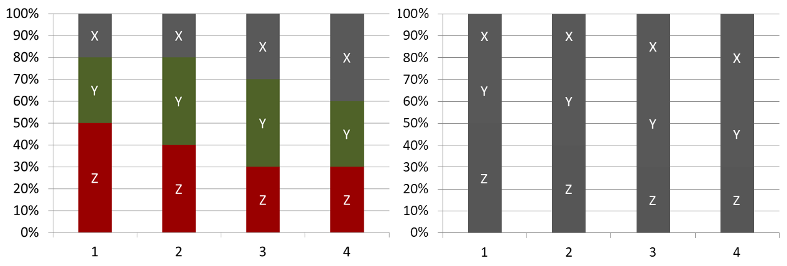

*Descrição: À esquerda, um gráfico de colunas que mostra o percentual de três séries com cores parecidas. À direita, no mesmo gráfico em preto e branco, não é possível distinguir as fronteiras entre cada série. Autoria própria.*

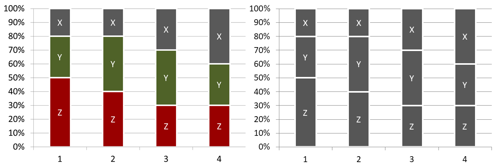

*Descrição: À esquerda, um gráfico de colunas que mostra o percentual de três séries com cores parecidas, separadas por um contorno branco. À direita, no mesmo gráfico em preto e branco, o contorno branco permite distinguir as séries. Autoria própria.*

**3. Varie traços e use formas em gráficos de linha**

Se distinguimos as séries apenas por cor, as informações podem se perder. Podemos variar os traços e usar formas (quadrado, losango, triângulo) para facilitar a distinção.

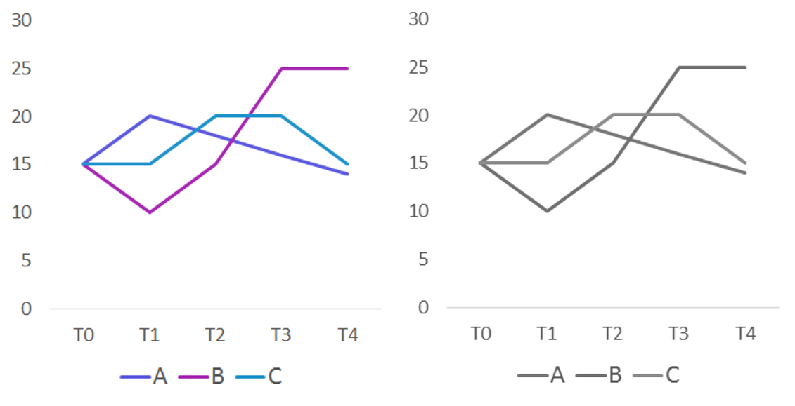

*Descrição: à esquerda um gráfico de linhas com três séries representadas por cores parecidas e legendas à parte. À direta, no mesmo gráfico em preto e branco, não é possível associar a legenda às cores do gráfico. Autoria própria.*

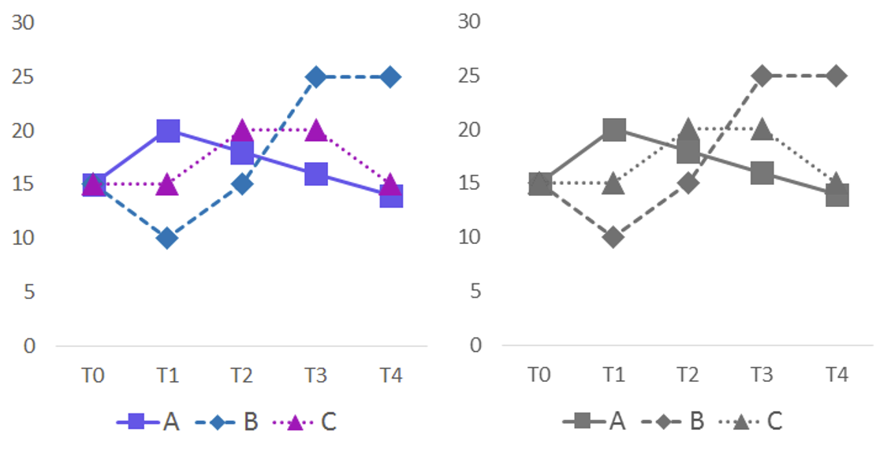

*Descrição: à esquerda um gráfico de linhas com três séries representadas por cores parecidas; cada série tem um padrão de traço e formas nos pontos (quadrado, losango, triângulo). À direta, no mesmo gráfico em preto e branco, os traços e formas ajudam a distinguir as séries. Autoria própria.*

**4. Use formas em gráficos de dispersão**

Em gráficos de dispersão, podemos usar formas diferentes para cada série, facilitando a distinção mesmo em preto e branco.

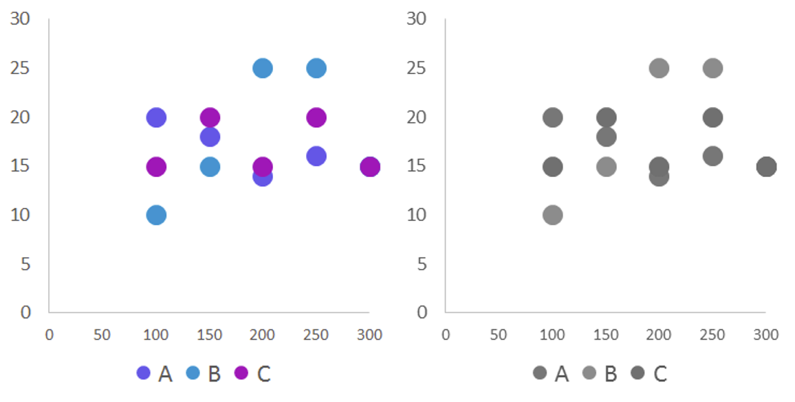

*Descrição: à esquerda, um gráfico de dispersão com três séries representadas por cores parecidas e círculos idênticos. À direita, no mesmo gráfico em preto e branco, não possível distinguir as séries. Autoria própria.*

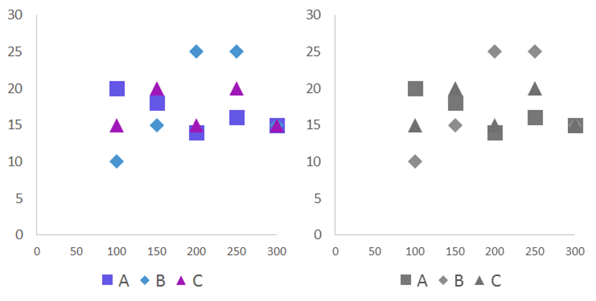

*Descrição: à esquerda, um gráfico de dispersão com três séries representadas por cores parecidas e formas diferentes (quadrado, losango, triângulo). À direita, no mesmo gráfico em preto e branco, não possível distinguir as séries. Autoria própria.*

**5. Use símbolos em tabelas**

Quando usamos símbolos em tabelas (seta para cima, seta para baixo, sinal de igual), conseguimos perceber as informações independentemente das cores.

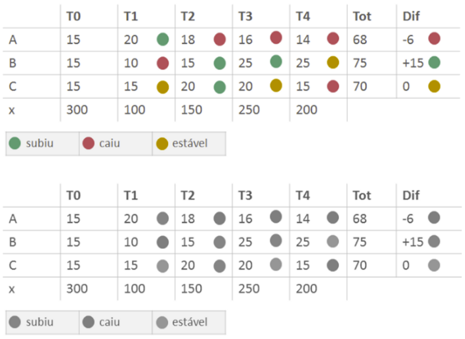

*Acima, uma tabela com círculos em tons de verde, vermelho e amarelo que sinalizam se os valores subiram, caíram ou se mantiveram estáveis. Abaixo, na mesma tabela em preto e branco, não é possível distinguir os círculos. Autoria própria.*

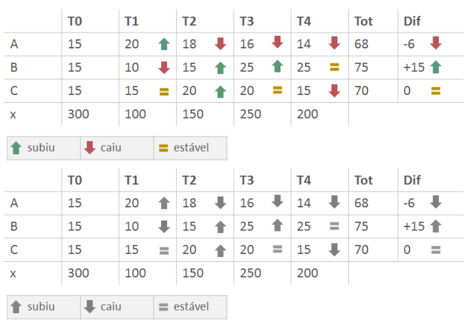

*Acima, uma tabela com símbolos em tons de verde, vermelho e amarelo que sinalizam se os valores subiram (seta para cima), caíram (seta para baixo) ou se mantiveram estáveis (sinal de igual). Abaixo, na mesma tabela em preto e branco, os símbolos ajudam a distinguir as categorias. Autoria própria.*

**6. Use padrões e texturas em gráficos e mapas**

Uma alternativa às cores pode ser o uso de texturas e padrões, como listras de diferentes posições.

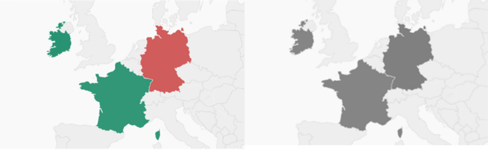

*Descrição: À esquerda, um mapa da Europa com regiões destacadas em tons de verde e vermelho. À direita, no mesmo mapa em preto e branco, não é possível distinguir as duas cores. Imagem adaptada do blog Chartable, do Datawrapper.*

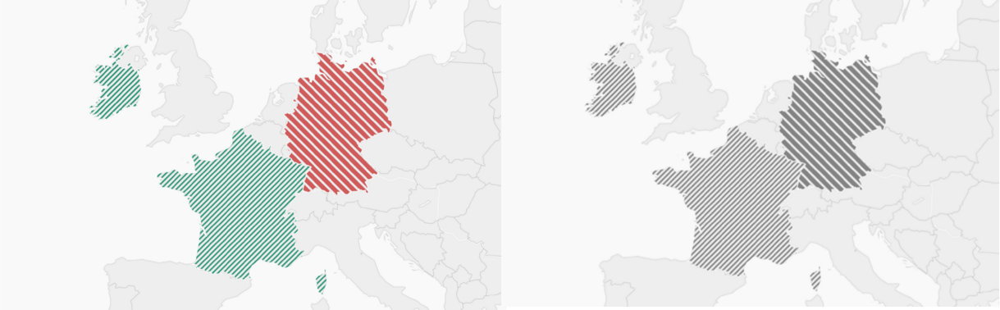

*Descrição: À esquerda, um mapa da Europa com regiões destacadas em tons de verde e vermelho, cada uma com padrão de listras em direções opostas. À direita, no mesmo mapa em preto e branco, o padrão de listras permite distinguir as regiões. Imagem adaptada do blog Chartable, do Datawrapper.*

**7. Use gráficos de barras e de colunas**

Geralmente um bom gráfico de barras ou de colunas substitui outros gráficos sem precisar de cores e legendas. O gráfico de pizza pode ser um gráfico de barras. O gráfico de linhas pode ser substituído por um conjunto de gráficos de colunas.

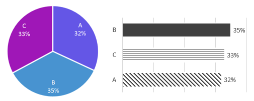

*Descrição: à esquerda, um gráfico de pizza com três séries: A (32%), B (35%) e C (33%). À direita, os mesmos dados são mostrados em um gráfico de barras em preto e branco, com padrões de listras diferentes e ordenação das barras do maior (B) para o menor (A). Autoria própria.*

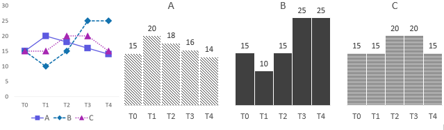

*Descrição: à esquerda, um gráfico de linhas com três séries. À direita, os mesmos dados são mostrados por três conjuntos de gráficos de colunas em preto e branco, um para cada série. Autoria própria.*

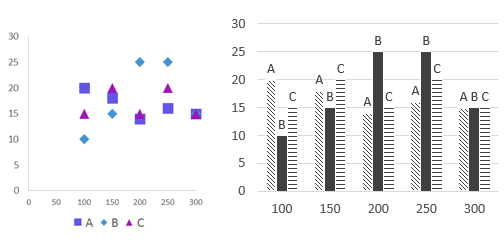

*Descrição: à esquerda, um gráfico de dispersão com valores de três séries (eixo y) em relação à variável do eixo x. À direita, os mesmos dados são mostrados por um gráfico de barras que mostra, para cada valor do eixo x, os valores das três séries. Autoria própria.*

**8. Use paletas com cores contrastantes**

Para isso, é importante escolher cores que tenham contraste suficiente. Em geral, devemos evitar combinações entre: Vermelho & Verde, Verde & Marrom, Verde & Azul, Azul & Cinza, Azul & Roxo, Verde & Cinza, Verde & Preto.

Lisa Charlotte Rost propõe uma paleta otimizada (baseada em Masataka Okabe e Kei Ito) que funciona para os principais tipos de daltonismo.

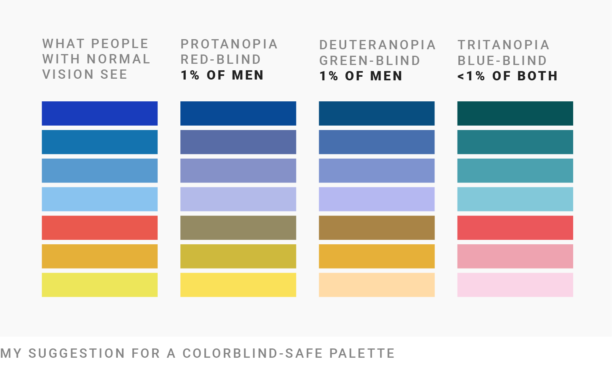

*Descrição: quatro colunas com sete cores empilhadas. A primeira coluna apresenta sete cores diferentes e mostra como pessoas sem daltonismo as enxerga. As outras três colunas apresentam como pessoas com protanopia, deuteranopia e tritanopia enxergam as mesmas sete cores com contraste adequado. Fonte: blog Chartable, do Datawrapper.*

**9. Use um simulador de condições visuais**

A extensão NoCoffee no Google Chrome simula diferentes tipos de condições visuais. Outras opções: Coblis (upload de imagem) e IamcalColor Vision.

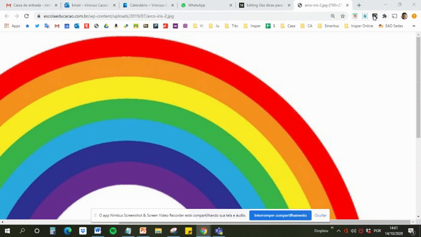

*Descrição: gif que mostra o funcionamento da extensão NoCoffee no navegador Google Chrome. Na tela, um arco-íris troca de cor à medida que simulo diferentes tipos de daltonismo.*

**10. Descreva seus gráficos, tabelas e mapas**

Redigir um parágrafo que sintetize a informação principal de cada visualização é muito poderoso para a acessibilidade:

- Deixa visualizações acessíveis para pessoas cegas ou com baixa visão que usam softwares de leitura.
- Ajuda pessoas não acostumadas a interpretar gráficos.

Conforme propõe Amy Cesal, quatro passos para descrever gráficos:
1. Tipo de gráfico
2. Tipo de dado
3. Propósito do gráfico
4. Dados na íntegra

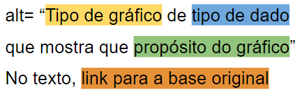

*Descrição: imagem que ilustra os quatro passos descritos no texto: [Tipo de gráfico] de [tipo de dado] que mostra que [propósito do gráfico]. Fonte: Nightingale.*

Exemplo: "Gráfico de barras que mostra o percentual dos tributos na arrecadação no Brasil. Cinco deles concentram 71% da arrecadação: ICMS (21%), IR (18%), Cofins (16%), Contra. à previdência (11%), Contra. ao FGTS (5%)."

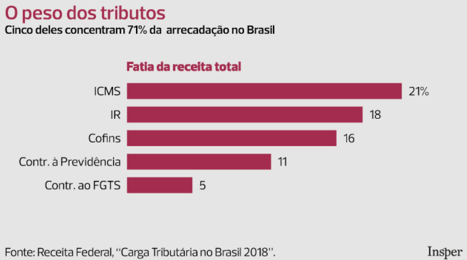

*Descrição: Gráfico de barras que mostra o percentual dos tributos na arrecadação no Brasil. Cinco deles concentram 71% da arrecadação: ICMS (21%), IR (18%), Cofins (16%), Contra. à previdência (11%), Contra. ao FGTS (5%). Fonte: Receita Federal, "Carga Tributária no Brasil 2018". Autoria: Insper.*

---

*Esse post foi originalmente postado no [Medium do datavizbr](https://medium.com/datavizbr/dez-dicas-para-deixar-sua-visualização-de-dados-mais-acessível-bf884895812d) e pode ser encontrado no link acima.*