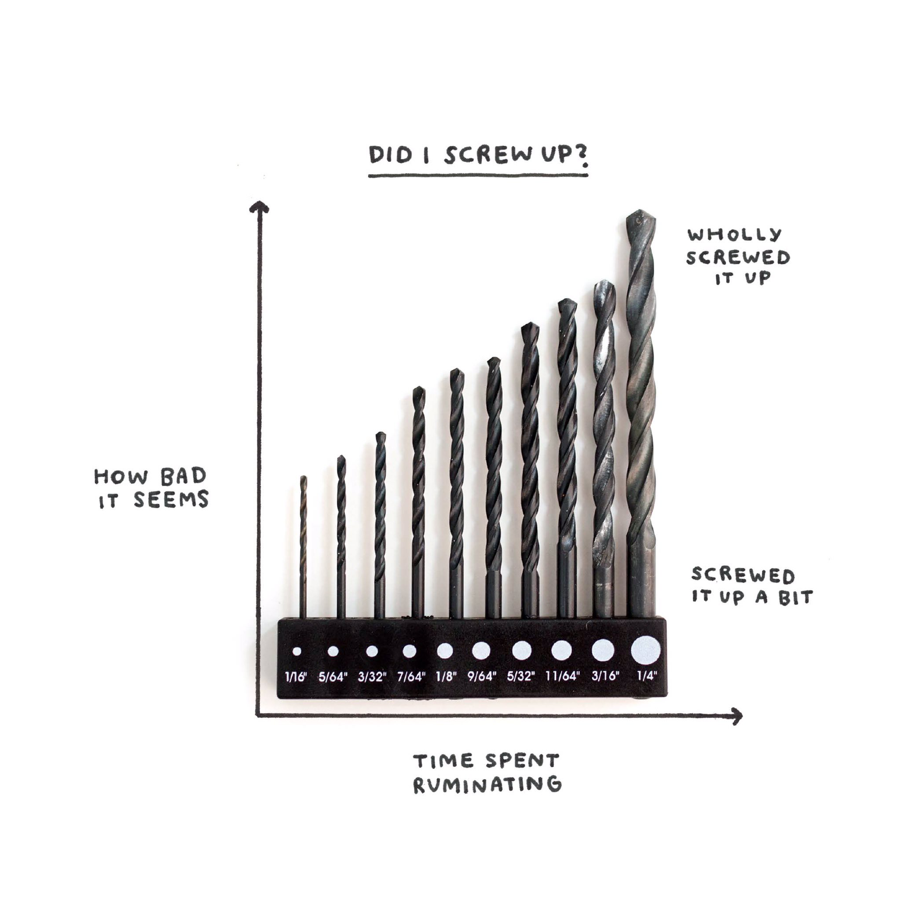
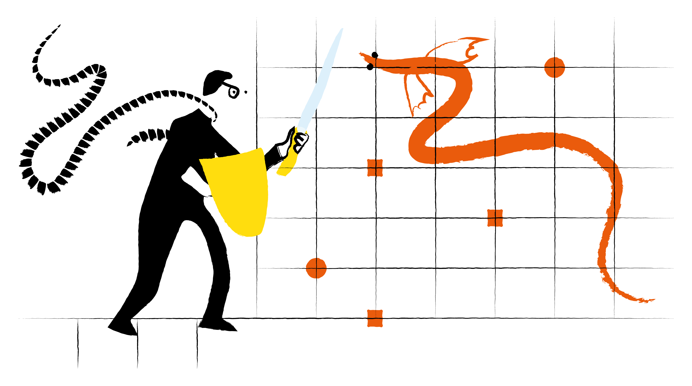
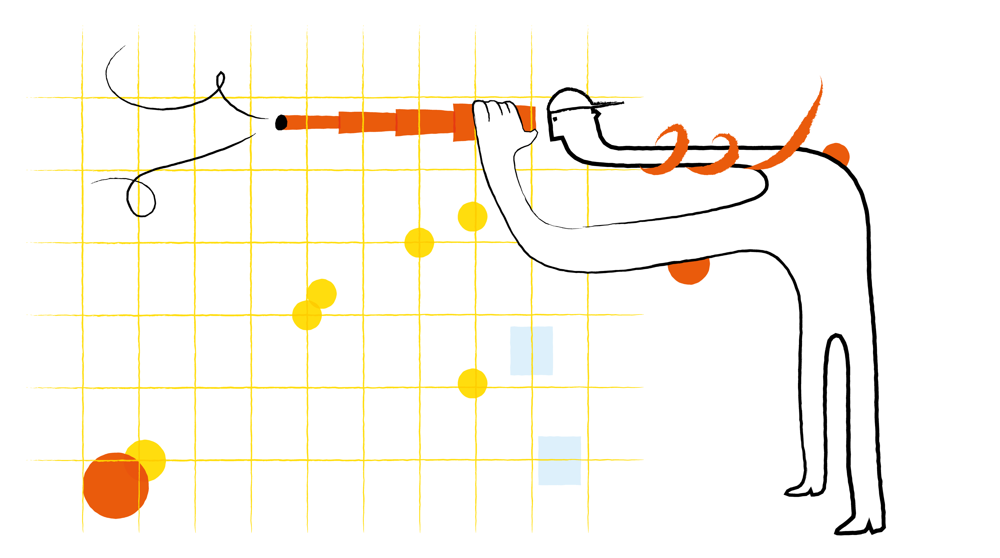

*por Elijah Meeks publicado pela FastCompany e originalmente no Nightingale / traduzido por Rodrigo Medeiros*

Quando o presidente dos Estados Unidos está mostrando um gráfico Sharpie, você sabe que a visualização de dados não está mais nas margens das notícias.

Sempre há algo acontecendo no campo da visualização de dados, mas até recentemente era apenas algo que as pessoas da área notavam. Não foi assim em 2019, onde a visualização de dados apareceu com destaque nas principais notícias.

**O Primeiro Presidente da Visualização de Dados**

Quando Donald Trump foi eleito, ele emoldurou e pendurou na Casa Branca um mapa dos Estados Unidos que implicava que ele foi eleito por uma enorme maioria dos votos. O que era importante para Trump era o valor retórico da visualização de dados geoespaciais — não o conjunto de dados subjacente.

Em setembro de 2019, confrontado com um mapa oficial do alcance dos efeitos do furacão Dorian — um que contradiz suas alegações sobre quais estados poderiam ser afetados — ele decidiu desenhar no mapa um pouco mais de alcance. Os dados não o apoiavam, mas Trump sabia que se ele pudesse mudar a visualização, isso era tudo o que importava.

Trump é um sinal de que "a visualização é o dado" para muitas pessoas. À medida que avançamos em nossa prática, precisamos estar mais conscientes disso.

**Visualização de Dados Reflexiva**

O livro "Am I Overthinking This?" de Michelle Rial sinaliza uma mudança fundamental em direção ao ato de criar visualização de dados como uma maneira independente de imputar significado. Ela criou uma série de gráficos à mão em seu estilo inigualável, que destaca as contradições, medos e complexidades da vida moderna de uma maneira que o texto simplesmente não consegue.

**A Imparável Giorgia Lupi**

Giorgia Lupi ao longo de sua carreira evitou toda linha de raciocínio técnico para criar um caminho que aborda a visualização de dados tradicional, data art, design e data humanism. Em 2019, Lupi teve suas duas conquistas mais significativas: ela iniciou uma linha de moda e ingressou na Pentagram, a maior consultoria de design independente do mundo.

**Compradores da Looker e do Tableau**

Em 2019, a Salesforce comprou a plataforma de análise Tableau por US$ 15 bilhões, e o Google comprou o Looker por quase US$ 3 bilhões. São investimentos sérios que demonstram que a visualização de dados é considerada estratégica.

**A Sociedade de Visualização de Dados**

O crescimento da Data Visualization Society em 2019 indica claramente um desejo reprimido de reunir a profissão. O que era apenas uma idéia de três pessoas em fevereiro cresceu para uma organização de 10.000 membros.

**Pensando no Futuro**

A visualização de dados é tecnicamente madura. Cada vez mais, percebemos abordagens baseadas em aprendizado de máquina para melhorar as sugestões de qual gráfico usar. Como profissionais, isso nos permite mudar nosso foco dos problemas técnicos para temas como subdesenvolvimento do design e modelagem de informações.

A visualização de dados está se tornando menos uma raridade da empresa de tecnologia e mais uma parte da vida cotidiana de todos. Precisamos jogar fora nossas antigas noções de visualização de dados e entender como essa nova visualização de dados é feita, como é lida e como ela se relaciona.

*Elijah Meeks é o diretor executivo da Sociedade de Visualização de dados e engenheiro de visualização de dados na Apple.*
