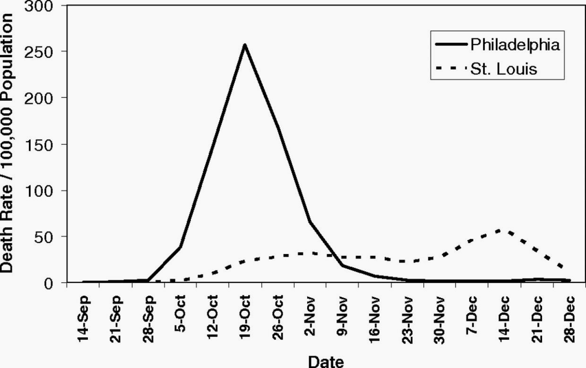
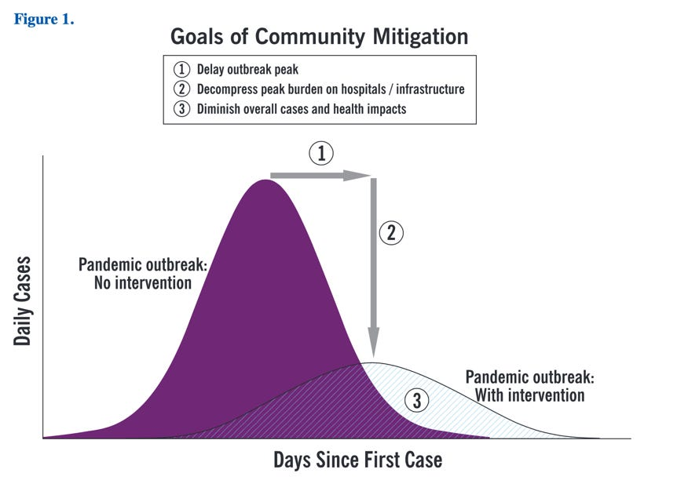
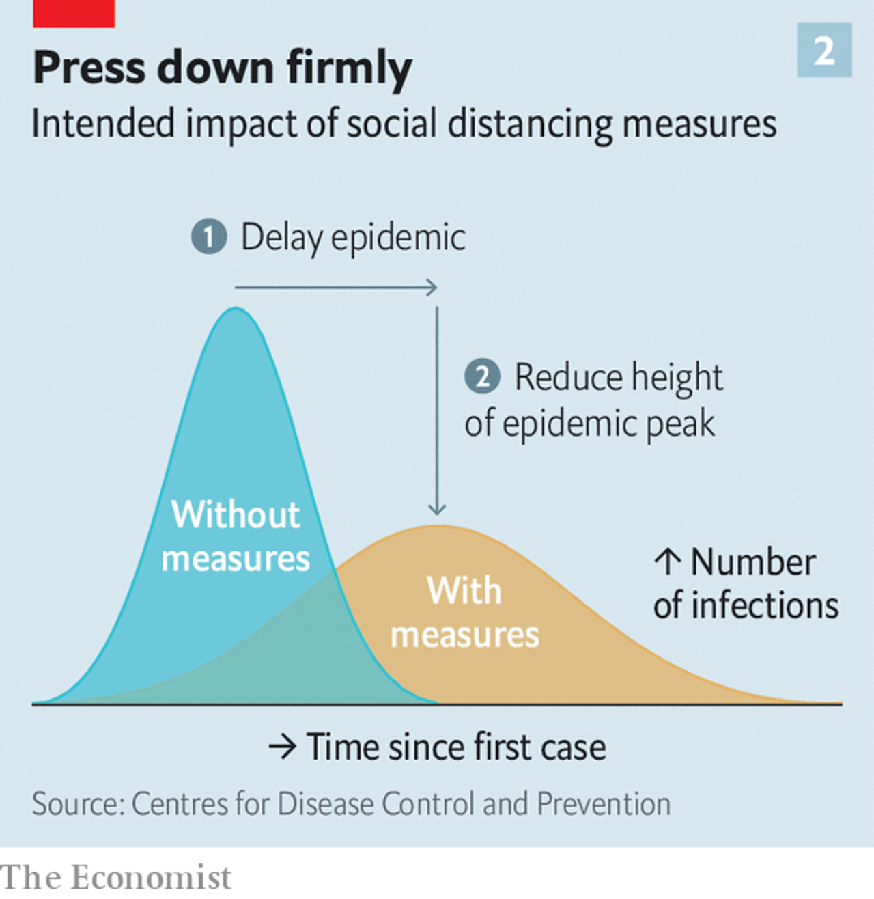

Desde o início da quarentena, além de enlouquecer no "family office" e fazer pão de fermentação natural, tenho colecionado visualizações de informação sobre o avanço da epidemia de COVID-19.

A ideia desta série de posts é agrupar, de forma aberta e colaborativa, exemplos de visualizações ligadas à pandemia.

Dividi a coleção em 7 temas principais (até agora):
1. Achate a curva
2. Simulações
3. Narrativas visuais
4. Crescimento exponencial
5. Pequenos múltiplos
6. Mapas
7. O que mais medir?

**1. Achate a curva**

Em 1918, na epidemia de influenza, as cidades da Filadélfia e St Louis tiveram abordagens muito diferentes. Enquanto a primeira organizou uma parada em homenagem aos soldados se preparando para a primeira guerra, a segunda promoveu ações de isolamento social. Nos dias seguintes a Filadélfia viu milhares de mortes pela gripe espanhola.

*Smithsonian Magazine*

*Quartz*

O CDC, Center for Disease Control americano, em um paper de 2007 sobre prevenção de pandemias, trouxe um gráfico explicando o impacto de ações de isolamento social na mitigação da crise.

*CDC*

Foi neste paper que Rosamund Pearce, jornalista de dados da The Economist, se inspirou para criar uma visualização. A matéria foi responsável por dar destaque ao conceito de diferentes curvas de contágio no contexto do coronavírus.

Na imagem do The Economist, porém, faltava um detalhe que faz toda diferença: a linha indicando a capacidade do sistema de saúde. Drew Harris, da Thomas Jefferson University, viu o artigo e fez uma nova versão, publicada em sua conta no Twitter, que viralizou e ganhou muitos outros formatos.

Um dos primeiros e mais compartilhados é a ilustração com o título "Flatten the curve", feita pela microbiologista Dr Siouxsie Wiles e o ilustrador Toby Morris.

Para se manter simples e fácil de entender, a imagem perde em precisão. Não leva em conta, por exemplo, a mudança da capacidade do sistema de saúde com o tempo.

A ideia ilustrada pelas duas curvas ganhou diversas adaptações, e virou até campanha de conscientização e animações.

As muitas variações são até alvo de piada (precisamos achatar a curva de novas versões do gráfico achate a curva).

---

*Esse post foi originalmente postado no [Medium do datavizbr](https://medium.com/datavizbr/entendendo-o-agora-dataviz-em-tempos-de-coronavírus-9484233667fe) e pode ser encontrado no link acima.*