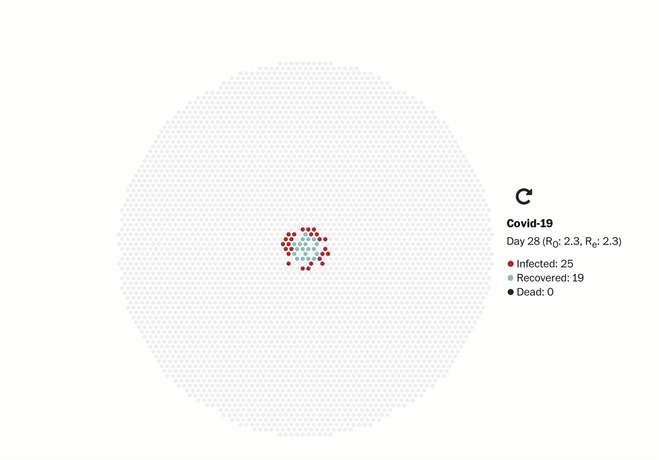
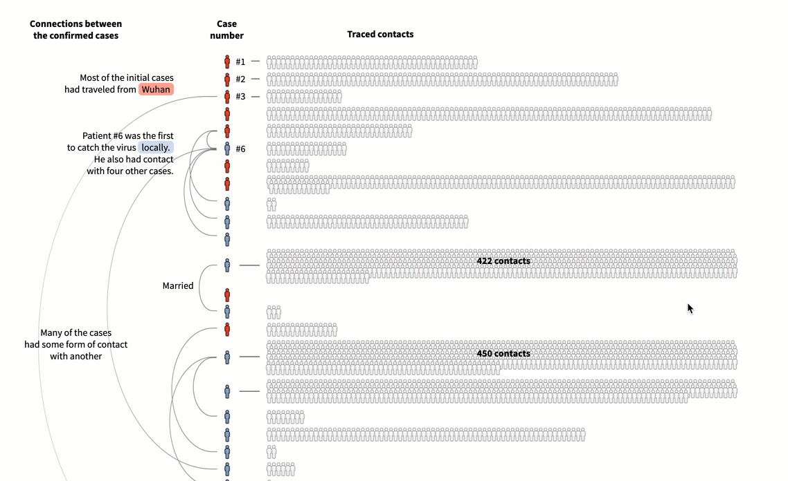
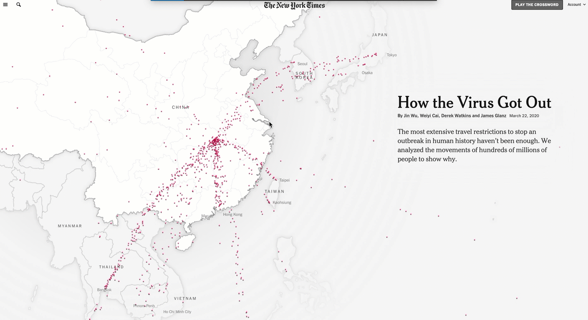
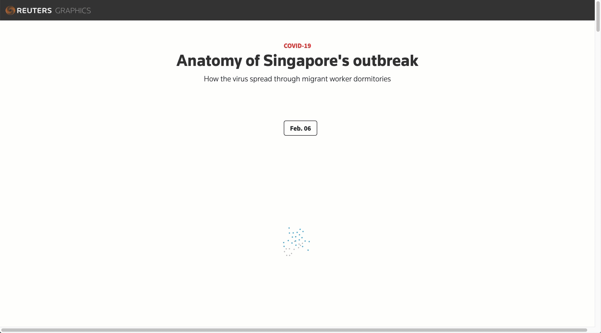

Este é o segundo post de uma série sobre visualização de dados em tempos de pandemia. A ideia é listar e discutir exemplos de imagens que nos ajudam a entender o que está acontecendo.

Dividi a coleção em 7 temas principais: 1. Achate a curva; 2. Simulações; 3. Narrativas visuais; 4. Crescimento exponencial; 5. Pequenos múltiplos; 6. Mapas; 7. O que mais medir?

**2. Simulações**

Enquanto não há cura ou vacina para Covid-19, o isolamento social é a principal estratégia de mitigação do contágio.

O artigo do Washington Post comparando 4 modelos diferentes de isolamento foi o artigo mais acessado na história do Washington Post. De uma forma bastante simples ele ilustra como o contato entre pessoas espalha o vírus e quais são os impactos da adoção de diferentes medidas de restrição de circulação.

O site r2d3 reuniu 4 simulações com premissas mais complexas, ilustrando o efeito de medidas de distanciamento social.

O FiveThirtyEight fez uma comparação de diferentes modelos ao longo do tempo.

**3. Narrativas visuais**

Outro gênero de visualização bastante presente na cobertura da pandemia são narrativas visuais: matérias com texto, gráficos, ilustrações e animações que contam uma história com a rolagem da tela.

A Reuters mostrou em detalhes os primeiros 31 casos confirmados na Coreia do Sul, mapeando os contatos sociais e formas de transmissão de cada um deles. Até chegarem à paciente 31, responsável por um grande surto de contágio no país. Ela teve contato direto com mais de 1.000 pessoas — incluindo duas idas a uma igreja, almoço em um restaurante tipo buffet. Mais de 5.000 casos na Coréia do Sul foram relacionados à igreja de Shincheonji, frequentada por ela.

O NYTimes trouxe explicações sobre como o vírus se espalhou rapidamente pelo mundo. Quando Wuhan foi fechada, o vírus já tinha se espalhado para outros locais no mundo de forma silenciosa.

O South China Morning Post trouxe uma explicação sobre as diferentes famílias de coronavírus e seu mecanismo de ação no corpo, usando muito bem elementos de animação disparados pela rolagem da tela.

*Avanço das contaminações em Singapura (Reuters)*

---

*Esse post foi originalmente postado no [Medium do datavizbr](https://medium.com/datavizbr/entendendo-o-agora-dataviz-em-tempos-de-coronavírus-930890d8c23c) e pode ser encontrado no link acima.*