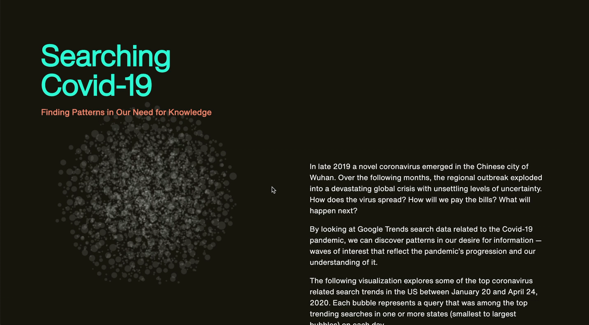
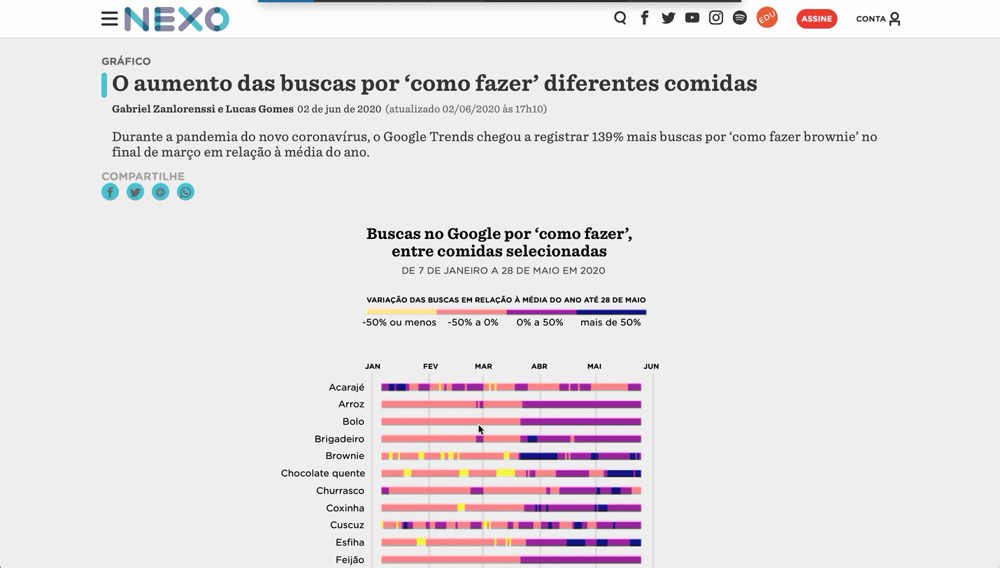
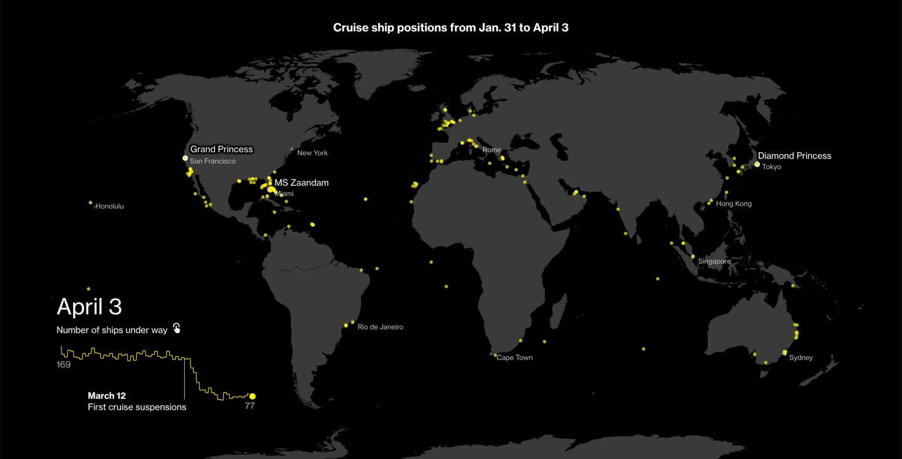
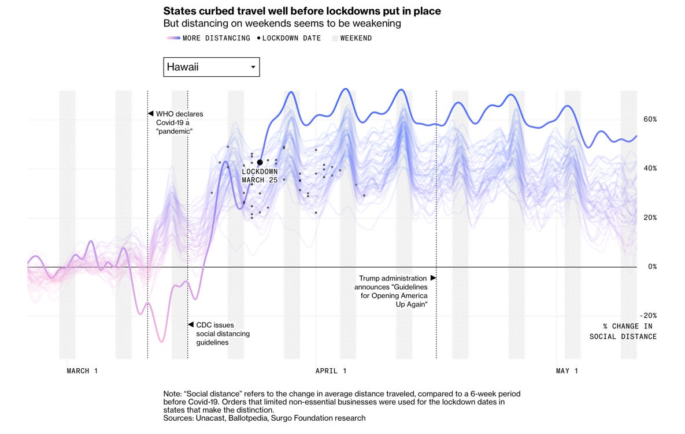
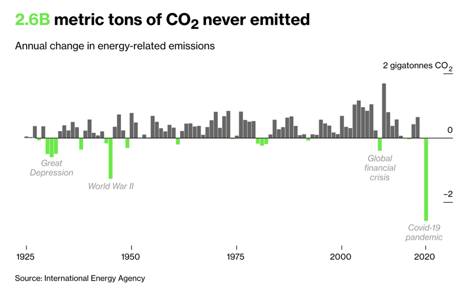
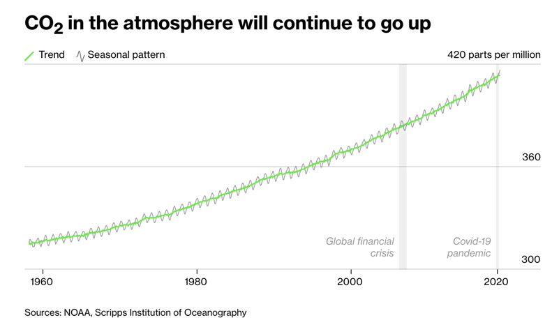

Quando falamos em Dataviz em tempos de Coronavírus lembramos logo de mapas mostrando o avanço da pandemia, curvas exponenciais comparando crescimento de casos e número de vítimas. Mas, para além do retrato trazido pelos números diretos da pandemia, o impacto do vírus e da restrição de contato social permitem muitas outras leituras e contagens.

Neste terceiro post da série mostro alguns exemplos interessantes de outros ângulos para entendermos o momento.

**Buscas na internet**

"Searching Covid-19" é uma exploração visual das mudanças de comportamento de buscas iniciadas com "O que é" e "Como fazer". Resultado de uma parceria entre o Google Trends, a empresa de dataviz Schema e a empresa de notícias Axios, em parceria com Alberto Cairo. Ela mostra como o desconhecimento inicial sobre o Covid-19, deu lugar a questões sobre como lidar com o isolamento e se proteger do vírus e por fim migrou para questionamentos sobre os impactos econômicos da crise.

O Nexo perguntou como a quarentena mudou as buscas por receitas no Brasil. Brownie e pão foram os campeões de audiência.

**Padrão de disseminação de informação**

O NYTimes mapeou o fluxo de compartilhamento de uma notícia inverídica, adotada por grupos de direita nos EUA, e viu como o conceito, partindo apenas de duas fontes, se espalhou.

**Padrões de mobilidade**

A queda no número de voos foi mostrada por Reuters, NYTimes e The Guardian. A indústria de cruzeiros também sofreu um impacto drástico.

Os padrões de locomoção locais foram muito discutidos como forma de avaliação da adesão à quarentena. Apple e Google lançaram relatórios mostrando a evolução dos deslocamentos em diversas cidades do mundo.

**Impacto econômico**

O impacto econômico de fechar as cidades foi recorrentemente traduzido em gráficos. O avanço do número de pedidos de seguro desemprego nos EUA foi um dos que mais marcou, traduzindo literalmente a expressão "off the charts".

Dados de gastos em cartões de crédito e débito e as variações nas listas de produtos mais comprados mostram de outra forma a mudança de comportamento derivada da crise.

OpenTable e Yelp, empresas com ligação direta com os mercados de restaurantes e negócios locais, divulgaram conjuntos de dados e análises sobre os impactos das medidas de restrição.

**Dados pessoais**

Alguns conjuntos de dados conseguem explicitar mudanças individuais de comportamento, como Eleanor Lutz ao analisar seus padrões de ligações nos últimos meses.

**Como o Covid afeta diferentes populações**

Mona Chalabi criou uma ilustração sensível sobre a população de NY, ressaltando a enorme desigualdade social que foi evidenciada na pandemia — seja pela possibilidade de estar em quarentena, seja pelo acesso ao tratamento quando necessário.

**Impacto ambiental**

Os efeitos no ambiente têm sido comentados como um possível lado bom da pandemia. As cidades ficaram mais limpas, com diminuição da quantidade de gases poluentes na atmosfera. Imagens de satélite mostram que a mancha de poluição em SP se reduziu na quarentena.

Porém a Bloomberg, colocando os dados em perspectiva, tem uma visão menos otimista. Apesar do lockdown ter gerado a maior queda de emissão de CO2 já registrada, em perspectiva a diminuição terá pouco efeito na desaceleração do aquecimento global.

---

*Esse post foi originalmente postado no [Medium do datavizbr](https://medium.com/datavizbr/entendendo-o-agora-dataviz-em-tempos-de-coronavírus-parte-3-5ae96cc7ac11) e pode ser encontrado no link acima.*