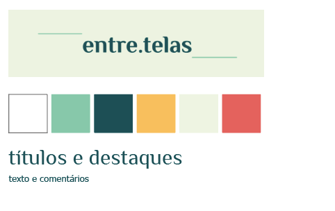
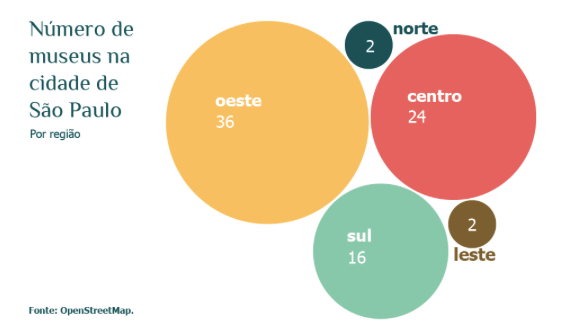
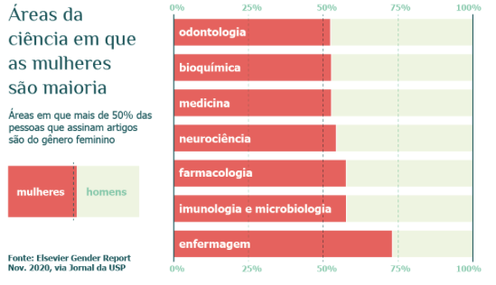
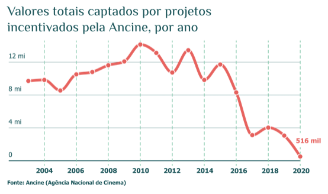

A newsletter semanal em que trouxemos notícias culturais acompanhadas de visualizações de dados

Logo que descobri o universo do jornalismo de dados, o que me afastava dele era o outro lado da moeda do que acabou me aproximando dele. Nos primeiros contatos com o jornalismo de dados, ele não me atraía porque o achava muito burocrático, com uma ligação muito intensa com a computação e as ciências exatas. Ao mesmo tempo, desde o início me apaixonei pelo jornalismo visual, que me permitia explorar a criatividade de uma nova maneira e me aproximar cada vez mais da arte.

Foi assim que comecei a trabalhar com infografia, crente de que essa área era apenas um seguimento do design. Pouco tempo depois, percebi que, na verdade, estava trabalhando com jornalismo de dados. Mais precisamente, com visualização de dados.

Descobri que os dados não são inimigos da criatividade, da arte e de produções dinâmicas: eles se completam. Descobri novas coisas que poderia fazer com a visualização de dados, e criei aos poucos o desejo de usá-la cada vez mais em projetos ligados a cultura, entretenimento e sociedade, que sempre me interessaram.

No segundo semestre de 2021, me juntei a minha colega Júlia Carvalho para pensarmos um projeto de Jornalismo Digital, e assim criamos a newsletter entre.telas.

Propusemos uma newsletter semanal, que traria as principais notícias culturais da semana, cada uma acompanhada de uma visualização (em geral, gráfico ou ilustração). Eram quatro seções: entre linhas, que falava sobre literatura; entre cenas, sobre cinema e televisão; entre notas, sobre música e entre salas, com notícias sobre exposições. Além disso, incluímos uma seção final com indicações pessoais de conteúdos da semana.

Depois de prepararmos a estrutura, foi o momento de criar uma identidade visual para o projeto. Propus uma paleta discreta, com tons próximos ao pastel e outros contrastantes, as fontes para título e texto e uma logo simples para usarmos de imagem.

Produzimos 8 edições, disparadas nas manhãs de segunda-feira, entre outubro e dezembro de 2021. Ao longo da semana, escolhíamos as notícias e produzíamos o breve texto que seria enviado, para depois pensar na visualização que escolheríamos e ir atrás dos dados.

Durante essas edições, passeamos por temas mais leves, como o Grammy, artistas que hitaram no Spotify e lançamentos de filmes e exposições. Mas também entramos em assuntos com maior relevância social, como a localização dos museus na cidade de São Paulo e o orçamento de projetos financiados pela Ancine ao longo dos anos.

Usamos, em maioria, dados públicos, mas outros buscamos nas plataformas e empresas cabíveis. Em geral, tabulamos esses dados manualmente, e os gráficos foram produzidos usando o Flourish e o Illustrator.

Um trabalho simples, majoritariamente de curadoria e usando ferramentas que já dominava. Mas que trouxe temas relevantes e uma abordagem diferente usando visualização de dados. E, mais uma vez, mostrei para mim mesma — e, quem sabe, para algumas outras pessoas — que qualquer tema pode ter uma abordagem interessante com dados.

Gabriella Sales é jornalista em formação pela ECA-USP e trabalha na equipe de Gráficos do Nexo Jornal.

---

*Esse post foi originalmente postado no [Medium do datavizbr](https://medium.com/datavizbr/entre-telas-como-usamos-dados-para-falar-de-cultura-e-entretenimento-822899185038) e pode ser encontrado no link acima.*