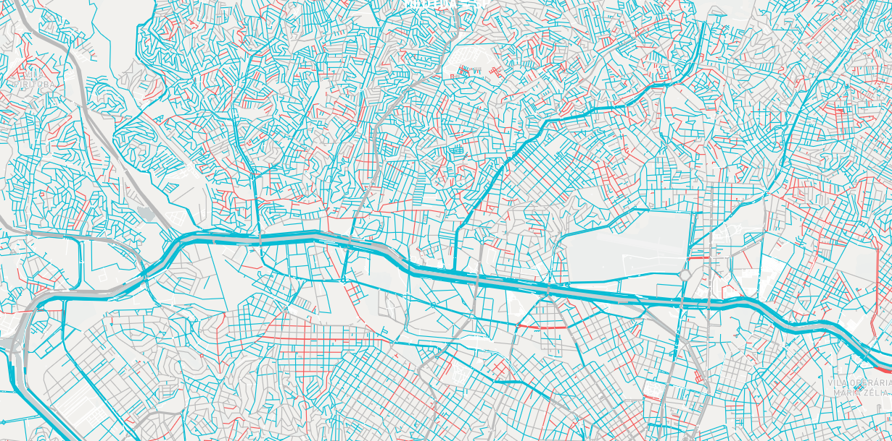

Essa semana tivemos a oportunidade de entrevistar o Bernardo Loureiro, do Medida SP, um laboratório de visualização urbana.

*Projeto Gênero e nomes de ruas*

O Bernardo é mestre em Desenho Urbano pela Parsons School of Design, com foco em uso de dados e tecnologias para urbanismo. Desenvolve análises, visualizações e aplicativos voltados para problemas urbanos.

**Você poderia me contar um pouco da sua trajetória com visualização de dados? Como iniciou o MedidaSP?**

Me especializei em análise e visualização de dados durante meu mestrado em urbanismo. Estudei na Parsons em Nova York, como bolsista do programa Ciência Sem Fronteiras do governo federal, e lá tomei contato com um ecossistema muito ativo de pessoas trabalhando com dados e mapeamento.

Após o mestrado e de volta em São Paulo me deparei com um grande volume de dados abertos. A Prefeitura de São Paulo havia lançado o portal de dados espaciais Geosampa recentemente, e havia poucas análises feitas sobre esses dados. Comecei a desenvolver análises e publicar online, e assim nasceu o Medida SP, através do qual também passei a dar cursos e consultoria na área.

**Como você organiza seu fluxo de trabalho para decidir quais ferramentas utilizar em cada projeto?**

Todo projeto começa no papel e caneta. Depois, há um processo em que transito entre o papel e o computador. Essa é geralmente a fase em que faço análise exploratória de dados e avalio possíveis ferramentas de visualização.

Eu sou agnóstico em relação a ferramentas: acho que a melhor ferramenta é aquela que resolve o projeto bem e de um jeito eficiente. Se o projeto começa a virar uma batalha constante entre você e a ferramenta é um bom sinal de que há algo errado e você deve reavaliar o que está fazendo.

**Entre todas essas ferramentas, linguagens e frameworks, quais você mais gosta de trabalhar?**

Eu prefiro usar a ferramenta mais adequada para cada projeto. Mas tem um lugar especial no meu coração para o JavaScript, talvez porque foi a primeira linguagem que aprendi seriamente. E para fazer mapas, QGIS, pela sua simplicidade e por ser um projeto open source incrível.

**Qual é a maior dificuldade em trabalhar com o D3 e AngularJS?**

D3 tem uma curva de aprendizado alta, e um approach bem diferente da maioria dos frameworks de JavaScript. Se você não tem uma noção boa de JavaScript, o D3 pode acabar te confundindo mais ainda.

A dura realidade do desenvolvimento front-end é que os frameworks entram e saem em voga muito rápido, então o que você aprende hoje pode estar em desuso em pouco tempo.

**Quais ferramentas você sugere para quem está iniciando?**

Se você gosta de mapas, QGIS é uma ótima porta de entrada para esse mundo. No caminho, você pode ir aprendendo um SQL básico, que vai sempre ser útil.

Não há um caminho único, mas hoje em dia eu sugiro JavaScript se você quiser focar mais em visualizações interativas e desenvolvimento front-end. Se quiser algo mais para análise de dados sugiro pegar a trilha Python e Pandas.

Mas para mim o mais importante de tudo é ter um projeto que você quer fazer, e tentar fazê-lo e ir aprendendo as ferramentas no caminho. É executando projetos que eu mais aprendo. Procure tutoriais e cursos focados em projetos e ao mesmo tempo tente fazer seus próprios projetos usando o que aprendeu. E não esqueça de tentar se divertir no caminho.

---

*Esse post foi originalmente postado no [Medium do datavizbr](https://medium.com/datavizbr/entrevista-com-bernardo-loureiro-b62090ce40b1) e pode ser encontrado no link acima.*