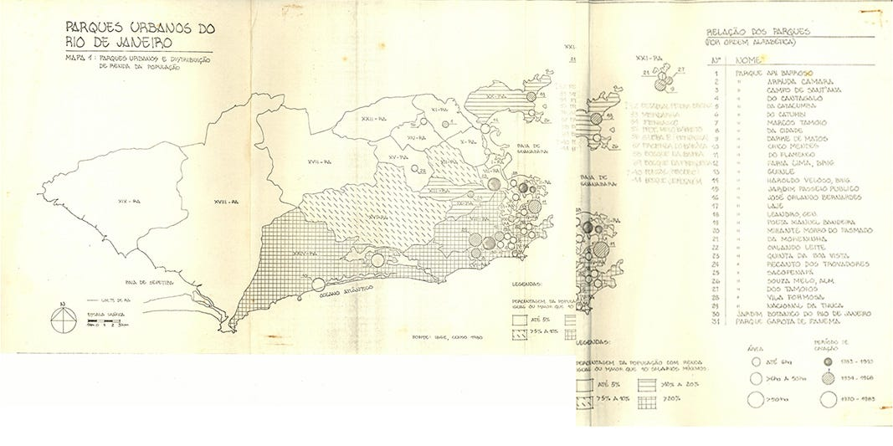
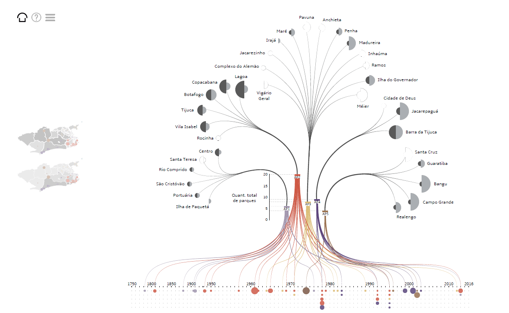
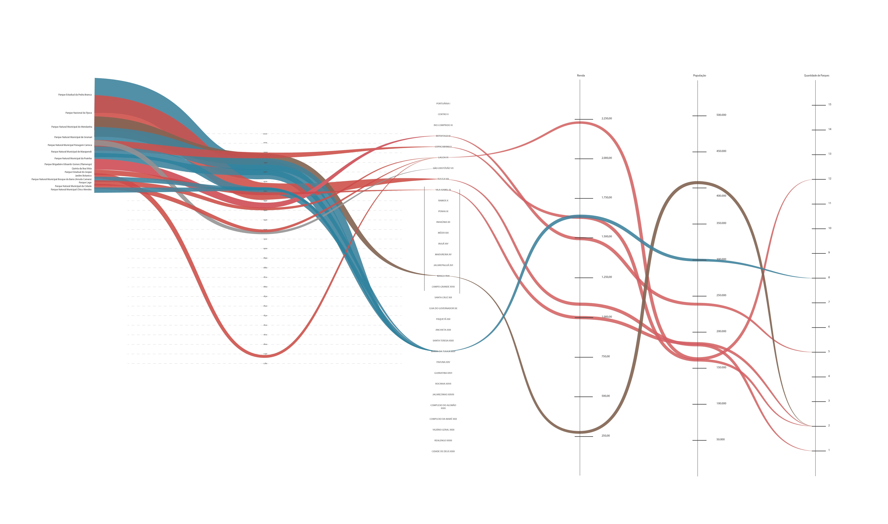
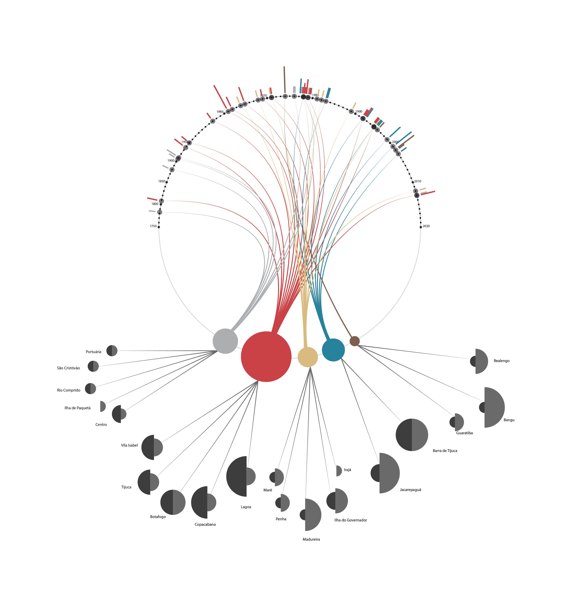

Essa semana tivemos a oportunidade de entrevistar Victória e Larissa Elisa que realizaram uma visualização sobre os parques públicos cariocas.

*Fonte: Behance do projeto*

**Vocês poderiam contar um pouco da trajetória com visualização de dados e como iniciou o projeto?**

A visualização de dados caiu de paraquedas em nossas vidas. Na época, estávamos cursando o curso de Comunicação Visual Design na UFRJ, quando surgiu a oportunidade de uma bolsa de Iniciação Científica, em uma parceria da EBA com o PROURB da FAU. Tendo como orientação a professora Lucia Costa, da FAU, e co-orientação, professora Julie Pires, da EBA, começou assim nosso primeiro contato com a visualização de dados.

*Trabalho cartográfico desenvolvido pela Profa. Dra. Lucia Costa nos anos 1980.*

O projeto inicial tratava apenas da atualização dos dados de um trabalho cartográfico desenvolvido pela Lucia Costa nos anos 80, que buscava mostrar possíveis correlações entre a distribuição dos parques públicos no Rio de Janeiro, com a população, renda per capita e data de criação dos parques. Conforme fomos desenvolvendo o trabalho, percebemos que apenas a cartografia não era o suficiente para contemplar tantas informações. Começamos então a buscar outras representações gráficas e nisso entramos no mundo da visualização de dados.

Uma das principais inspirações que encontramos foi a biblioteca D3, além do Wind Map (Fernanda Viégas e Martin Wattenberg) e Writing Without Words (Stefanie Posavec).

**Vocês pensaram em fazer alguma versão interativa do projeto?**

Nosso projeto, devido a sua complexidade, foi pensado para ser interativo. Como não tínhamos conhecimento em programação, a maneira provisória que encontramos para simular a interatividade consistiu na criação de um PDF interativo usando o Adobe Indesign. O PDF acabou sendo uma opção muito limitada. A todo momento tínhamos em mente que a solução ideal seria uma plataforma para web que facilitasse o acesso da população a esses dados.

*Fonte: Behance do projeto*

**Como foi o processo de criação do projeto?**

*Primeira proposta de layout*

O projeto consistiu, primeiramente, pela coleta e atualização dos dados. Compilamos dados referentes aos parques, seus respectivos tamanhos, localização, e dados sobre população e renda per capita das regiões do Rio de Janeiro.

*Segunda proposta de layout*

Após a coleta, geramos uma planilha que facilitou a análise dos dados. Com a ajuda do RAW Graphs, plataforma que permite inserir e visualizar rapidamente dados em escala, e após diversos testes, chegamos a um layout que agrupou todos os dados em uma única visualização. Por fim, desenvolvemos a simulação de uma interatividade, unindo o mapa à nova visualização.

**Qual foi a maior dificuldade desse projeto?**

Como queríamos compilar os diferentes tipos de dados em um gráfico só, nossa maior dificuldade foi essa. Estávamos lidando com dados sobre tempo, localização, quantidade de população e renda. Criamos diversos tipos de gráficos antes de chegarmos ao resultado final. Queríamos também que o gráfico remetesse de alguma forma ao tema, e assim, foi tomando a forma de uma árvore.

Além disso, a transparência de dados públicos é essencial para auxílio na compreensão por parte da população. Infelizmente, eles nem sempre são apresentados da melhor forma e de fácil acesso.

**Quais dicas para quem está começando na área?**

Seria bacana conhecer um pouco sobre as opções e funcionalidades de cada tipo de gráfico. O Dataviz Catalogue e o Dataviz Project são duas plataformas boas para isso. É interessante conferir também o trabalho de pessoas como Fernanda Viégas, Alberto Cairo, Nathan Yau, Edward Tufte, Ben Fry e Hans Rosling. Stefanie Posavec e Giorgia Lupi possuem projetos incríveis e publicaram o Dear Data. Para praticar, o Raw Graphs é uma ferramenta online simples e acessível.

---

*Esse post foi originalmente postado no [Medium do datavizbr](https://medium.com/datavizbr/entrevista-com-victória-sacagami-e-larissa-elisa-sobre-uma-visualização-dos-parques-públicos-1dc3ef8a9f1c) e pode ser encontrado no link acima.*