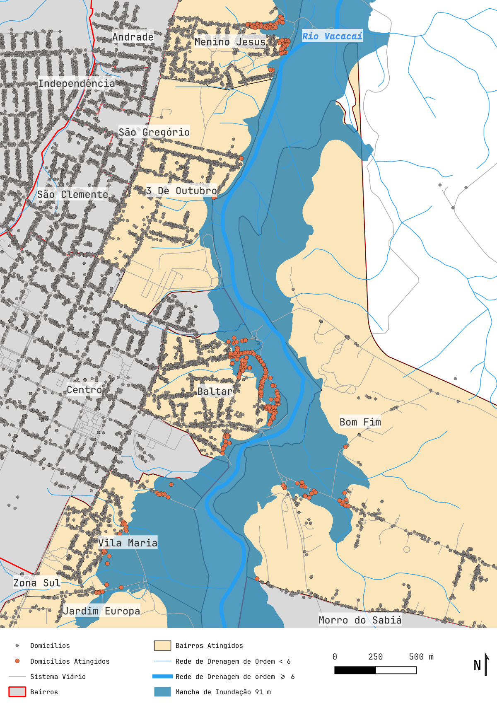
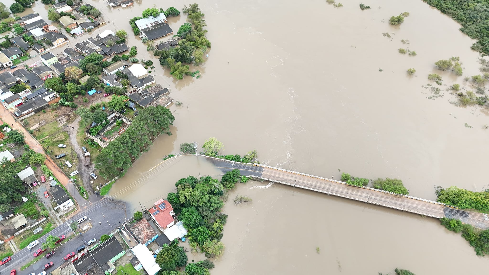
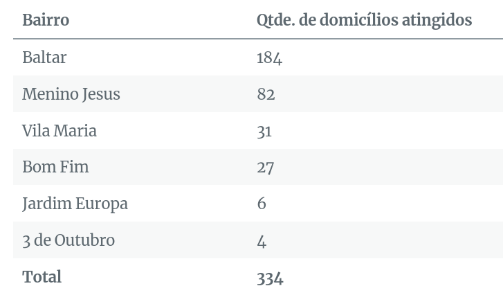
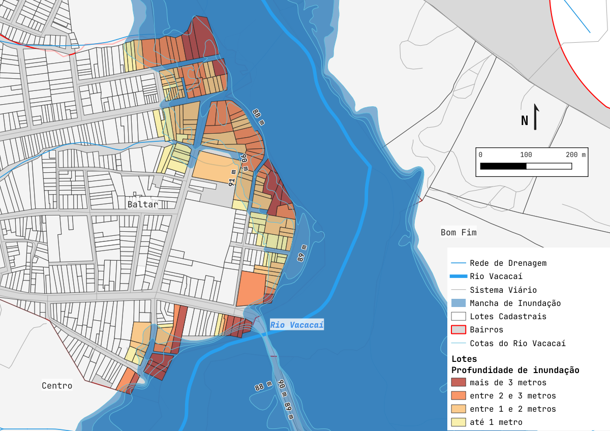
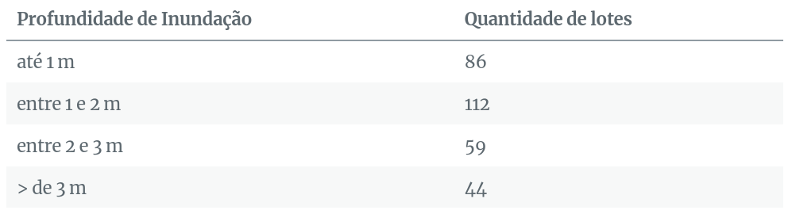
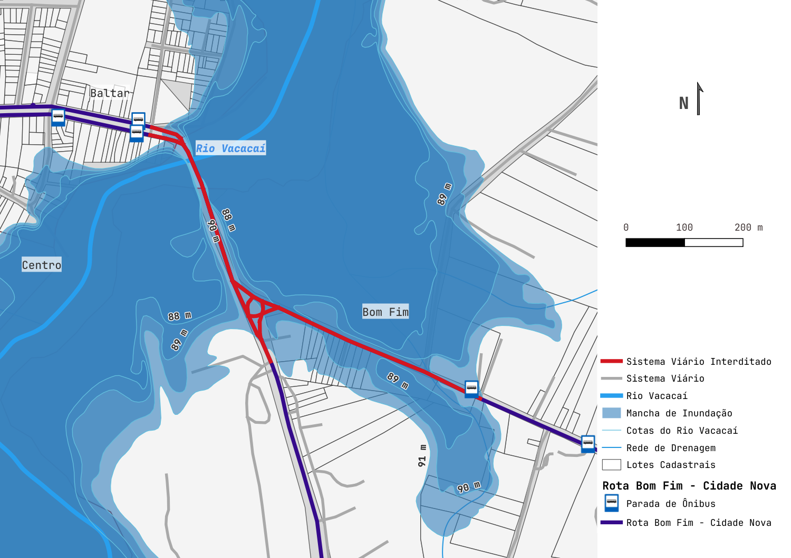
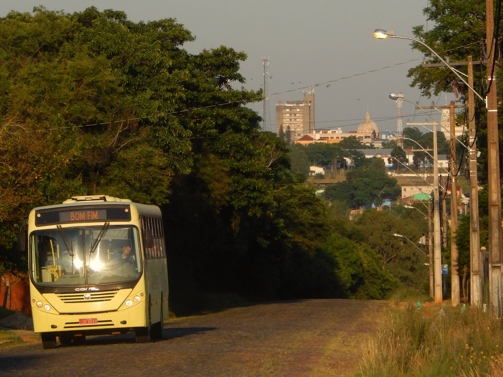
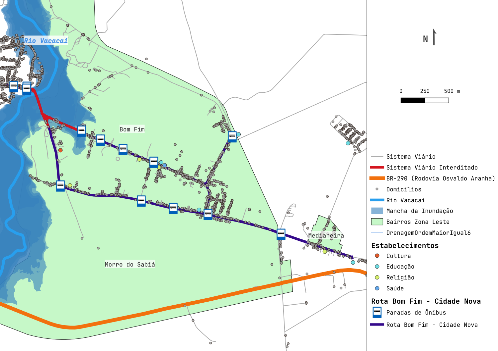

**Localização**

A Região Hidrográfica do Guaíba, segunda maior do estado (atrás apenas da Região Hidrográfica do Rio Uruguai), sofreu em abril/maio de 2024 uma temporada de chuvas volumosas que varreram cidades inteiras e contribuíram para a dramática situação de inundação de cidades da região metropolitana de Porto Alegre.

O Rio Vacacaí, dentro da Bacia do Vacacaí-Vacacaí Mirim e no limite ocidental da Região Hidrográfica do Guaíba, banha parte da zona urbana do município de São Gabriel e sua mancha de inundação será analisada por meio de operações espaciais comuns em sistema de informações geográficas.

Apesar de não ter atravessado a cidade com tanta violência como em outras cidades, o Rio Vacacaí, entre fim de abril e início de maio, alcançou cota (91 m acima do nível do mar) que supera a cota considerada normal (86 m), atingindo vários domicílios e obrigando que pessoas saíssem de suas residências. Os bairros atingidos foram: Baltar, Menino Jesus, 3 de Outubro, Vila Maria, Jardim Europa e Bom Fim, este último ficando isolado de todo o restante da cidade.

Notícias veiculadas pela prefeitura e por portais de notícias citavam a quantidade estimada de pessoas atingidas pela enchente: 1,7 mil. Mais de 400 famílias. Com técnicas de geoprocessamento é possível ter uma estimativa mais precisa de domicílios/pessoas atingidas e a distribuição pela cidade.

As fontes de dados utilizadas foram:
- curvas de nível de 1m de equidistância, bairros e lotes (Prefeitura de São Gabriel)
- hidrografia e coordenadas geográficas de endereços (IBGE)
- vias e rotas de ônibus (OpenStreetMap)

**Inundação**

Carregando a camada de curvas de nível no QGIS, a curva que representa a cota de 91 metros é poligonizada até cobrir o limite norte do bairro atingido mais ao norte (Menino Jesus) e o limite sul do bairro atingido mais a sul (Bela Vista). Essa curva é escolhida por conta de coincidir com a entrada (coberta pela enchente) da ponte, entre 91 e 92 metros de cota.

*Foto de Borin Produções*

Considerando um domicílio médio com família de 4 pessoas, a estimativa é de 1336 pessoas atingidas só na zona urbana do Rio Vacacaí. Lembrando que números de defesa civil e assistência social são imprescindíveis para complementar esta estimativa.

Para avaliação da gravidade da inundação em diferentes domicílios, é feita a interseção da camada de lotes cadastrais com cada uma das cotas do Rio Vacacaí. Começando em 90 metros, um metro abaixo da cota atingida na última cheia, temos inundação de até 1 metro de profundidade; na cota de 89 metros, entre 1 e 2 metros de profundidade; e assim por diante.

**Mobilidade**

A rota de transporte público mais afetada pela inundação do Rio Vacacaí é a rota circular que liga bairros do extremo leste da cidade com o extremo oeste: Bom Fim — Cidade Nova. Com a ponte Baltar — Bom Fim interditada, o ônibus não consegue atender os bairros Bom Fim, Morro do Sabiá, Medianeira e Pomares dentro de seu trajeto usual e a única solução é fazer o contorno pela Rodovia BR-290.

**Zona Leste**

Separados do Centro da cidade e de muitos dos estabelecimentos básicos de São Gabriel pelo Rio Vacacaí, os bairros do extremo leste tem a ponte entre o Bairro Baltar e o Bairro Bom Fim como o trajeto mais curto de ligação. Contabilizando bairros Bom Fim, Morro do Sabiá, Medianeira e núcleo urbano autônomo Pomares, há mais de 1200 domicílios atingidos indiretamente pela interdição da ponte.

**Considerações**

- Técnicas de clusterização podem ser utilizadas para definir grupos de domicílios atingidos próximos e dividir equipes minimizando deslocamentos entre domicílios atingidos.
- Dados de pluviômetros contribuem para registrar quantos mm de chuva são necessários nos afluentes do Rio Vacacaí para que a sua cota atinja diferentes níveis de severidade de inundação.
- Geometrias atualizadas de edificações, obtidas por cadastro manual ou segmentação por imagens aéreas/satélite, melhora ainda mais a análise.
- Os dados do Censo 2010 nos setores censitários das áreas atingidas revelam renda per capita baixa na média dos domicílios, o que torna os danos causados ainda mais dramáticos.
- Mais do que resposta a eventos climáticos extremos, o geoprocessamento pode e DEVE ser utilizado para planejamento urbano responsável de forma a minimizar danos emocionais e materiais da população, principalmente das que estão em situação de extrema vulnerabilidade socioambiental.

---

*Esse post foi originalmente postado no [Medium do datavizbr](https://medium.com/datavizbr/geoprocessamento-na-resposta-a-eventos-climáticos-extremos-8682c21b33c6) e pode ser encontrado no link acima.*