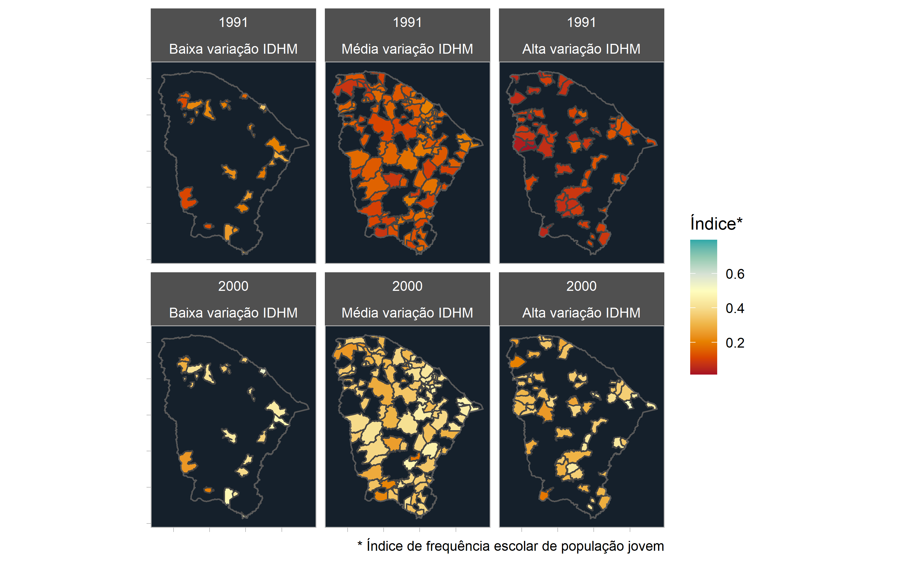
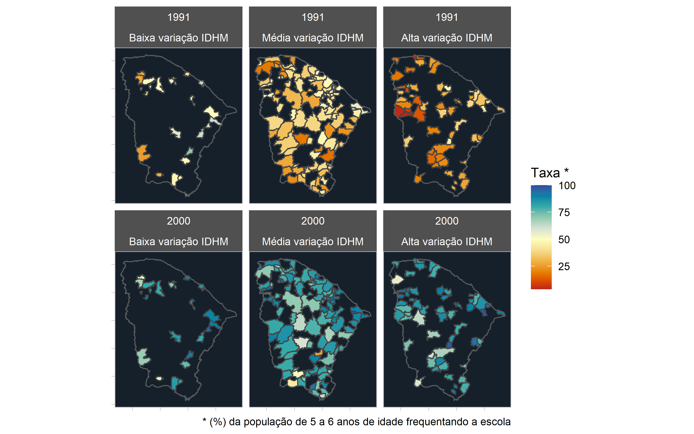
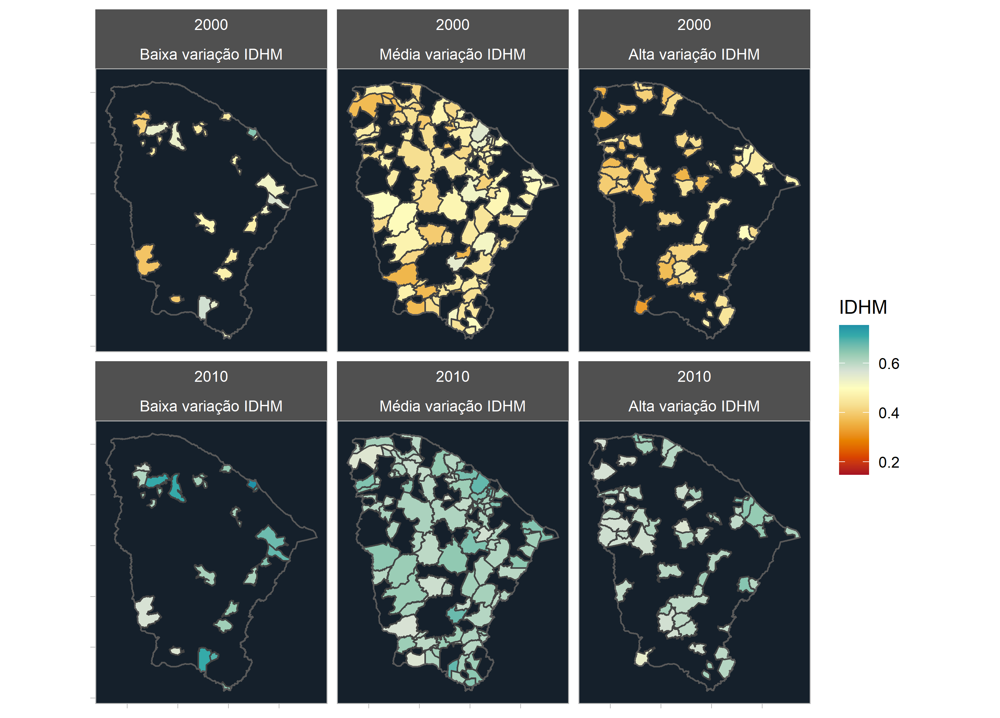
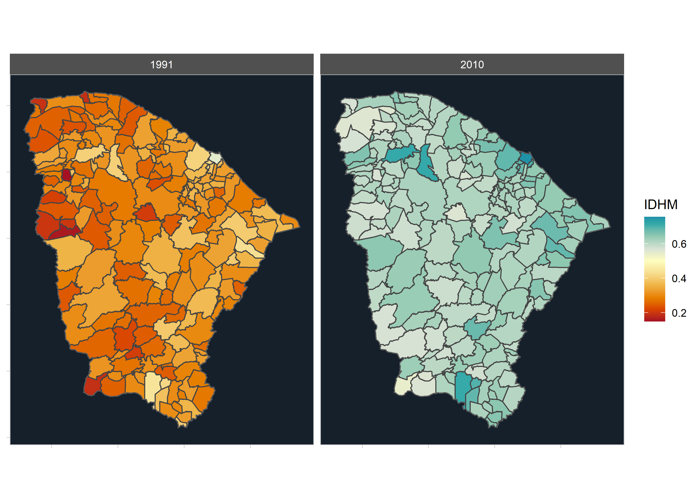
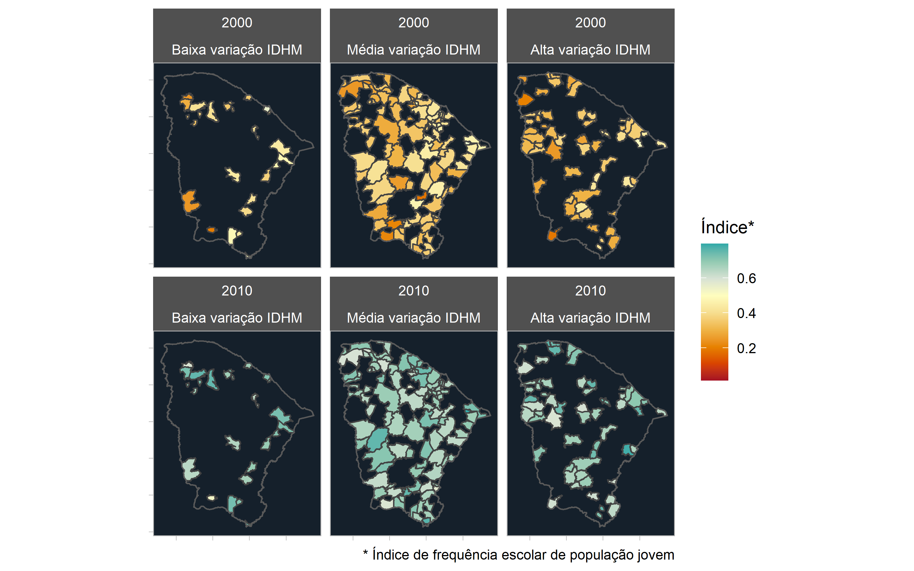
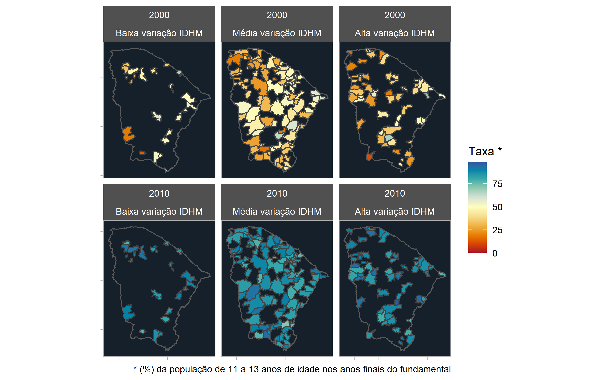

Em março deste ano eu fiz um texto que explorava as principais variações de IDHM entre os censos de 1991 e 2000 e depois entre os censos de 2000 e 2010. Aqui neste texto faço uma série de anotações e gráficos com foco exclusivo sobre o que ocorreu no estado do Ceará nessas comparações. O estilo do texto é meio livre, tipo anotações de campo.

**Comparação entre 1991 e 2000**

O trabalho original comparou as variações de IDH entre 1991 e 2000 e em seguida entre 2000 e 2010. Dessas comparações gerou-se três agrupamentos utilizando método de clusterização: os municípios com baixa variação de IDHM, os municípios com média variação de IDHM e aqueles com alta variação de IDHM.

O mapa mostra como os municípios cearenses variaram os IDHMs entre 1991 e 2000. Quanto mais azul maior o índice e quanto mais vermelho menor. O ponto de mudança de tom de cor é o que corresponde a IDHM 0,5. Para a ONU, locais com IDHM menor que 0,5 são considerados de baixo desenvolvimento.

A grande maioria dos municípios apresentavam IDHM muito baixo em 1991, sendo que as cores vermelhas mais fortes predominavam no grupo de Alta Variação de IDHM. Em 2000 já se percebe uma redução na tonalidade vermelha.

Depois de identificar e caracterizar os grupos, foi rodado um algoritmo (árvores de decisão) para identificar entre as mais de 200 variáveis que tratam de IDHM, quais foram aquelas que mais determinaram as modificações no IDHM. Foram descobertas oito variáveis relacionadas à Educação como as que mais influenciaram as modificações no IDHM entre 1991 e 2000. Dessas, a variável Índice de frequência escola dos jovens foi a que mais influenciou. Esse índice corresponde à conjunção de porcentagens de crianças de 5 a 6 anos de idade que frequentam a escola, de 11 a 13 anos de idade nos últimos anos do ensino fundamental, de 15 a 17 anos de idade com o ensino fundamental completo, e de 18 a 20 anos de idade com o ensino médio completo.

Em 1991 o índice era muito baixo para todos os municípios do Ceará, principalmente naqueles que se enquadram no agrupamento de Alta variação de IDHM, com predominância de cores vermelhas muito fortes. Já em 2000 percebe-se nitidamente uma suavização da tonalidade vermelha.

A segunda variável mais importante foi a taxa em percentual da população de 5 a 6 anos de idade que frequentam a escola. Em 1991 os tons eram quase todos em vermelho. Já em 2000 percebe-se claramente o alcance de valores importantes na população de 5 a 6 anos frequentando a escola, com quase todos os municípios nos tons azuis.

**Comparação entre 2000 e 2010**

Para todos os grupos não há mais em 2010 municípios considerados de baixo desenvolvimento de acordo com o critério da ONU. Todas as áreas estão pintadas em tons azuis.

Ao analisar-se as variáveis que mais influenciaram as modificações no IDHM entre 2000 e 2010, novamente ocorreu predominância daquelas relacionadas à educação e mais uma vez o destaque foi para o índice de frequência escolar dos jovens. Em 2010 já não há mais municípios pintados em tons vermelhos, demonstrando assim a evolução dessa variável ao longo de uma década.

A outra variável de destaque para a explicação da variação do IDHM entre 2000 e 2010 foi a taxa da população de 11 a 13 anos de idade nos anos finais do ensino fundamental. Cores azuis e com tons fortes dominam plenamente os mapas em 2010, com nítido contraste com o que se via em 2000.

Os códigos desta análise estão disponíveis no github do autor. Os dados são consumidos do repositório da Base dos Dados.

---

*Esse post foi originalmente postado no [Medium do datavizbr](https://medium.com/datavizbr/gráficos-e-anotações-de-análises-de-idhm-x-educação-para-o-estado-do-ceará-910912151eaa) e pode ser encontrado no link acima.*