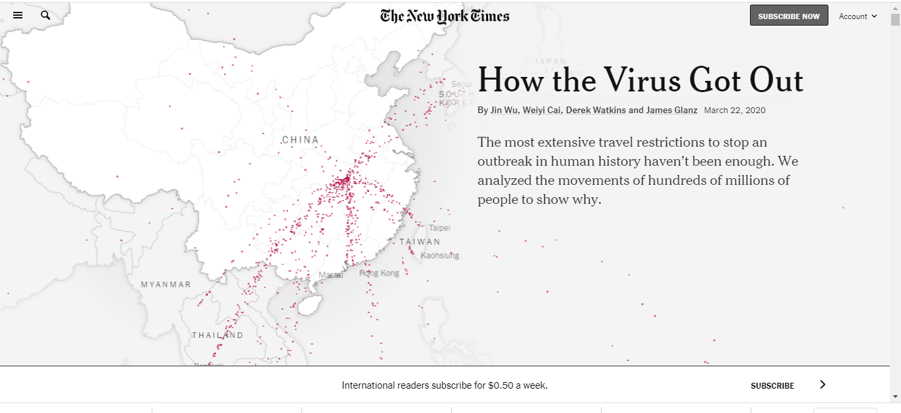
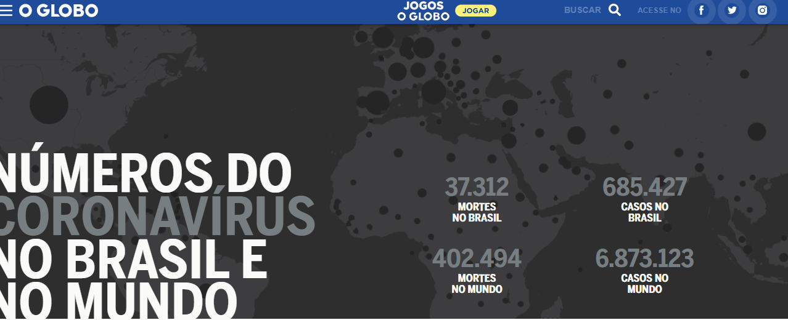

*Por: William Robson Cordeiro*

Uma das expressões mais utilizadas pelos especialistas, autoridades e a imprensa neste período de isolamento social trata-se do tal "crescimento" ou do "achatamento da curva" de vítimas da Covid-19. A pandemia é o tema de maior destaque da mídia brasileira e internacional nas últimas semanas. Ao lado do noticiário cotidiano, os infográficos acompanham, auxiliam e estão mais presentes, no intuito de transformar dados brutos em visualização sintética para a audiência.

São inúmeros os infográficos publicados nos jornais de referência, muitos em linha, outros tantos em barra ou do tipo megagráficos sobre o espraiamento global do vírus. A utilização da infografia neste período pode ser comparada à "revolução da infografia" da Guerra do Golfo, nos anos de 1990.

**Os quatro estágios da infografia**

Para compreendermos os tipos de infográficos que permeiam o jornalismo destes tempos: o primeiro, que são os infográficos lineares, de sequência estática; o segundo, no ambiente web, caracterizado pela multimidialidade; o terceiro, que se desdobra na infografia quando integrada a bases de dados; e, por fim, o quarto, que são os hiperinfográficos, modelos hipermidiáticos mais complexos e que incluem potencialidades imersivas.

A hiperinfografia são modelos ou conjunto de modelos de infográficos autônomos de alta capacidade expressiva e imersiva, disponíveis no ambiente hipermidiático. As propriedades morfológicas do hiperinfográfico são: síntese, interação, autonomia, hipermídia, imersão/visualidade estética e sincronia sintática.

**Três exemplos de hiperinfografias sobre a pandemia**

**La Vanguardia (Espanha)**

O jornal espanhol La Vanguardia lançou em 1 de abril de 2020 o hiperinfográfico "¿Qué debo hacer cuando regreso del supermercado?". O trabalho propõe oferecer recomendações de como se proteger do coronavírus ao chegar em casa. O hiperinfográfico oferece estética em terceira dimensão que age motivada pela ação do usuário, partindo da interação mediante scrolling e leitura verticalizada.

*Hiperinfográfico do jornal La Vanguardia, da Espanha*

**The New York Times (Estados Unidos)**

O New York Times traz o hiperinfográfico "How the Virus Got Out", lançado em 22 de março de 2020, cuja ação interativa do usuário também é ativada por scrolling. O recurso utilizado para explicar as razões pelas quais as restrições de viagens não foram suficientes para conter o avanço do vírus pelo mundo são os modelos ubicativos e coropléticos, além das animações.

*Exemplo de hiperinfográfico do jornal The New York Times*

**O Globo (Brasil)**

"Números do Coronavírus no Brasil e no Mundo" é um minucioso detalhamento sobre as mortes e os casos de covid-19, atualizado diariamente a partir de base de dados dos governos federal e estaduais. O trabalho está disponível desde o dia 20 de março de 2020. Este modelo compila infomapas interativos, infográficos de barra e de linha.

*Apresentação do hiperinfográfico do jornal O Globo*

Estes modelos demonstram como os jornais experimentam infografias de estágios variados, porém ousam positivamente nos modelos mais complexos, como as hiperinfografias, a fim de oferecer meios mais dinâmicos, atrativos e sofisticados para o usuário que busca informações sobre a pandemia.

*Sobre o autor: William Robson Cordeiro é Doutor em Jornalismo pelo POSJOR/UFSC com estágio-sanduíche na Universitat Autònoma de Barcelona (UAB) e pesquisador do Núcleo de Estudos e Produção Hipermídia Aplicados ao Jornalismo (Nephi-Jor).*

---

*Esse post foi originalmente postado no [Medium do datavizbr](https://medium.com/datavizbr/hiperinfográficos-e-covid-19-modelos-sofisticados-nos-jornais-para-a-cobertura-da-pandemia-b6d137b8cc41) e pode ser encontrado no link acima.*