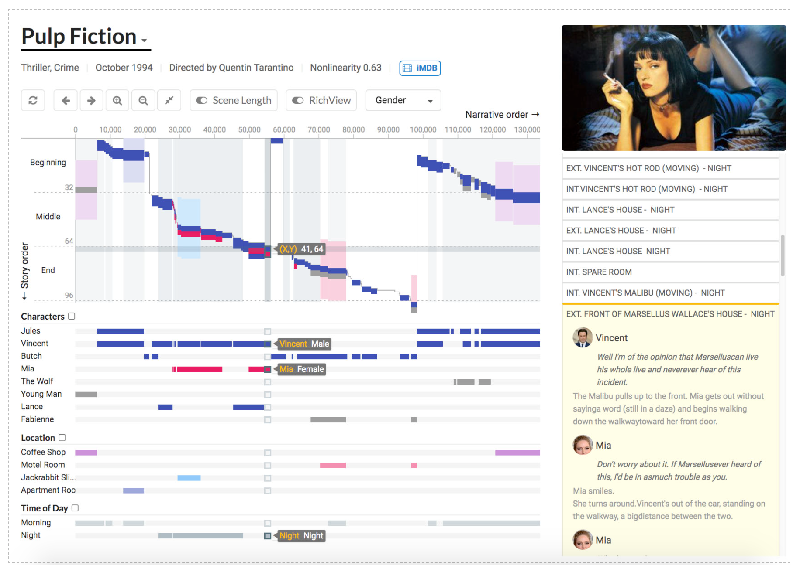

Uma das formas mais complexas e ricas de trabalho com informações é o uso de Machine Learning e do Deep Learning para contar histórias por meio da visualização de dados. Existem alguns recursos para criar o data storytelling, dentre eles, o TextVis.

Por meio do TextVis é possível criar visualizações de dados através dos textos. A ferramenta foi desenvolvida por Kostiantyn Kucher e Andreas Kerren do Grupo ISOVIS, Linnaeus University na Suécia. O TextVis utiliza do Machine Learning e Deep Learning para organizar os dados, encadeando informações complexas em diversos tipos de gráfico, tais como de geolocalização, gráficos de pizza, de colunas, nuvens de palavras, entre outros.

Alguns exemplos de aplicações de análise textual em gráficos por meio do TextVis:

**1. Narração e marcações temporais em filmes (que não têm marcação de tempo linear)**

Story Explorer é uma abordagem de visualização para explorar séries temporais hierárquicas. As curvas de história visualizam a narrativa não linear de um filme mostrando a ordem em que os eventos são contados no filme e comparando-os com sua ordem cronológica real, resultando em padrões visuais possivelmente sinuosos na curva.

O Story Explorer fornece uma interface de curadoria de scripts que permite aos usuários especificar a ordem cronológica dos eventos nos filmes. Foi utilizado para analisar 10 filmes não lineares populares e descrever o espectro de padrões narrativos encontrados.

**2. Popularidade de um tweet no tempo e no espaço**

Abordagem analítica visual para explorar a variação da popularidade do tópico nas mídias sociais (como o Twitter) ao longo do espaço e do tempo. Como tentativas de extração de tópicos de textos muito curtos, como tweets, podem não produzir resultados significativos, os textos são agregados antes de aplicar as técnicas de modelagem de tópicos. As visualizações interativas suportam a detecção de eventos de explosão em atividades de postagem de mídia social em diferentes locais.

**3. O "ritmo dos tópicos": Evolução de variáveis ao longo do tempo**

MultiStream é uma abordagem de Streamgraph multiresolução para explorar séries temporais hierárquicas. Séries temporais múltiplas são um conjunto de múltiplas variáveis quantitativas que ocorrem no mesmo intervalo. Estão presentes em muitos domínios, como medicina, finanças e manufatura para fins analíticos. A abordagem permite a exploração de séries temporais em diferentes granularidades (por exemplo, da visão geral aos detalhes).

---

Sobre a autora: Juliana Freitas, potiguar radicada em São Paulo. De humanas, mas também de dados. Graduada em Marketing pela Universidade Cruzeiro do Sul e Data Science Analytics em empresas, com foco em insights vindos dos dados para marcas e enterprises.

---

*Esse post foi originalmente postado no [Medium do datavizbr](https://medium.com/datavizbr/machine-learning-e-deep-learning-criando-visualização-de-textos-com-o-textvis-8e038da80902) e pode ser encontrado no link acima.*