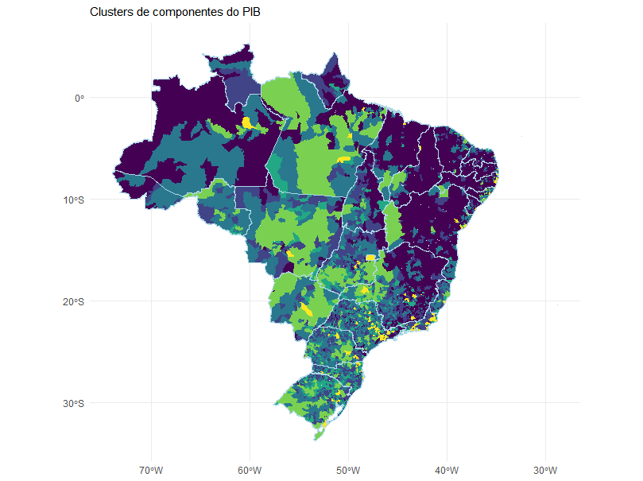
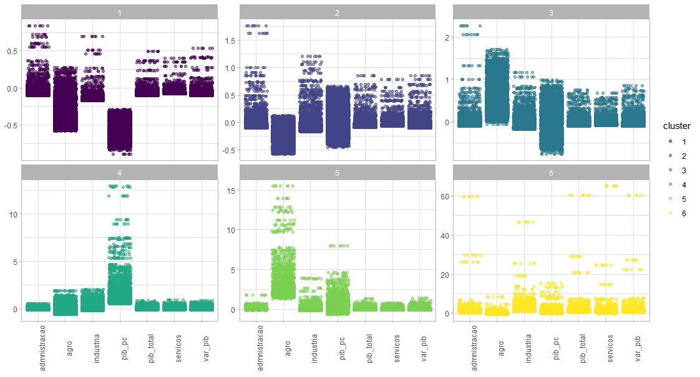
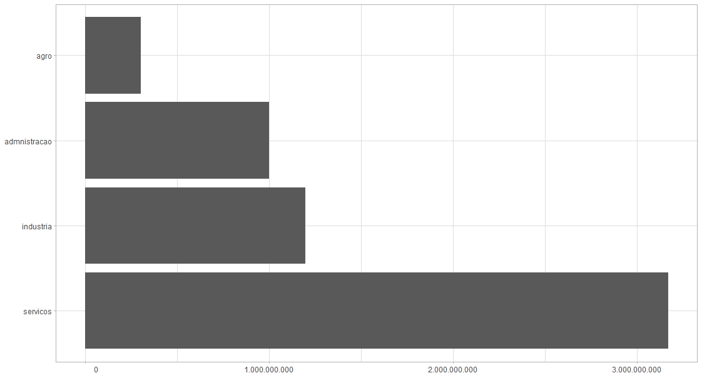
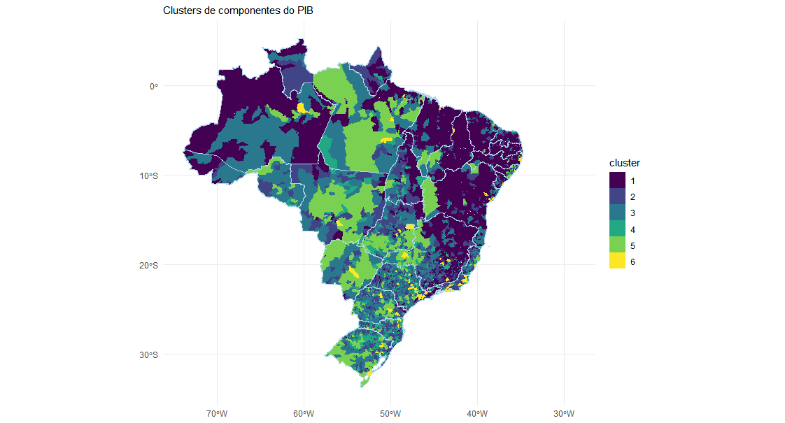
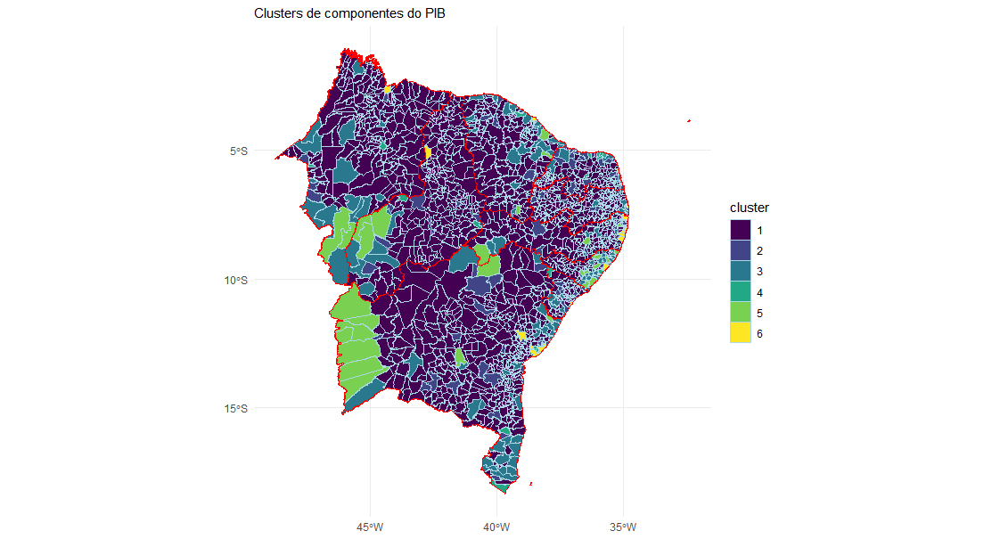
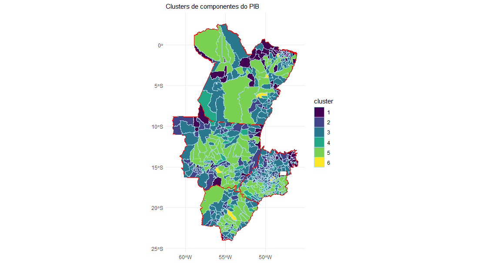
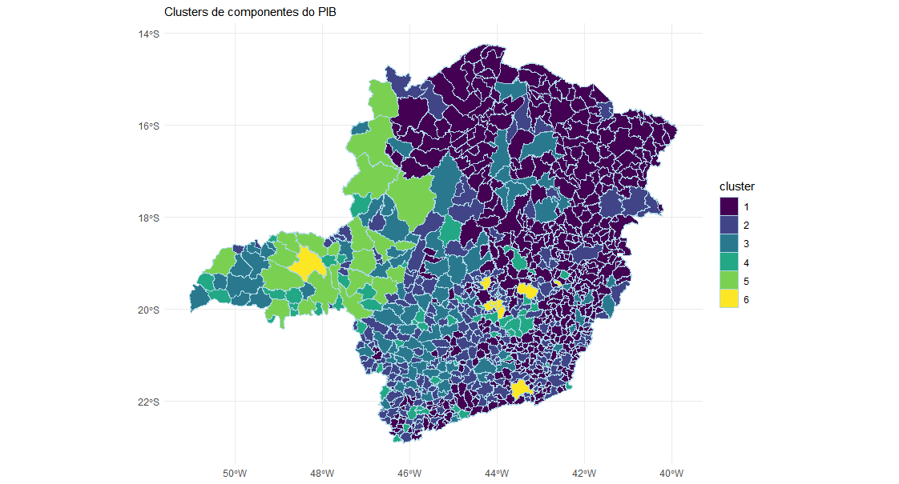
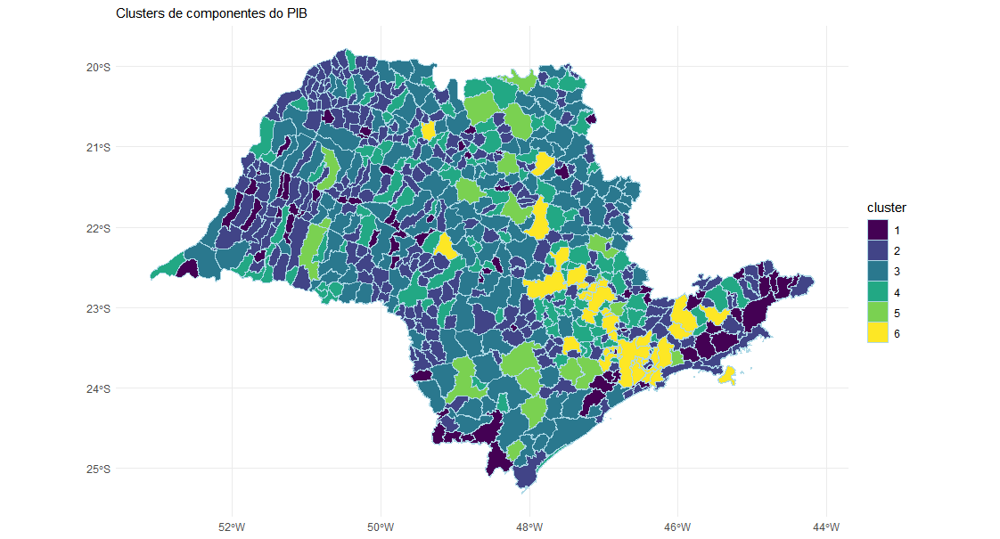
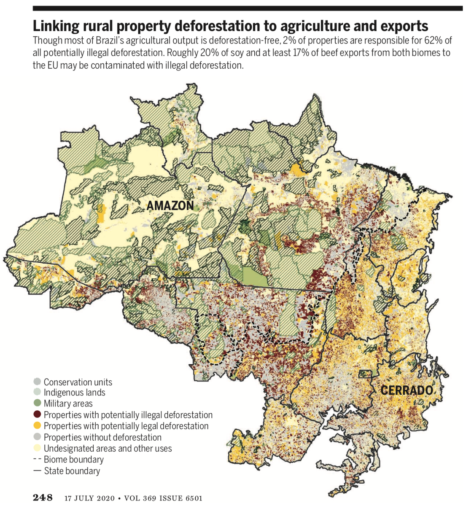

Riqueza, pobreza, territórios maiores do que países, municípios que são quase apenas pequenos povoados, populações enormes, agropecuária, indústria e serviço. O que todos esses elementos tem a nos dizer quando estão presentes em mapas que mostram os municípios do Brasil?

Usando uma escala única para as variáveis dos componentes do PIB, o próprio PIB e o PIB per capita dos municípios, foi rodado um algoritmo de formação de agrupamentos (clusters). A melhor combinação testada levou à formação de seis clusters. Os dados são de 2017, fornecidos pelo IBGE. Os mapas foram feitos com o suporte do pacote geobr na linguagem R.

Antes de detalhar o que caracteriza os agrupamentos, veja como fica o mapa do Brasil com cada município representado por sua posição nos agrupamentos.

**Os seis agrupamentos**

Os agrupamentos 1, 2 e 3 (cores mais frias) são os municípios com as piores combinações das variáveis econômicas. O agrupamento 4 se destaca por ter um elevado PIB Per capita. O grupo 5 se destaca por um elevado PIB gerado pela atividade agropecuária. O agrupamento 6 é formado pelos municípios que têm todas as variáveis elevadas para o caso brasileiro.

A maior contribuição ao PIB vem do setor de serviços. Com contribuições equivalentes a um terço do setor de serviços aparecem em seguida indústria e administração. Com contribuição bem menor está o setor agropecuário.

**Nordeste e Go-West**

O Nordeste é praticamente dominado pelas cores mais frias, que caracterizam os municípios em situação econômica mais complicada. O agrupamento 6 está presente apenas nas capitais e em mais alguns municípios próximos a Recife e Salvador.

Outro achado: "Go West" parece ser o lema da economia atual. Nas vastas regiões do Centro-Oeste concentra-se o agrupamento 5, com PIB elevado do setor agropecuário. Essa expansão econômica das novas fronteiras agrícolas está sendo feita às custas de forte desmatamento.

**Minas Gerais e São Paulo**

Minas Gerais é conhecido por ser o estado que sintetiza o Brasil. Os clusters econômicos formam clusters territoriais. As cidades nos clusters de cores mais frias estão mais ao Norte. Os tons mais esverdeados concentram-se no Oeste.

São Paulo mostra que dinheiro chama dinheiro, dada a concentração territorial dos municípios dourados. Os municípios em amarelo representam elevados valores de PIB, PIB per capita e dos três componentes do PIB mais importantes. Apesar de pequeno em número e em termos territoriais, o agrupamento amarelo representa municípios de elevada população.

**Outros mapas e outras histórias**

O mapa Go-West pode ser contrastado com o que está presente nesse tuíte do professor Raoni Rajão, sobre um artigo que indica que, nas regiões das novas fronteiras agrícolas, a expansão econômica está sendo feita às custas de forte desmatamento.

*Imagem do tuíte de [Raoni Rajão (@RajaoPhD)](https://x.com/RajaoPhD/status/1283844944357097473), 16 de julho de 2020.*

*Fernando Barbalho — Doutor em Administração pela UnB (2014). Pesquisa e implementa produtos para transparência no setor público brasileiro. Usa R nos finais de semana para investigar perguntas que fogem às finanças públicas.*

---

*Esse post foi originalmente postado no [Medium do datavizbr](https://medium.com/datavizbr/mapas-contando-história-o-pib-dos-municípios-brasileiros-aebb82f06086) e pode ser encontrado no link acima.*