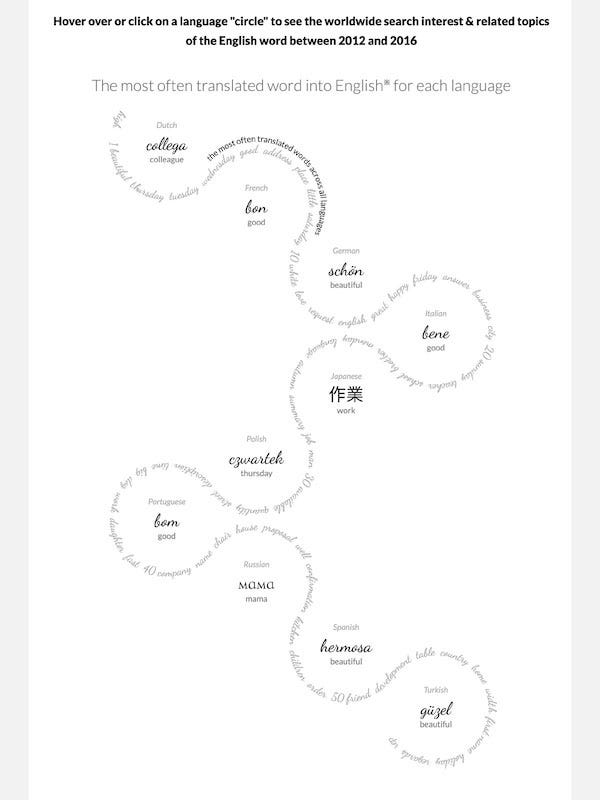
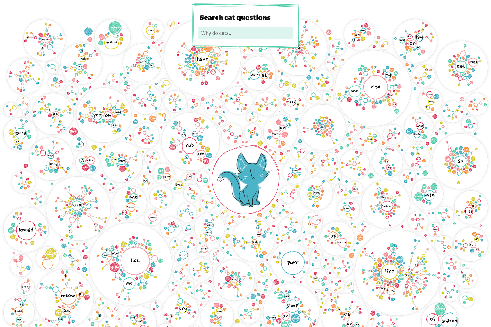

Há dois anos escrevi um texto que mostrava a evolução das tecnologias web utilizadas nos projetos de visualização de dados nos últimos 10 anos. Com a queda do flash, a evolução de programas como o Processing e a consolidação dos frameworks JavaScript para animações na web, designers e programadores têm se aproximado dos navegadores para criar melhores experiências para seus usuários. E a Nadieh Bremer tem um mix de habilidades desses profissionais.

Em 2011 ela se formou como astrônoma pela University of Leiden e trabalhou por muitos anos como consultora de análise da Deloitte. Nessa consultoria iniciou os primeiros anos profissionais como cientista de dados.

Desde 2015 ela começou a listar nos shortlist de eventos como o Information is Beautiful Awards. Em 2017 ganhou ouro em Unusual, prata em Ciência no Information is Beautiful Awards. Em 2018 ganhou ouro em Politics & Global no Information is Beautiful Awards, no Malofiej ganhou prata em Features e bronze na categoria Design. Nesse mesmo ano ganhou o Online Jornalism Awards em Jornalismo de dados investigativo e melhor visualização de dados no North American Digital Media Awards.

Boa parte das criações da Nadieh estão dentro da tríade html, css, javascript e seus frameworks como D3js e React. Dois projetos de destaque:

**Beautiful in English** — análise das palavras mais traduzidas no Google Translate para inglês em todas as línguas. Nesse projeto Nadieh utilizou Excel, D3js e R.

*Fonte: https://www.visualcinnamon.com/portfolio/beautiful-in-english*

**Why Do Cats and Dogs…?** — projeto para o Google News Lab no qual o usuário pode explorar as perguntas mais populares feitas no Google sobre gatos e cachorros. Nesse projeto ela utilizou budo, canvas, D3js e R.

*Fonte: https://www.visualcinnamon.com/portfolio/why-do-cats-and-dogs*

O que faz o trabalho da Nadieh impressionante é o cuidado tanto na parte visual como das tecnologias utilizadas em cada projeto. Esses frameworks conseguiram chegar no nível de navegação e fluidez em animações que conseguíamos com o flash. Outro ponto interessante é o processo de colaboração com outros pesquisadores. Ela faz um projeto muito legal com a Shirley Wu chamado datasketches.

---

*Esse post foi originalmente postado no [Medium do datavizbr](https://medium.com/datavizbr/nadieh-bremer-e-a-nova-era-da-visualização-de-dados-2401094c0403) e pode ser encontrado no link acima.*