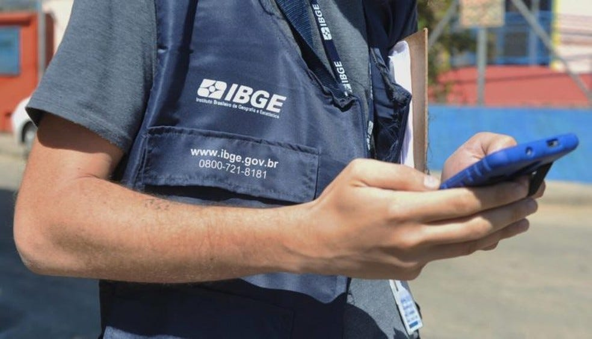
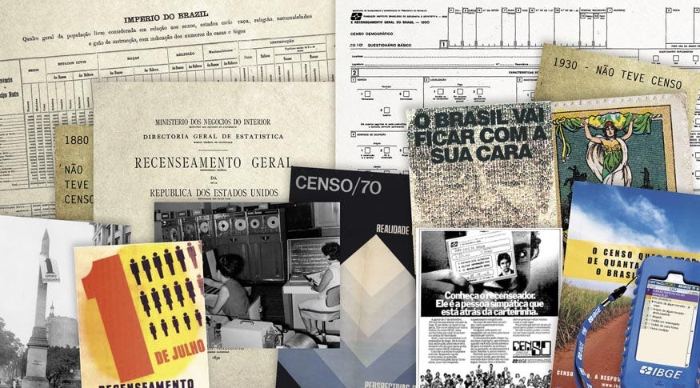
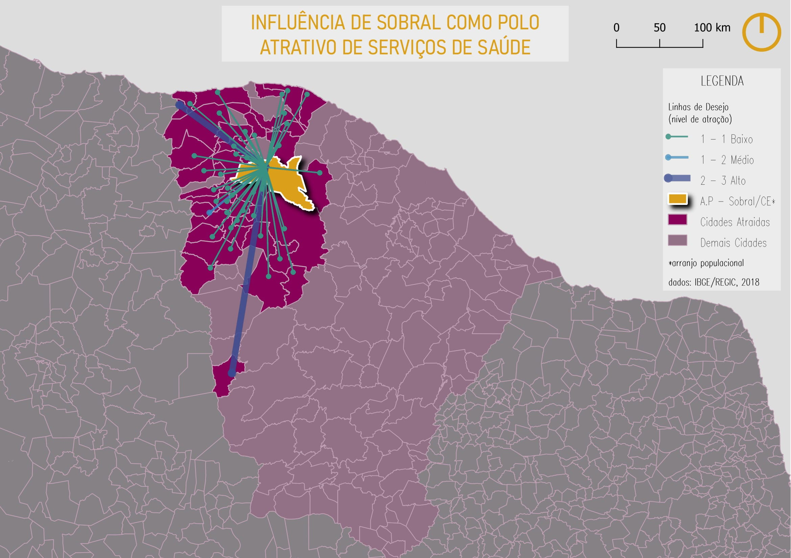
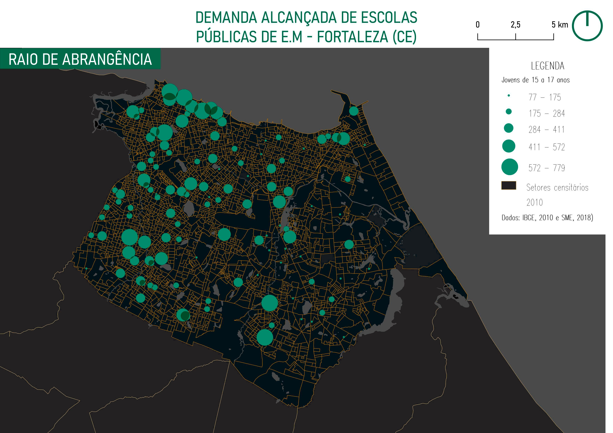

Entendendo a importância e visualizando os dados referentes ao censo demográfico

Esse texto nasceu a partir de uma thread que fiz no twitter, onde buscava demonstrar um pouco da importância de poder contar com dados públicos fornecidos pelo Instituto Brasileiro de Geografia e Estatística (IBGE). A convite do Rodrigo Medeiros, editor do Datavizbr, resolvi destrinchar ainda mais a discussão feita lá e relatar um pouco do problema que vem comprometendo a realização do censo demográfico brasileiro e as possíveis consequências que poderão decorrer disso. Além de trazer exemplos práticos da utilização desses dados como forma de elucidar a sua importância na elaboração de políticas públicas e tomadas de decisão de planejamento e gestão urbana.

**1 — Crise Orçamentária e Contexto Pandêmico**

Se você está atualizado das notícias do país, deve ter se deparado com a decisão do governo federal de cortar mais da metade da renda destinada ao IBGE. Do montante total de 2 R$ bilhões destinados à realização do censo demográfico foram retirados 1.76 R$ bilhões, quantia maior que a metade da renda total e que deverá ser destinada para a sustentação e funcionamento da estrutura organizacional que possibilita que os recenseadores coletem em 3 meses dados sócio demográficos de aproximadamente mais de 70 milhões de domicílios, ao longo de todo território brasileiro.

Essa quantia anterior que seria enviada pela união já vinha sendo criticada, pois caso não se lembrem o instituto vem sofrendo cortes orçamentários desde 2018, antes disso o IBGE recebia 3.1 R$ bilhões para sua realização. Com os novos cortes de 2021 o valor decaiu para um total de 190,7 R$ milhões. E levando em conta o cenário econômico nacional, tudo indica que a postergação da realização do censo para mais um ano, signifique também novos cortes orçamentários.

Além de enfrentar todo o reajuste econômico, a realização do censo demográfico (assim como qualquer outra atividade nesse momento), vem sendo comprometido pela pandemia do Covid-19. O censo deveria ter sido realizado em 2020 mas a situação pandêmica tornou o adiamento inevitável. São várias as problemáticas que implicam a não realização do censo demográfico neste ano. Devo lembrá-los que recentemente o Boletim Extraordinário do Observatório Covid-19 da FIOCRUZ declarou que o Brasil passa no momento pela maior crise sanitária e hospitalar, com mais de 24 estados e o Distrito Federal apresentando taxas de ocupação iguais ou superiores a 80% — 90%, além disso o surgimento de novas variantes do vírus torna tudo ainda mais perigoso.

Talvez até aqui você já tenha compreendido que o IBGE esteja passando por crises internas e externas que comprometem a obtenção de dados sócio demográficos do país, mas a intenção principal desse texto, parte de uma dúvida pessoal, que é: será que boa parte da população brasileira (ou pelo menos você que está lendo esse texto), consegue entender o que a não-realização do censo demográfico implica?

*Fonte: IBGE, divulgação*

**2 — A Importância da realização do censo demográfico**

Já no período imperial, o Brasil possuía um órgão com atividades exclusivamente estatísticas, a Diretoria Geral de Estatísticas (criada em 1871). Durante o início da República o governo decidiu ampliar as atividades estatísticas, que passaram a ser divididas entre o Departamento Nacional de Estatística e alguns Ministérios competentes. O fim do Departamento em 1934, favoreceu a criação do Instituto Nacional de Estatísticas (INE) — que posteriormente, em 1937 recebeu o anexo do Conselho Brasileiro de Geografia, passando então a se chamar de Instituto Brasileiro de Geografia e Estatística.

*Fonte: Agência IBGE, divulgação*

Isso significa que desde 1872 o Brasil realiza um censo demográfico. Somente a partir de 1920 que a realização desse censo passou a ocorrer a cada 10 anos. Até 2020, desde que foram iniciadas as atividades estatísticas nacionais, o censo havia sido adiado apenas duas vezes, uma em 1930 devido a todo o levante que levou Getúlio Vargas ao poder e outra em 1990, quando o censo foi prorrogado para o ano seguinte.

Os dados catalogados e fornecidos pelo IBGE revelam características e situações de vida da população brasileira, os quais contêm informação a respeito da renda familiar, raça, gênero, composição familiar, grau de escolaridade, situação domiciliar, dentre tantos outros aspectos. Para se ter uma ideia, em 2019 de um montante de aproximadamente 396 R$ bilhões que foram transferidos pela União a estados e municípios, cerca de 65% desse montante (251 R$ bilhões) foram distribuídos baseados nas leituras realizadas a partir dos dados censitários fornecidos pelo IBGE.

**3 — Utilizando dados do IBGE**

Como forma de elucidar a utilização prática de dados do IBGE, foram apresentadas duas visualizações desses dados em forma de mapa. Estes são referentes a municípios do Estado do Ceará (Sobral e Fortaleza), tendo como base os dados do Censo Demográfico de 2010 e os dados da REGIC de 2018.

O primeiro mapa é referente à demanda ofertada de serviços da saúde pelo Arranjo Populacional de Sobral/CE. Ao todo 41 municípios estabeleceram ligações com o arranjo populacional de Sobral, demonstrando que a cidade é um polo atrativo do serviço de saúde.

*Mapa produzido utilizando dados referentes ao censo de 2010 do IBGE e os de 2018 da REGIC*

O segundo mapa diz respeito à demanda alcançada de escolas do ensino médio em relação aos jovens do município de Fortaleza, CE, utilizando dados do censo de 2010 referentes aos jovens de 15 a 17 anos da cidade.

*Mapa produzido utilizando dados referentes ao censo de 2010 do IBGE e dados públicos da Prefeitura de Fortaleza (Fortaleza em Mapas)*

**4 — Conclusão**

A não ocorrência do censo significa uma perda gigantesca para nossa pesquisa demográfica. É inconcebível propor políticas públicas e melhorias à nossa população sem antes conhecer os perfis que compõem essa população. O desmonte institucional que o IBGE vem sofrendo revela muito sobre o descaso com a transparência por parte do governo e pode impedir um entendimento mais preciso sobre como a pandemia afetou de fato a vida dos brasileiros e das nossas cidades.

---

*Esse post foi originalmente postado no [Medium do datavizbr](https://medium.com/datavizbr/o-ibge-corre-perigo-2dd9e21f76a0) e pode ser encontrado no link acima.*