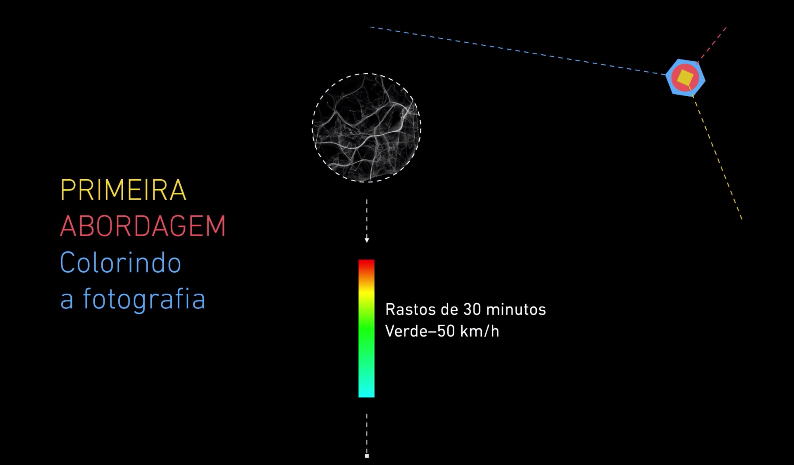
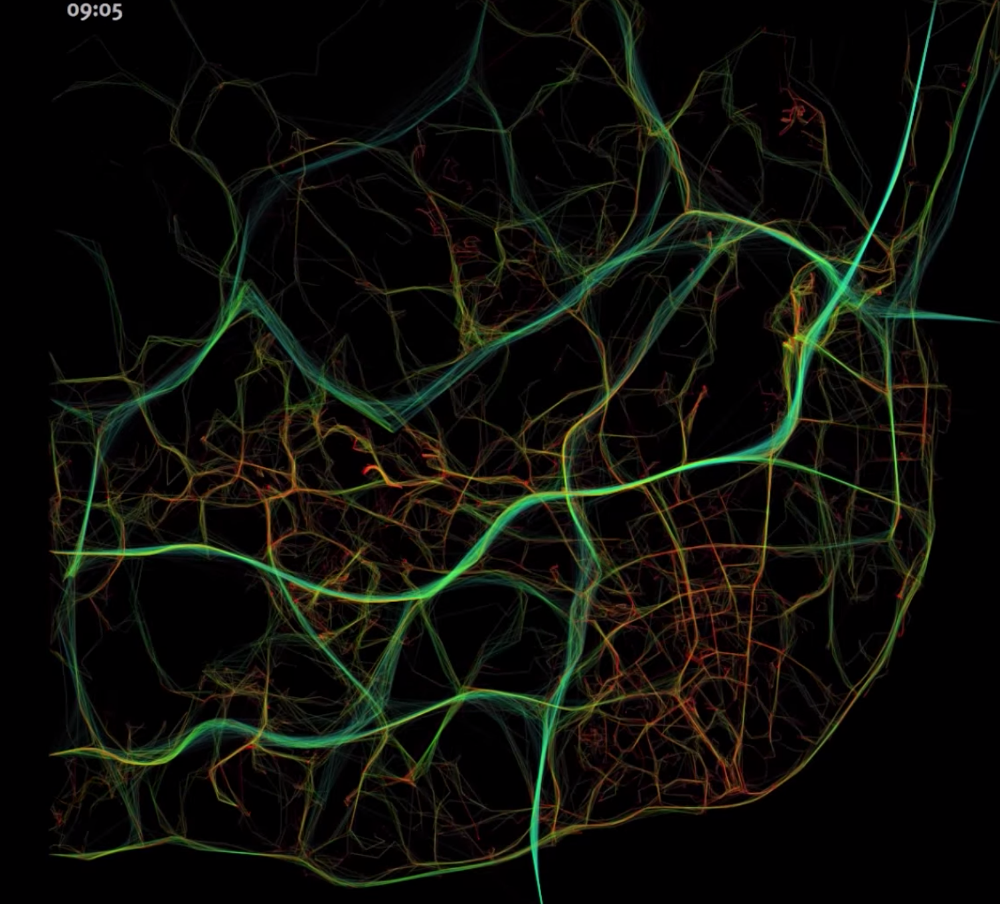
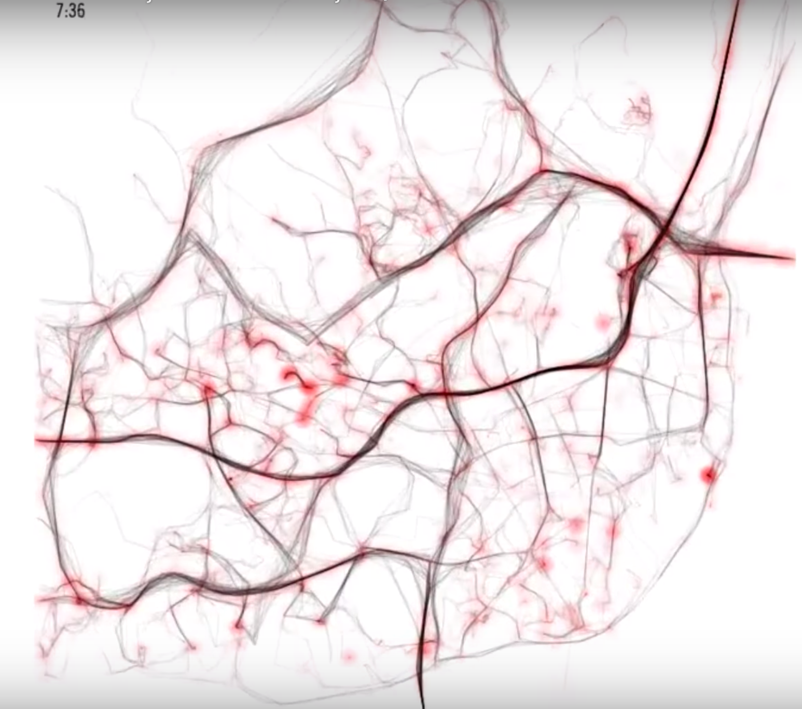
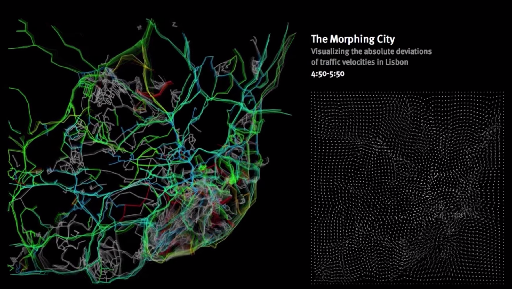
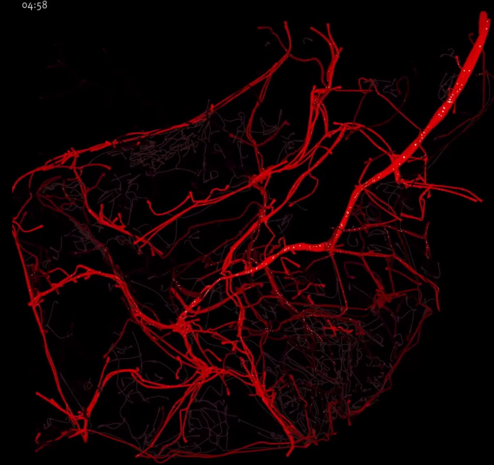

Pedro Miguel Cruz é um multipremiado designer de visualização português, hoje professor do mestrado em visualização de informação na Northeastern University em Boston. Pedro tem doutorado em Ciência da Informação e Tecnologia pela Universidade de Coimbra e foi pesquisador no MIT Senseable City Lab em Boston e em Singapura.

Em 2013 tive a oportunidade de convidá-lo para realizar uma palestra e um workshop sobre visualização de dados no Interaction South America 2013. Nessa palestra o Pedro nos trouxe os conceitos de fotografias, retratos, caricaturas e desfiguramentos na visualização de dados.

Antes de falar qualquer coisa sobre esses termos o Pedro fez uma breve explicação sobre visualização de dados classificando como "uma prática que tenta sintetizar grandes quantidades de dados mas para uma audiência alargada". E pontuou como a semiologia gráfica é importante nesse processo: "preciso estudar qual tipo de forma que servem para transmitir determinado tipo de dados".

Pedro considera que claramente assume um papel autoral nas criações de visualizações. Mas pondera que existe uma visão mais purista que "dizem que quem faz visualização, o designer da visualização não é autor. Só existem uma maneira de se fazer as coisas". E completa afirmando que até nas abordagens mais clássicas "existem opções que se tomam... e só essa opção, já aqui tem um envolvimento autoral do designer de visualização".

Os aspectos que mais me interessam são efetivamente trazer metáforas visuais e exageros e distorções para a visualização. Ou seja, se eu usar uma metáfora visual bastante forte, como acontecem nos retratos e nas caricaturas, eu posso tentar transmitir uma mensagem mais forte com minha visualização.

**Fotografia**

A abordagem de fotografia "é a abordagem mais direta para a visualização. É a translação mais direta do espaço dos dados, para o espaço visual". Exemplo: o mapeamento da palavra "Reis" em Os Lusíadas, um gráfico que retrata a ocorrência da palavra por canto.

**Retrato e Caricatura**

Num projeto com 2 milhões de pontos GPS de 1534 veículos em Lisboa (outubro de 2009), o Pedro começou com uma abordagem fotográfica e evoluiu para um retrato com metáfora forte e depois para uma caricatura. A metáfora escolhida foi "o trânsito como um organismo vivo, a cidade como um organismo vivo e começamos a explorar a ideia de coágulos no trânsito".

Ele criou uma visualização minimal onde "quando os veículos estão mais lentos, eu desenho pontos vermelhos, e fica com essa aparência de um sistema com problemas de circulação".

Para criar uma caricatura, utilizou a cidade "como sistema circulatório, as artérias são veias, as espessuras das veias tem a ver com o volume de tránsito, e a cor das veias também está relacionada a velocidade média, se o sangue fica mais escuro, o tráfego é mais lento".

**Desfiguramento**

Refinando ainda mais a metáfora: "agora temos mesmo quase glóbulos sanguíneos a circular nas veias e a fazer as veias a pulsar e exageramos mais essas distorções".

Como o Pedro comenta: "esse tipo de abordagem foi bastante pictórica, às vezes quase artística em alguns aspectos, bastante exploratória" mas que usaram os conceitos formais de caricatura, retrato, metáfora e desfiguramento tanto no trabalho prático como no trabalho teórico.
