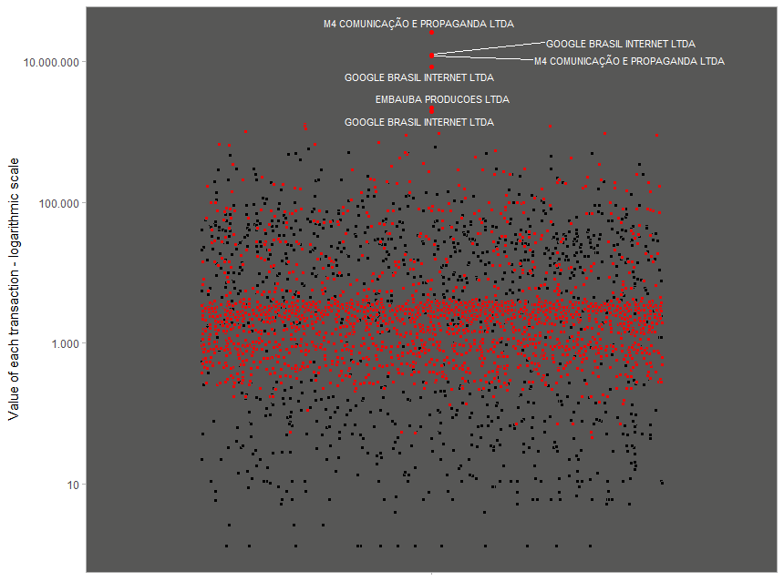
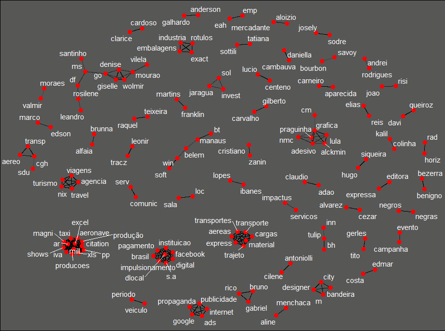
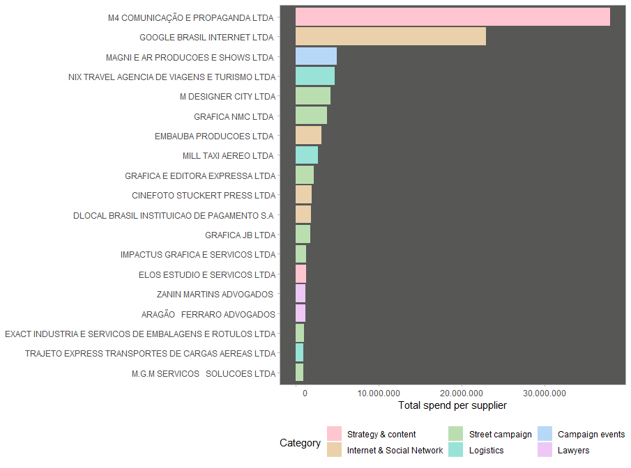
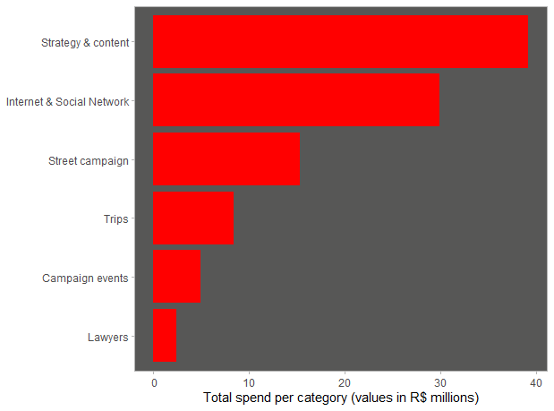

O que os dados sobre gastos da campanha de Lula nos diz sobre a estratégia da candidatura?

Uma forte ênfase na produção de conteúdo, uma abordagem estratégica para a comunicação, o impulso da mídia social e da internet, campanhas de rua e um conjunto de eventos significativos em todo o Brasil são os principais elementos associados aos dados abertos sobre os gastos presidenciais de Lula nas eleições de 2022.

**Coleta de dados**

Para fazer a análise foi necessária apenas uma tabela disponível no data lake da Base dos Dados, filtrando despesas do candidato do PT para presidente no ano de 2022.

**Análise dos maiores fornecedores**

A primeira análise foi a de identificar os fornecedores mais significativos para a campanha. Uma empresa de comunicação, M4 comunicação e propaganda LTDA, ocupou a primeira posição no ranking. Já a gigante da internet Google ficou na segunda posição. Estas duas empresas estão muito distantes de todas as outras 18 quando visualizamos o comprimento das barras.

No gráfico de dispersão comparando quantidade de transações e total gasto, destaca-se uma agência de viagens, a Nix Travel Agência de viagens e turismo, envolvida em mais de 1000 transações — pista essencial para compreender a estratégia da campanha.

**Rede de palavras das descrições**

Da rede de palavras correlacionadas das descrições das transações, percebeu-se as seguintes características da campanha:

- **Alvo na Internet e na rede social:** duas cadeias cruciais de palavras enfocam o desenvolvimento de um público na Internet e na rede social — google, anúncios, internet e propaganda, além de Facebook, digital e impulsionamento.
- **A campanha nas ruas não está morta:** houve uma demanda por muitos materiais impressos usados por militantes em eventos de rua — bandeiras, adesivos e panfletos (santinhos).
- **Gênero e cor importam:** o par de palavras "negros e negras" aparece nas descrições das transações associado a materiais de campanha, desenvolvidos para um público interessado em políticas afirmativas.
- **Um desafio logístico:** muitas cadeias de palavras estão relacionadas ao trabalho de agências de viagem e empresas de transporte. O Brasil é enorme, a campanha foi curta no tempo e houve foco significativo em grandes eventos em todo o país.
- **Grandes eventos:** as palavras "evento" e "campanha" estão relacionadas a transações com uma empresa que produz eventos e shows.
- **Abordagem federada:** desenvolvimento de materiais que combinam candidatos de diferentes estados.

**Framework da estratégia**

As categorias do framework:

1. **Estratégia e conteúdo** — o pilar mais crucial, decorrente das opções de abordagem e da contratação da empresa M4 para o serviço de estratégia de comunicação.
2. **Internet e redes sociais** — segundo maior gasto.
3. **Campanha de rua**
4. **Logística**
5. **Eventos de campanha**
6. **Advogados** — presença de dois escritórios de advocacia no ranking dos 20 principais fornecedores.

Na visão do dinheiro gasto, Estratégia e Conteúdo foi o pilar mais crucial da campanha, seguido por Internet e Rede Social. Outros pilares que requerem muito menos dinheiro podem ter sido bastante efetivos para determinar o resultado da campanha.

---

*Esse post foi originalmente postado no [Medium do datavizbr](https://medium.com/datavizbr/raio-r-de-uma-campanha-vitoriosa-75d461f452e2) e pode ser encontrado no link acima.*