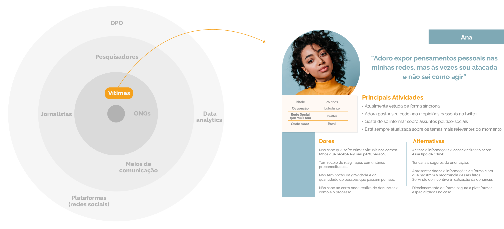
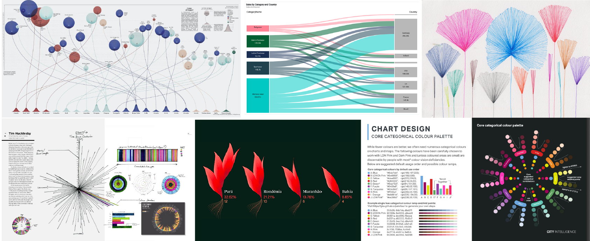
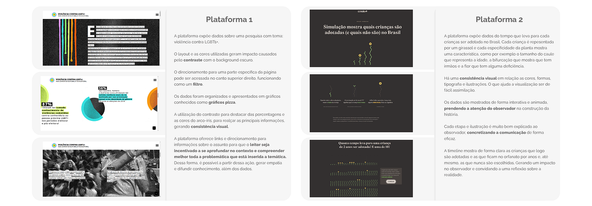
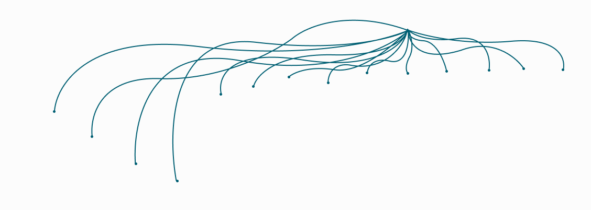
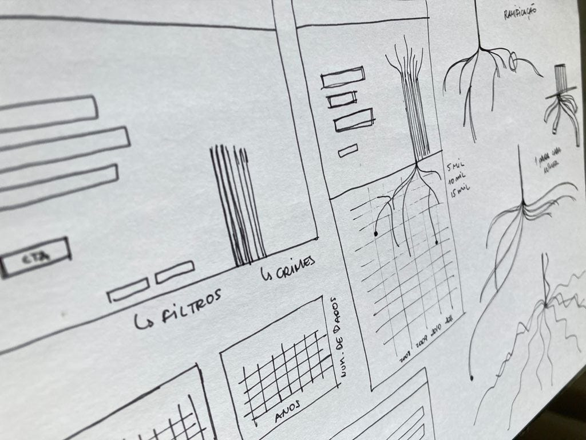
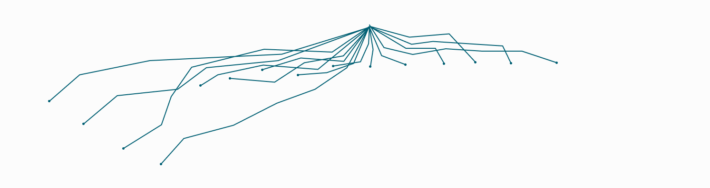
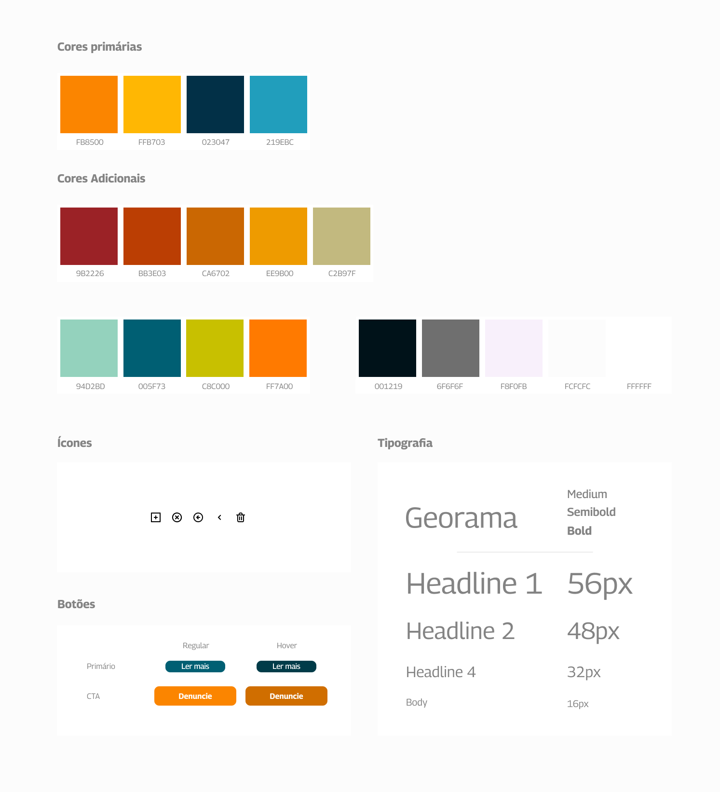
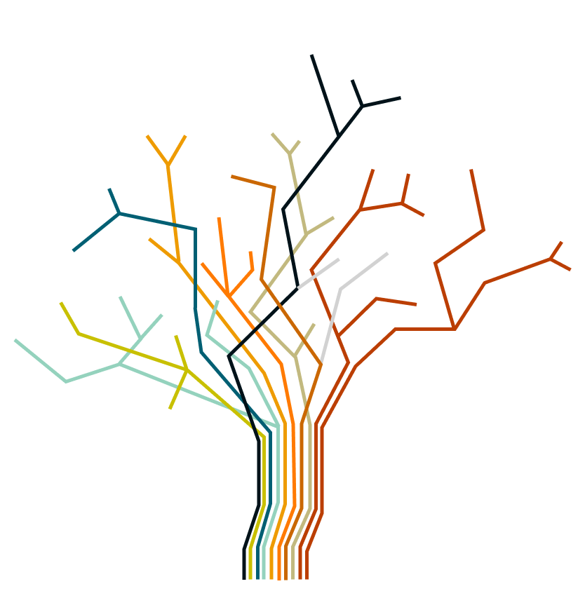
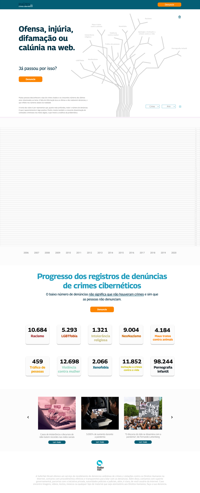

Este artigo tem como objetivo apresentar o processo de desenvolvimento do projeto Raízes, que foi elaborado na disciplina de planejamento visual 4, do curso de Design gráfico do Instituto Federal da Paraíba (IFPB), sob orientação do Professor Dr. Rodrigo Medeiros. Nesse cenário, nos foi atribuído o desafio de desenvolver um artefato digital, considerando todas as etapas da concepção do design com foco na experiência do usuário.

Ao observar o contexto atual e os inúmeros relatos de discurso de ódio nas redes sociais tanto de pessoas próximas, quanto de pessoas midiáticas, encontramos uma oportunidade para desenvolver uma visualização de dados com as informações que serão coletadas.

**Contexto**

Sabemos que a intolerância faz parte da humanidade há muito tempo, mas, durante a pandemia ocasionada pelo novo corona vírus, houve uma propagação crescente dos discursos de ódio em diversas plataformas. Os crimes são comumente relacionados a conteúdos como o racismo, LGBTfobia, pornografia infantil, xenofobia, violência contra a mulher, entre outros. A Safernet aponta um crescimento alarmante de crimes vinculados a esses temas, chegando a 5.000% de aumento durante a pandemia nas plataformas mais utilizadas como o instagram, facebook e twitter.

*Fonte: Veja (2020)*

Assim, chegamos a seguinte questão: como eu poderia combater a falta de informação, gerar interação entre o espectador e os dados e conscientizar acerca da importância do ato de denunciar?

- Expondo informações e orientações confiáveis para fazer as denúncias;
- Informando, de forma clara e ilustrada, acerca dos dados numéricos;
- Mantendo-os atualizados;
- Aproximando os dados das pessoas ao utilizar uma linguagem direcionada.

**Persona**

Foram selecionados stakeholders envolvidos nos pontos de contato do produto, pois, se tratando de uma visualização de dados, é fundamental priorizar a experiência do observador. Dessa forma, foi definida uma protopersona para guiar o projeto, delimitando formas de linguagem e estrutura do storytelling.

**Matriz de alinhamento**

**Análise de Similares**

Duas plataformas foram analisadas levando em consideração a estrutura de organização das informações, as cores e fontes utilizadas, a forma de expor os dados, os tipos de interação com o observador e a maneira que a constância visual da identidade foi aplicada.

*Plataforma 1 | Plataforma 2*

**Os dados**

Os dados apresentados foram coletados da central de denúncias da Safernet, ONG que monitora violações de direitos humanos na internet. Desse modo, foram estruturadas as informações do monitoramento de 10 crimes recebidos e processados pela plataforma durante 15 anos.

**Construção**

A partir disso, foram realizados estudos sobre como expor os dados aplicando o conceito metafórico proposto, de modo que atendesse o objetivo de desenvolver uma visualização de dados que gerasse interesse, engajamento e exibisse, de forma ilustrativa, as informações necessárias.

*Fonte: Google Imagens*

*Fonte: Pinterest*

Após a escolha das referências visuais e a seleção dos dados que seriam trabalhados, foram feitos alguns esboços para compreender a organização dos elementos tanto no layout do desktop, quanto no comportamento da visualização dentro desse espaço.

Ao observar a relação Dados x Anos, foi necessário extrair o maior número registrado de denúncias para que fosse utilizado como base para a divisão numérica do gráfico. Em 2008 foram realizadas 289.707 no crime de pornografia infantil, dessa forma, a visualização foi estruturada utilizando o denominador 5 como fator em comum.

Com base na definição anterior, foi iniciado o processo de determinar a elaboração das raízes. As primeiras ramificações foram feitas utilizando linhas curvas, porém não foi obtido um resultado satisfatório. 

Em um segundo momento, as linhas foram construídas com formas pontiagudas e geométricas, resultando em um direcionamento mais alinhado com a proposta do projeto.

*Construção das ramificações superiores*

**Guia de Estilo**

**DataViz**

A visualização foi desenvolvida para criar interação entre espectador e dados e, ao clicar em um galho ou no nome do crime, automaticamente as raízes dos números se ramificam, sendo possível acessar cada dado específico do ano selecionado.

Além do objetivo de interação entre o usuário e os dados, a plataforma tem a finalidade de incentivar as denúncias, dessa forma, foram aplicados botões CTA para estimular uma possível ação.

**Considerações Finais**

A visualização de dados foi desenvolvida a princípio como um experimento para disciplina PV4. Dessa forma, é um projeto introdutório com possibilidades futuras de agregar outras interações e novas funções baseando-se em pesquisas mais aprofundadas e testes de usabilidade direcionados. No entanto, o objetivo principal de entregar informações utilizando linguagem direcionada, de modo estruturado e com intuito de gerar interações entre espectador e dados, foi atingido.

Autora: Tatyana Mendes | Orientador: Professor Dr. Rodrigo Medeiros

---

*Esse post foi originalmente postado no [Medium do datavizbr](https://medium.com/datavizbr/raízes-e91f9cf0cc) e pode ser encontrado no link acima.*