Esse ano tive a honra de fazer uma apresentação na sexta edição do VIS4DH (Workshop on Visualization for the Digital Humanities), uma oficina que integra a programação de IEEEVIS 2021, o maior evento acadêmico da área de visualização de dados.

A oficina trouxe apresentações de artigos costuradas com provocações: falas curtas, de cinco minutos, em que os participantes apresentam um argumento em favor de algum ponto de vista importante para eles.

O tema desse ano era "Política e Escala", com reflexões sobre o papel da visualização em um mundo que desafia nossas noções de escala.

A provocação que apresentarei hoje é intitulada "Uma unidade de dado já é 'Big Data'", supervisionada pela professora Doris Kosminsky.

Nosso relacionamento com os dados que coletamos sobre nosso planeta e como escolhemos representá-los tem impacto profundo em nossa compreensão do mundo e de seus habitantes.

A iminente — e cada vez mais presente — ameaça da crise climática traz a marca do Antropoceno — uma nova era geológica na história do planeta marcada pela escala e o alcance do impacto humano sobre os sistemas da Terra.

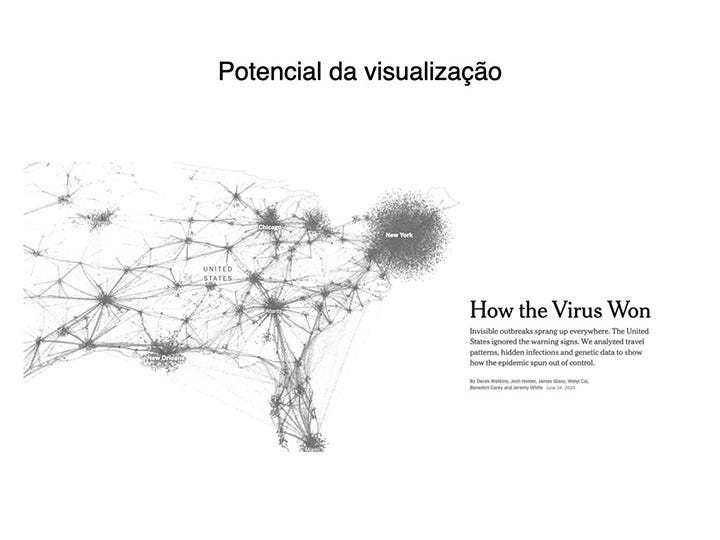

Designers e pesquisadores já podem ter bastante consciência do potencial da visualização para trazer insights e possibilitar a cognição humana sobre assuntos altamente complexos.

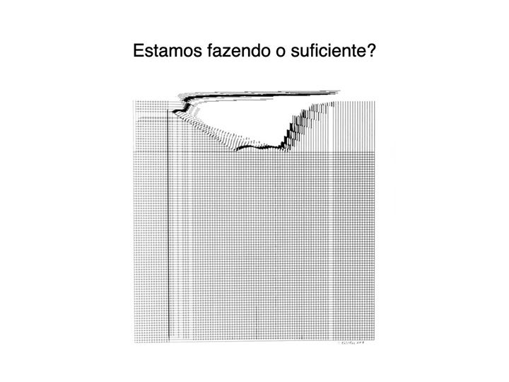

Mas, como estamos visualizando a escala dos desafios que se apresentam a nosso tempo?

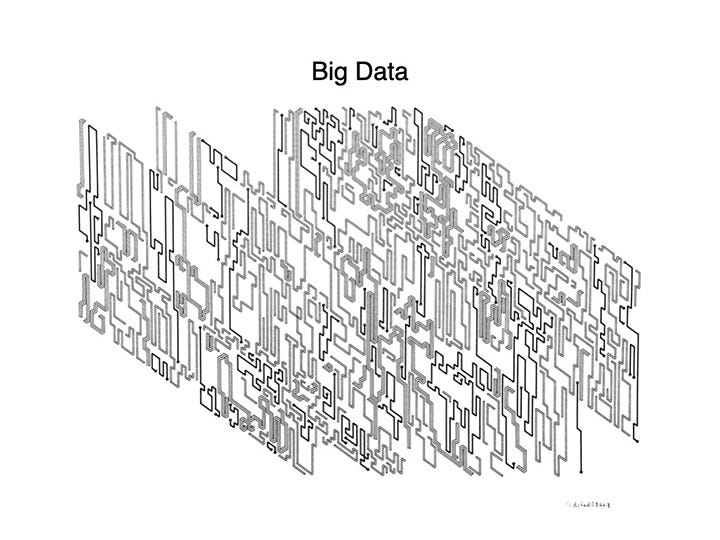

Quando falamos de visualizar realidades imensas, não podemos deixar de pensar em conjuntos de dados imensos. Ou, para usar o nome apropriado, em "Big Data": datasets gigantescos, com múltiplas camadas e dimensões que parecem replicar a própria estrutura dos ciclos de feedback do clima — uma série de eventos, sujeitos e agências profundamente interconectados.

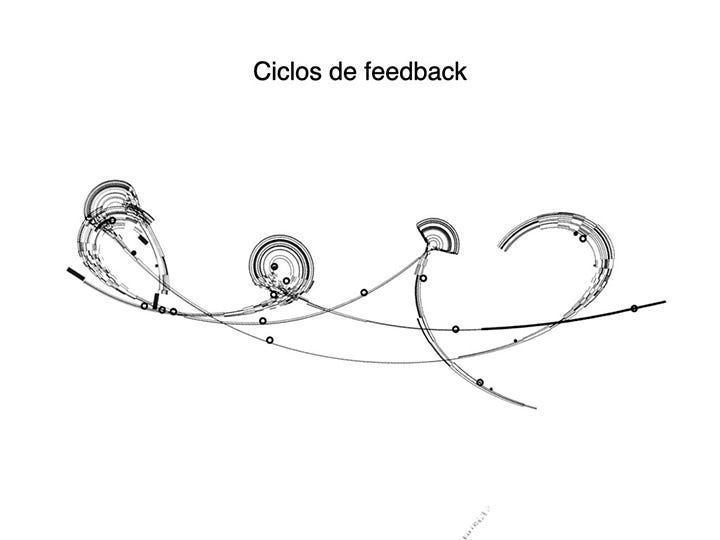

Um aumento de temperatura aqui, por exemplo, pode levar a um derretimento de geleiras ali, lançando na atmosfera gases antes congelados em permafrost, aumentando ainda mais a temperatura e eventualmente afetando umidade, colheitas, que por sua vez afetam outros sistemas, e daí em diante.

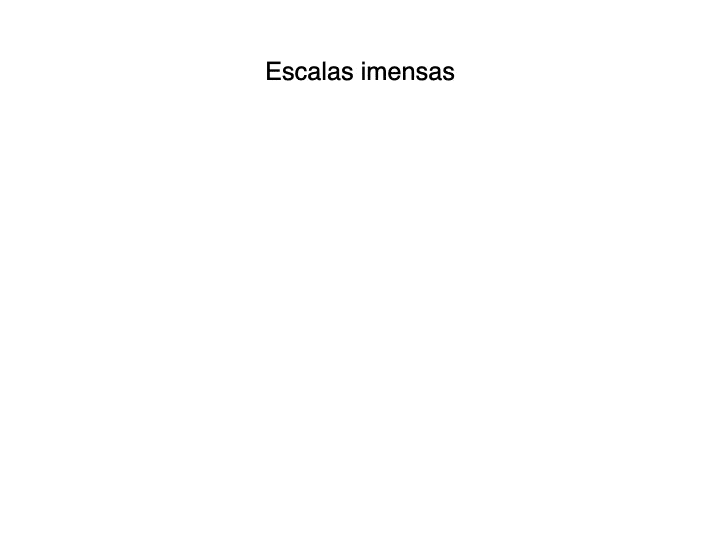

A realidade diante de nós é imensa não apenas em sua profunda interconectividade, mas também em seu alcance, tanto em espaço quanto em tempo. A poluição por plásticos, por exemplo, é uma realidade que podemos visualizar por meio de imagens de praias poluídas, mas que se estende muito além disso. Está também nos microplásticos invisíveis a olho nu em esgotos e correntes marítimas, depositados nos estômagos de peixes e de humanos, e à deriva por nossa atmosfera — até ao próprio ar que respiramos.

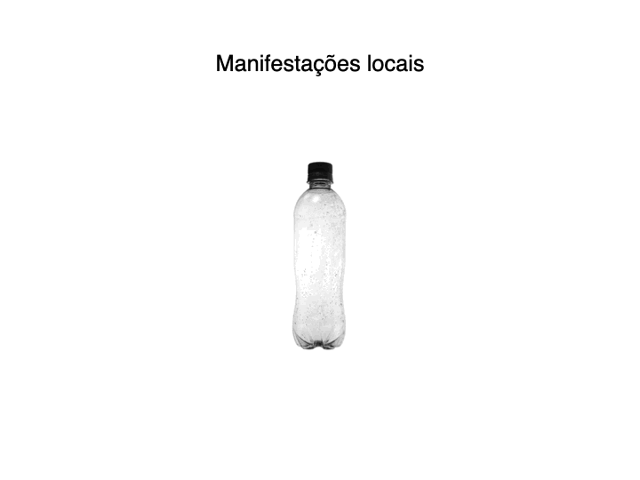

Dessa maneira, uma simples garrafa de plásticos que pode estar sobre sua mesa é apenas a manifestação local de um fenômeno milhares de vezes maior, um vasto objeto fora de alcance que desafia nossas capacidades de visualização.

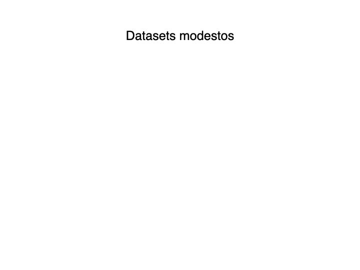

Apesar da dimensão imensa desses fenômenos, muitos de nossos contatos com dados de clima na vida cotidiana se tratam na verdade de contatos com datasets de tamanho modesto, facilmente exploráveis por meio de ferramentas comuns. E, ainda assim, esses pequenos ou médios conjuntos de dados já apresentam desafios significativos para a compreensão do público leigo sobre a urgência e dimensão do problema que está sendo representado.

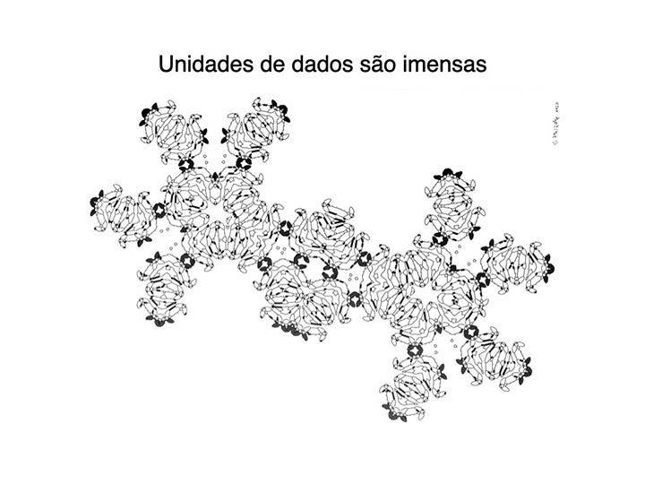

Uma unidade de dado isolada, como um registro de temperatura em uma estação meteorológica, por exemplo, já está inserida em uma intrincada rede de relacionamentos com outras unidades de dados, bem como com organismos vivos e fenômenos. Dessa forma, esse dado tem efeito profundo e direto sobre seu meio, assim como é afetado e produzido por ele.

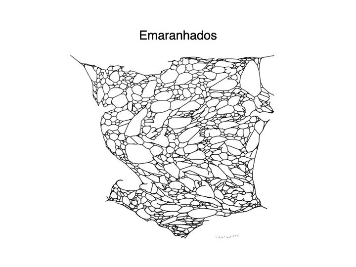

Esse tipo de rede tortuosa de relacionamentos e emaranhamentos é natural para a vida orgânica, mas parece desafiar nossa cognição e nossas formas de organizar e ver o mundo. Representar realidades que cobrem escalas temporais da ordem de milissegundos a milênios — de milímetros a quilômetros — pode demandar não que pensemos cada vez maior, mas que pensemos pequeno.

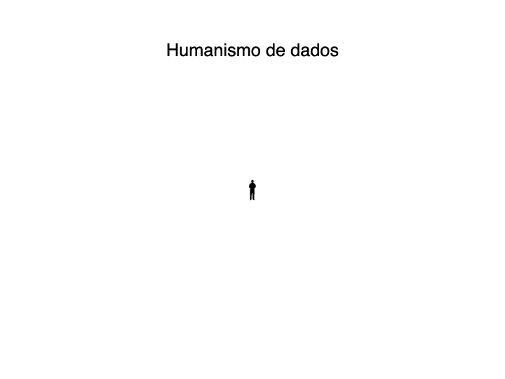

O humanismo de dados, popularizado por Giorgia Lupi, pode ser útil como uma resposta a esse problema, priorizando a escala e cognição humanas como a métrica pela qual devemos avaliar nossos esforços de visualização.

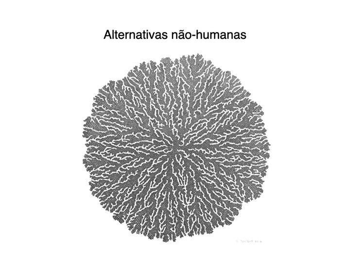

Ao mesmo tempo, pensadores das humanidades vêm tentando deslocar nossas perspectivas de uma visão de planeta centrada no humano para a miríade de alternativas centradas em não-humanos, reconhecendo as agências de fauna, flora e funga como forma de equilibrar os limites de nossa compreensão.

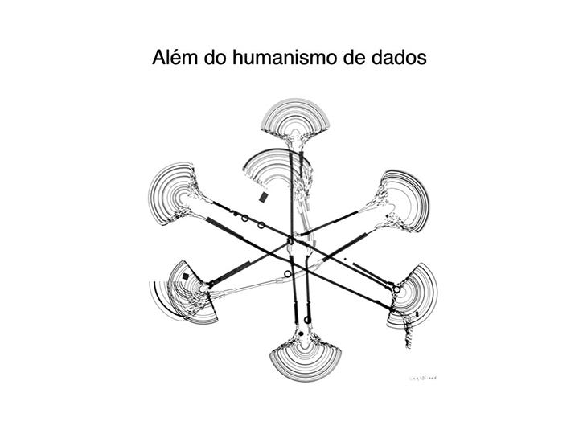

Seria possível imaginar uma moldura de pensamento além do humanismo de dados, focada na escala do planeta e em sua rede de relações? E que cara isso teria?

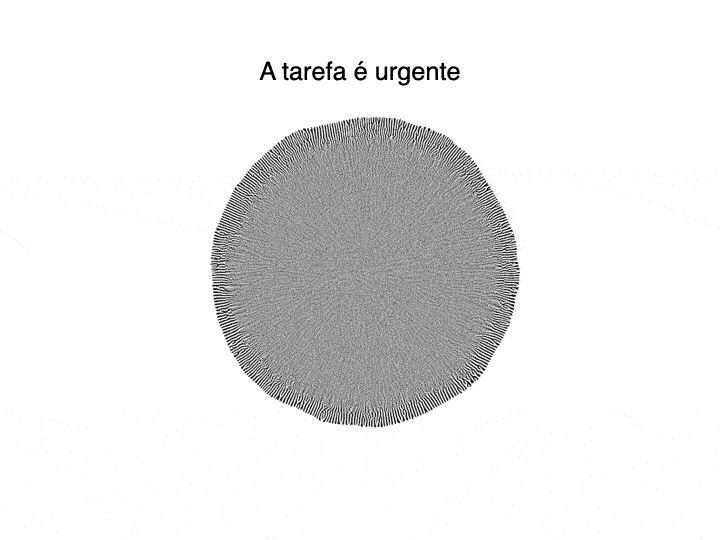

Precisamos urgentemente comunicar essas preocupações em nossas visualizações, questionando como nossas escolhas de representação tratam da escala da crise, do emaranhamento da vida na Terra, e nos esforçando para imaginar dados além do humanismo, para que aquilo que é infinitamente complexo possa ser não só compreendido, mas habitado.

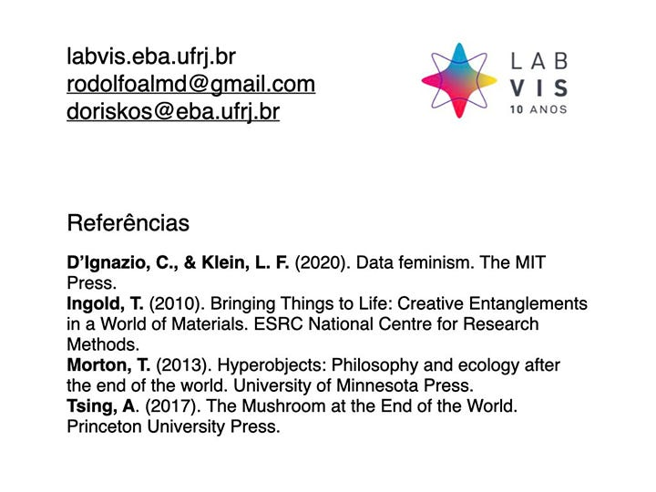

Rodolfo Almeida — Jornalista visual no Núcleo Jornalismo e mestrando em design na EBA-UFRJ, pesquisa representações da crise climática na visualização de dados junto ao LabVis.
