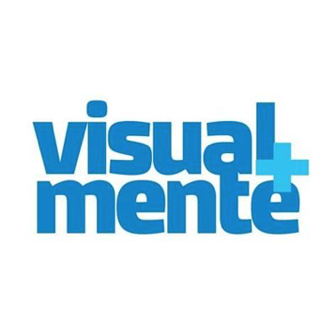
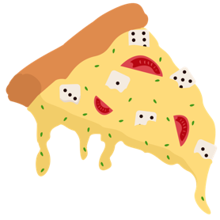
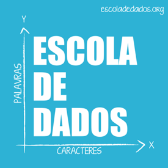
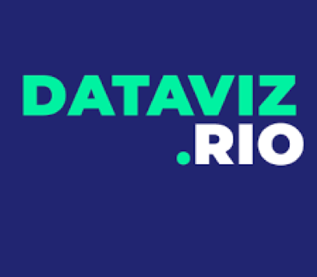
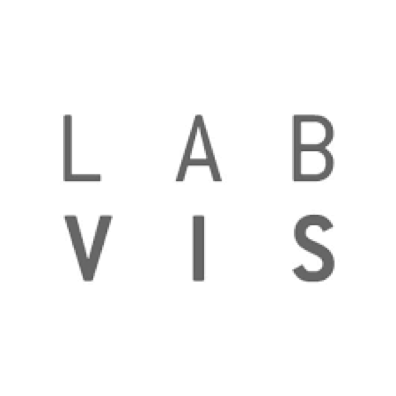
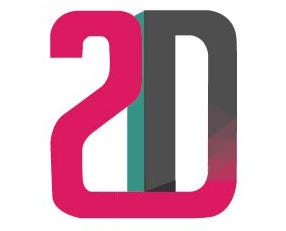
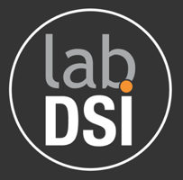
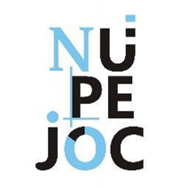
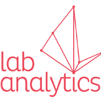

E começamos 2021 finalizando nossa série sobre visualização de dados no Brasil com as últimas categorias — Comunidades e Grupos de pesquisas. Lembro que essa série iniciou depois em uma live no Datavis Lisboa na qual falei sobre a evolução da comunidade de visualização de dados no Brasil nos últimos 10 anos.

Na primeira parte falamos sobre a história da Infografia no Brasil nos últimos 25 anos. Depois falamos sobre a primeira categoria de trabalhos envolvendo Arte e as interfaces físicas, a segunda categoria foi sobre Design e Computação e na terceira categoria comentamos sobre Jornalismo de Dados.

Comunidades
Começamos comentando sobre as comunidades que foram super importantes para consolidar a temática da visualização de dados no Brasil. Esse é um mapeamento preliminar, então muitos podem ficar de fora. Mas estamos dispostos a ir incluindo mais iniciativas por aqui ao longo dos anos. Também não inclui o datavizbr porque se vocês já chegaram esse texto, nosso papel já está feito.

Visual+mente

Podcast sobre design e artes visuais comandado por Rafael Ancara, Almir Mirabeau e Ricardo Cunha Lima. Os três são designers, pesquisadores e envolvidos com a comunidade de visualização de dados. Em 2017 e em 2020 lançaram episódios sobre dataviz.

Pizza de dados

Outro pocast que ajudou muito a comunidade de dataviz foi o Pizza de dados. O primeiro podcast Brasileiro sobre ciência de dados comandado por Jessica Temporal e Letícia Portella.

Escola de dados

Instituição que lidera o processo de educação para o jornalismo de dados no Brasil. Atualmente é também responsável pelo CODA — Conferência Brasileira de Jornalismo de Dados e Métodos Digitais.

Pensar Infográfico

Iniciativa para o ensino de Infografia criada por Rafael Ancara e Fabiano de Miranda, o Pensar Infográfico ganhou repercussão pelos workshops e pelos textos refletindo sobre o ensino da infografia no Brasil.

Dataviz.Rio

Uma comunidade de designers, programadores, artistas e pesquisadores do Rio de Janeiro e apaixonados por visualização de dados criada por Julia Giannella e Leandro Amorim. No Medium da comunidade tem o registro dos encontros que já tiveram. Na pandemia, a iniciativa teve a frente de muitas lives que rolaram sobre dataviz, principalmente no canal deles e no CVD Vive.

Grupos de Pesquisas
Vamos comentar sobre sete grupos que se destacaram, percebam que são de áreas de estudo diferentes. O Labvis, LabDSI e o 2ID pesquisam visualização de dados sob a perspectiva interdisciplinar do design. O GRID e o nupeJOC pesquisam a temática sobre a perspectiva da comunição. E o Visgraf e lab analytics são mais focados na perspectiva da computação.

Laboratório da Visualidade e Visualização — Labvis

O Laboratório da Visualidade e Visualização da Escola de Belas Artes da Universidade Federal do Rio de Janeiro (LabVis — EBA). Desde 2010 o grupo vem investigando sob a coordenação de Doris Kosminsky e de Claudio Esperança, unindo alunos de graduação em Comunicação Visual Design, de pós-graduação em Artes Visuais e COPPE-UFRJ de forma interdisciplinar na pesquisa e desenvolvimento de visualizações de dados. São 10 anos de muitos projetos, alunos e pesquisadores que passaram.

Design de informação e de interação — 2ID

O grupo Design de informação e de interação — 2ID — liderado pelo pesquisador Rodrigo Medeiros tem como foco a visualizações de dados sob a perspectiva do design. Você pode acompanhar as publicações aqui do medium do datavizbr para conhecer melhor o trabalho do pesquisador.

LabDSI

O LabDSI é um espaço de pesquisa e extensão científicas em design da Universidade Federal do Paraná (UFPR), com desenvolvimento de projetos que potencializam a inserção científica e contribuem na formação de novos pesquisadores na área. O laboratório tem uma coordenação colaborativa, porém na área de infografia e visualização de dados percebemos alguns alunos orientados pela professora Carla Spinillo no cenário nacional.

GRID

O Grupo Interdisciplinar de Pesquisa em Design da Informação Jornalística — GRID — nasceu em 2016 com o propósito de trabalhar com temas relacionados ao design editorial, visualização da informação e jornalismo de dados. O Professor Rodrigo Cunha lidera o grupo.

nupeJOC

O Núcleo de Pesquisa em Linguagens do Jornalismo Científico — nupejoc- é liderado pela professora Tattiana Teixeira e pesquisa o jornalismo de dados.

Visgraf

O laboratório VISGRAF foi criado eme 1989 com o propósito de desenvolver pesquisa na área de computação gráfica no Instituto de Matemática Pura e Aplicada. O laboratório tem a coordenação do professor Luiz Velho.

lab analytics

O Laboratório de pesquisa, desenvolvimento e inovação em análise de dados na UFCG é coordenado pelo professor Nazareno Andrade. Recentemente o professor deu acesso a participantes externos ao semestre da disciplina de visualização de dados do curso de Computação da UFCG.

Começamos uma nova década e a visualização de dados já mostrou o valor que pode dar a sociedade no entendimento de problemas complexos. Espero que consigamos evoluir mais e mais nesses próximos anos e estarei aqui para observar, colaborar e crescer junto com todos vocês!

Espero que vocês tenham gostado do material apresentado e não esquece de seguir a gente no twitter, no instagram e no linkedin.