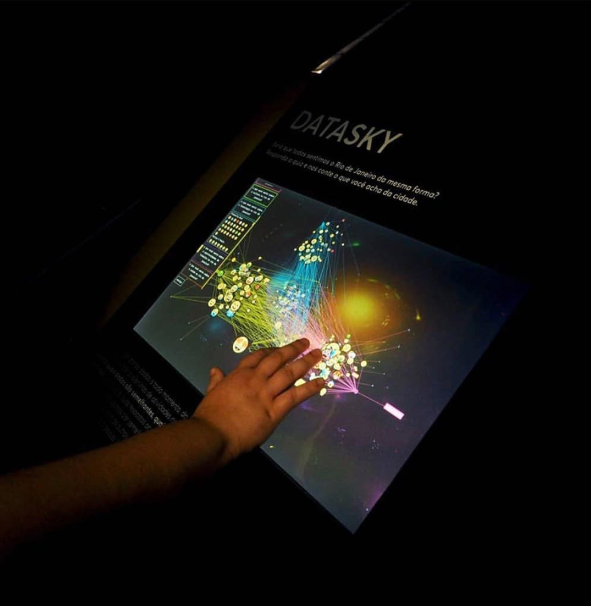
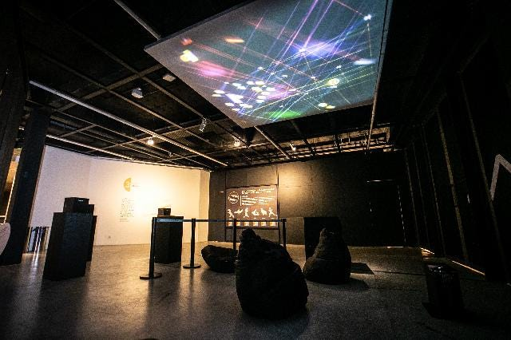
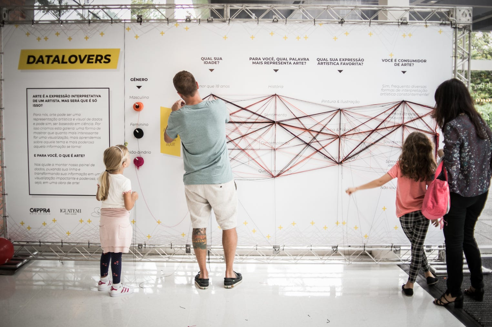
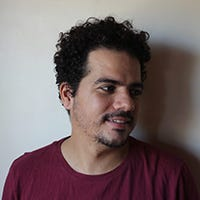
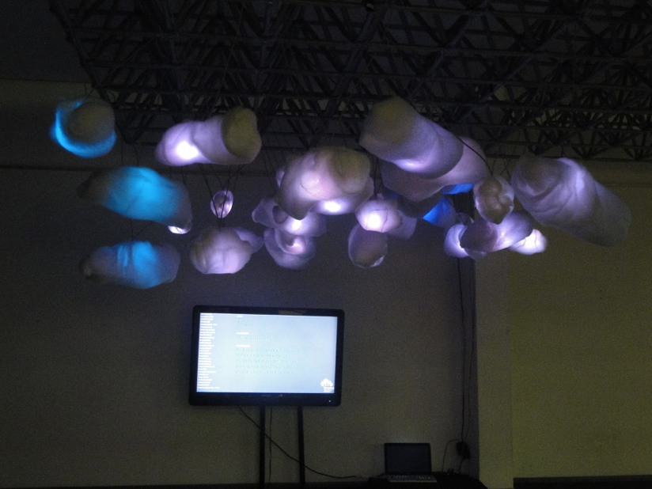
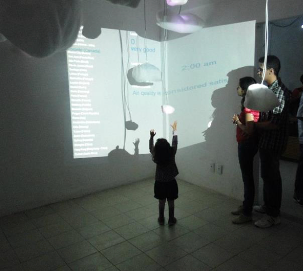
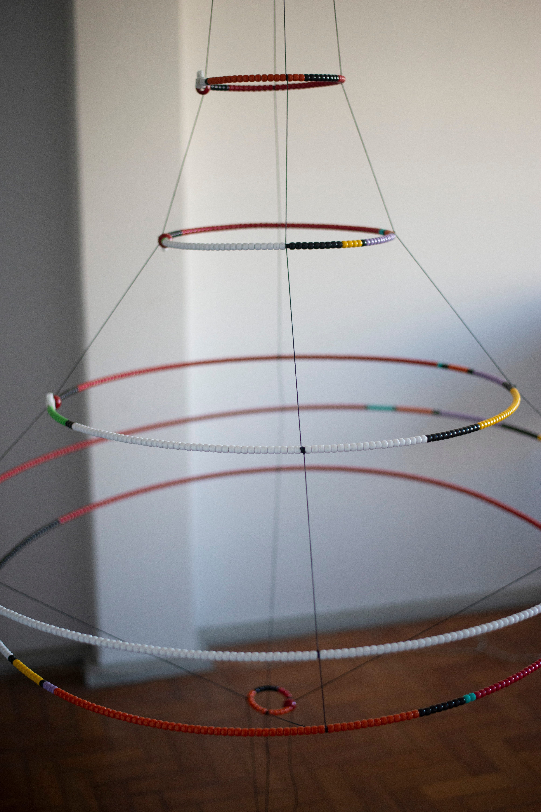

A convite da Sara Mesquita e da Caroline Doyé do Datavis Lisboa fizemos uma live sobre visualização de dados no Brasil. A partir disso resolvemos começar uma série de textos complementares aos assuntos que foram discutidos na live, caso você não tenha visto já lançamos a parte 1 focado na história dos últimos 25 anos da infografia no Brasil.

Nesse texto mostro minha interpretação dos trabalhos de visualização de dados (dataviz), a partir de uma categorização que tenho feito desde 2015 em parceria com a Júlia Giannella. Essas categorias estão no artigo Visualização de dados: avanços por pesquisadores brasileiros publicado no SIDI 2015 (7º Congresso Internacional de Design da Informação), um evento da Sociedade Brasileira de Design da Informação (SBDI).

No artigo separamos os projetos brasileiros em três categorias: Visualização de dados físicos, visualização cartográfica e visualização de dados em mídia impressa. De 2015 para cá muita coisa mudou no mercado e outras práticas foram adicionadas no escopo: Arte (interfaces físicas); Design, Computação e Ciência de dados; Jornalismo de dados; e as Interfaces Cartográficas. Nesse texto vamos focar a primeira categoria, Arte e seus trabalhos com interfaces físicas. Muitos projetos e profissionais transitam em mais de uma dessas categorias porém vamos adicionar onde consideramos mais

Arte e as interfaces físicas
Bárbara Castro

Bárbara é designer e diretora de criação do estúdio AMBOS&&. Quem nos acompanha por aqui deve lembrar que fizemos uma entrevista super legal com ela. A Bárbara se dedica a concepção e execução de instalações interativas, exposições e visualização de dados e talvez esse seja um diferencial do trabalho dela, tão diverso e instigante. Além disso tudo, desde 2018 ela é professora do curso de Design da PUC-Rio.

Uma dos destaques do trabalho da Bárbara se dar na parte de curadoria de exposições. Ela foi responsável por duas das mais legais exposições que envolveram visualização de dados aqui no Brasil, a Existência Numérica e a Data Corpus. Essa primeira também resultou um livro muito especial (e lindo) de textos em português e inglês sobre as obras da exposição. Acompanhem o trabalho dela e sejam deslocados para várias realidades e experiências.

Ricardo Cappra

Ricardo é um conhecido nome do mundo da Ciência de dados, fundador da Cappra, Cappra Institute e do CappraLab. Aqui vamos abordar dois projetos desenvolvidos pelo CappraLab.

O DATASKY é uma visualização interativa, onde as pessoas respondem como se sentem em relação a alguns tópicos sobre a cidade do Rio de Janeiro por meio de emojis. O projeto foi apresentado na exposição na DataCorpus.

Outra experiência conhecida do Cappra é o #DATALOVERS, uma exposição onde artistas foram convidados a expor obras baseadas em dados. Como o próprio autor descreve: “Uma exposição de arte que conta histórias através de dados, uma mistura de análise de comportamento com matemática, tudo representado de forma visual” e completa “É inegável que um dos principais aspectos envolvidos no nosso processo de consumo de informação é o aspecto visual. Muito mais do que um gráfico bonito, estou me referindo a contar histórias através de representações visuais. Transformar dados em histórias pode ser uma forma de arte.”

*Fonte: CappraLab*

Ricardo Brazileiro

Ricardo tem uma trajetória no movimento open-source e experimentações em arte e cibernética e dedica-se à experiência entre culturas tradicionais e inovações tecnológicas. É um cientista nato, um artista muito interessado na interseção entre arte, computação física e sistemas criativos. Foi nesse contexto que pude acompanhar o trabalho dele e conhecer na época como parte do Laboratório de Computação e Arte - LABOCA, junto com Jarbas Jácome, Jeraman. Participamos do mesmo grupo de pesquisa na Universidade Federal de Pernambuco, o MusTIC.

O trabalho que vou descrever aqui é o Cotidiano Sensitivo ou 3CO e é uma intervenção urbana interativa que coleta dados ambientais em tempo-real e como diz o autor “atua de forma a construir um ecossistema híbrido que reage com as intensidades do cotidiano urbano”. O 3CO analisa dados sobre qualidade do ar, alterações no som e na luminosidade, e ao serem alterados são passados para esses guarda-chuvas que fazem o movimento de abrir e fechar para representar a alteração. O vídeo do 3CO aqui embaixo foi uma expriência na cidade de Garanhuns, Pernambuco. Esse tipo de obra sai dos espaços convencionais da arte e ingressam no espaço público e interagem/interferem de forma significativa no dia-a-dia da cidade (nem que seja apenas pela curiosidade).

Rodrigo Medeiros

Esse que vos escreve é Rodrigo Medeiros, designer de interação e que durante seu mestrado na Universidade do Minho desenvolveu a instalação Warning. Nesse tempo, de 2009 a 2011 Rodrigo se envolveu com a comunidade do software livre (open source) de Portugal e do Brasil, desenvolendo tecnologia de baixo custo para arte digital. O projeto foi exposto em Guimarães (Portugal), Belo Horizonte e Recife entre 2009 e 2012.

O projeto Warning — Real Time Global Air Quality Display é uma instalação que recebe dados da internet a respeito da qualidade do ar de 30 cidades, em 5 continentes. A instalação dinamicamente representa estes dados em um monitor e numa estrutura física, através de um sistema de iluminação (LEDs) situado num espaço público. Este trabalho foi influenciado pela pesquisa, por um lado, sobre a arte digital em espaço público e, por outro, sobre a visualização de informação com foco em interfaces que não são baseadas em monitores, como as visualizações de ambientes.

Esse conceito de visualizações de ambiente surgiu do trabalho do pesquisador Andrew Vande Moere e representa projetos que apresentam informações variáveis, de modo ao usuário/expectador possa não perceber ao se deparar com o artefato mas, aos poucos, começa a perceber detalhes que só com uma grande variação de tempo poderia “visualizar aqueles dados”. No caso do Warning, ela é uma instalação que a pessoa precisa de alguns dias para se acostumar em receber os dados, entender qual nuvem representa cada cidade e por aí tentar fazer algum tipo de conexão e análise da cidade / dado/ artefato.

*Warning no Interaction South America, 2011, Belo Horizonte.*

*Warning na Exposição Vazão, Bcúbico, Recife.*

Douglas Luddens

Douglas é designer gráfico e artista plástico do Rio de Janeiro. Ele é um dos alunos que passaram pelo labvis na EBA/UFRJ que vamos descrever o trabalho por aqui.

O projeto se chama Escultura de dados: tráfico de escravos africanos. E como descrito no site do projeto: “O presente trabalho consiste em uma visualização de dados física. Insere-se no campo da arte e do design conhecido como data art, em visualização de dados. A presente escultura de dados mostra o tráfico de escravos africanos, considerando o número de homens e mulheres que cruzaram o Oceano Atlântico entre os séculos XV e XIX, tendo muitos deles morrido durante a travessia”.

Com o esquema de cores, é possível acompanhar o volume de tráfico de cada país ou região da África. Cada miçanga colorida representa 10.0000 africanos que foram deslocados como escravos.

Este trabalho foi realizado na disciplina de projeto de visualização de dados físico do curso de Comunicação Visual Design da Escola de Belas Artes da UFRJ, ministrado pela professora Doris Kosminsky no semestre de 2019.1.

Outros nomes
Sei que existem muitos outros trabalhos da arte digital que trabalham com dados poderiam aparecer por aqui. Quero deixar uma menção ao trabalho do Professor Mauro Pinheiro na UFES e seus alunos. Se você tiver alguma sugestão de outros projetos e pesquisadores que poderiam aparecer por aqui comenta aqui no Medium para a gente analisar.

Espero que vocês tenham gostado do material apresentado e não esquece de seguir a gente no twitter e no instagram. Continuaremos em breve com a terceira parte dessa série.

Rodrigo Medeiros é designer de interação e pesquisador em visualização de dados. Atualmente é professor do IFPB e curador do datavizbr, uma publicação em português sobre visualização de dados.
