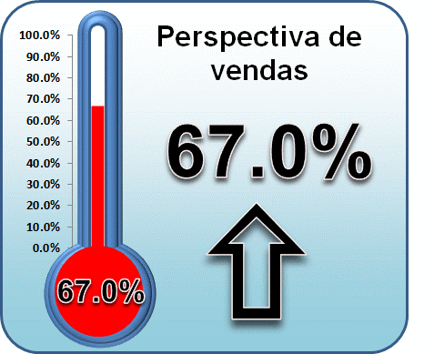
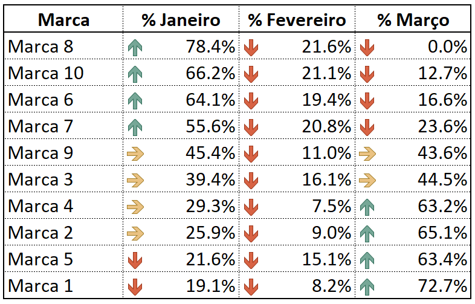
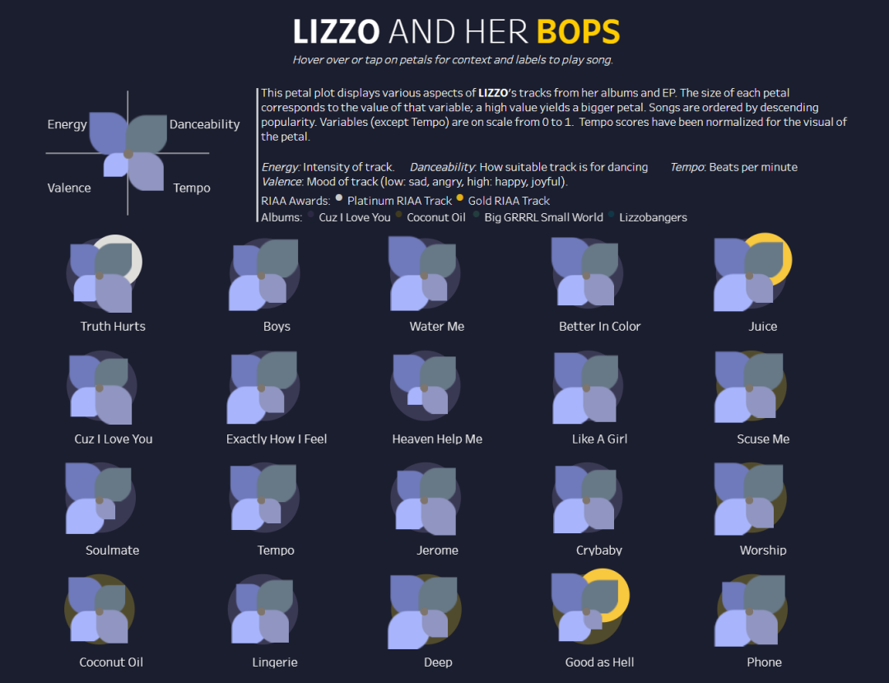
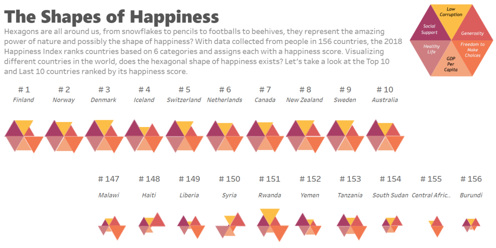
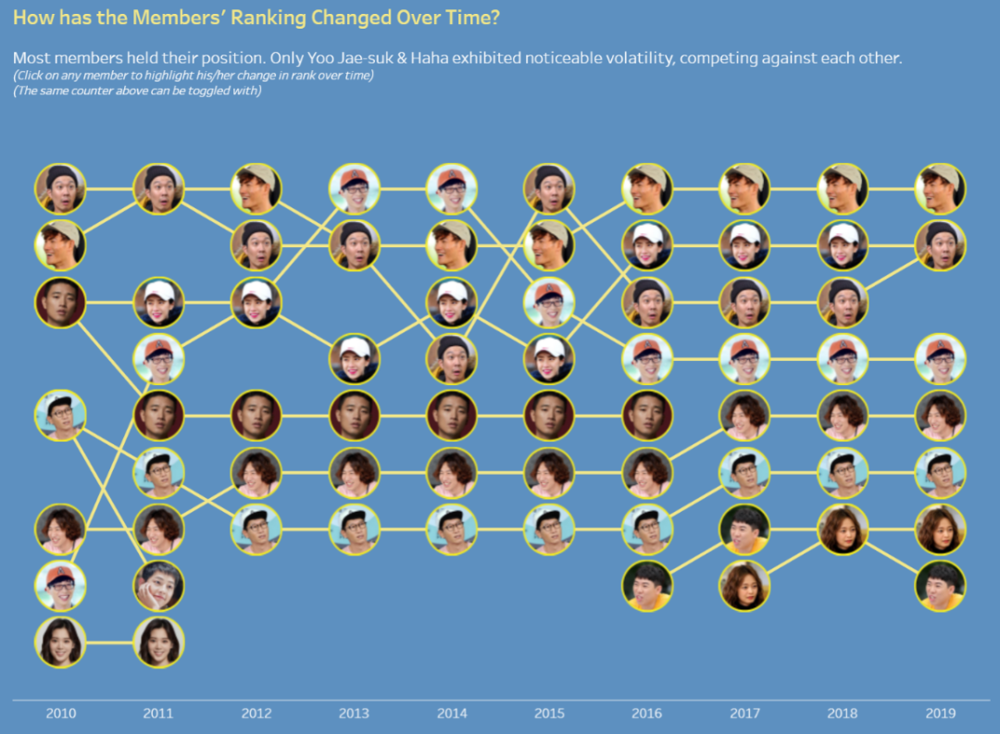
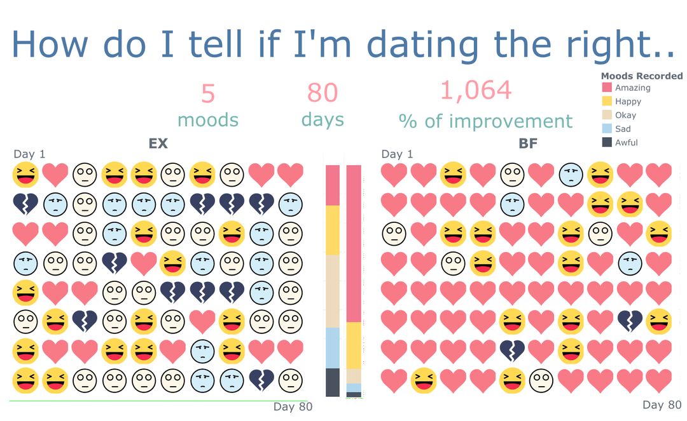

Uma das preocupações em desenvolver um painel gerencial com os principais achados dos conjuntos de dados é torná-los claros, concisos e completos para a audiência. Além de um grande conhecimento em análise, os profissionais que trabalham com a criação de dashboards precisam dar atenção para o design.

No momento de escolher as cores do painel alguns desenvolvedores buscam usar as cores das empresas, as cores do sinal de trânsito ou as cores que estão em evidência no momento. Mas muitos se esquecem que uma pequena parte de sua audiência pode ter alguma limitação em enxergar as diferentes cores, como é o caso das pessoas daltônicas.

Cerca de 5% dos 7,7 bilhões de indivíduos do mundo sofre com a dificuldade de diferenciar cores. Como falamos tanto de inclusão, é importante colocar os daltônicos dentro da discussão dos dados, permitindo a criação de um dashboard compreensível para todos.

**Os 4 tipos conhecidos de daltonismo:**

1. **Protanopia:** O indivíduo não consegue enxergar a cor vermelha.
2. **Deuteranopia:** O indivíduo não consegue enxergar a cor verde.
3. **Tritanopia:** O indivíduo não consegue enxergar a cor azul.
4. **Monocromia:** O mais raro, o indivíduo não consegue diferenciar as cores, tendo uma visão total em escala de cinza.

Entender os tipos de daltonismo abre uma percepção do quanto é difícil trabalhar cores em um painel gerencial mais inclusivo. Mas também banir as cores dos dashboards é uma tarefa desnecessária.

É muito difícil criar um dashboard com as cores ideais para atender aos daltônicos, por isso a sugestão é trabalhar as cores com ícones e textos. É a mesma solução criada pelo sistema de trânsito na maioria dos países. Para o trânsito ser um ambiente seguro para os daltônicos, a maioria das cidades usam o ícone de um bonequinho junto com as luzes.

Uma outra solução usada pelo trânsito é colocar as cores do sinal sempre na mesma posição. Nos semáforos do Brasil, as cores mudam sempre do verde, passando para o amarelo e terminando no vermelho.

**Exemplos para dashboards mais inclusivos:**

- No gráfico de velocímetro, não há necessidade de substituir as cores vermelha e verde. O daltônico consegue se guiar pela posição dos medidores e pelo contraste entre cada cor.

- No gráfico de termômetro, o resultado numérico é o mais importante e precisa ser destacado.

- Use a posição da seta para ressaltar os valores em tabelas.

- Use a posição de cada elemento para direcionar mais a análise do que a cor.

*Fonte: Justin Lorenzo Pimentel*

*Fonte: Gwendoline Tan*

- Uma outra opção é trocar as cores por imagens ou até mesmo por emojis.

*Fonte: Royce Ho*

*Fonte: Chee Ann*

A intenção é criarmos dashboards cada vez mais inclusivos e de fácil compreensão de todos. Não há cores ou gráficos proibidos, use sua criatividade para comunicar de forma clara. Caso tenha o conhecimento de alguma pessoa daltônica na equipe, convide ela para participar da criação do dashboard.

---

*Esse post foi originalmente postado no [Medium do datavizbr](https://medium.com/datavizbr/visualização-de-dados-inclusiva-3459a390b583) e pode ser encontrado no link acima.*