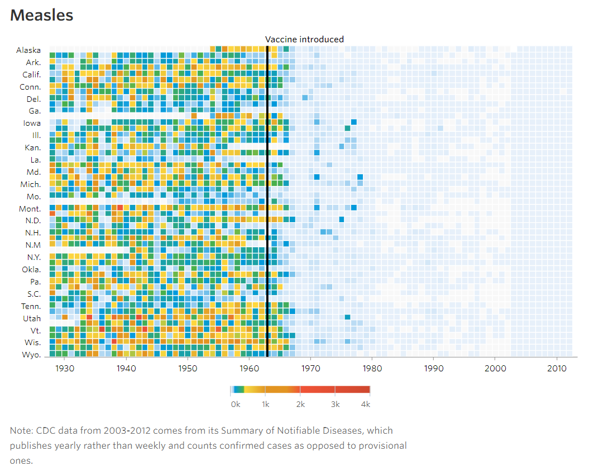
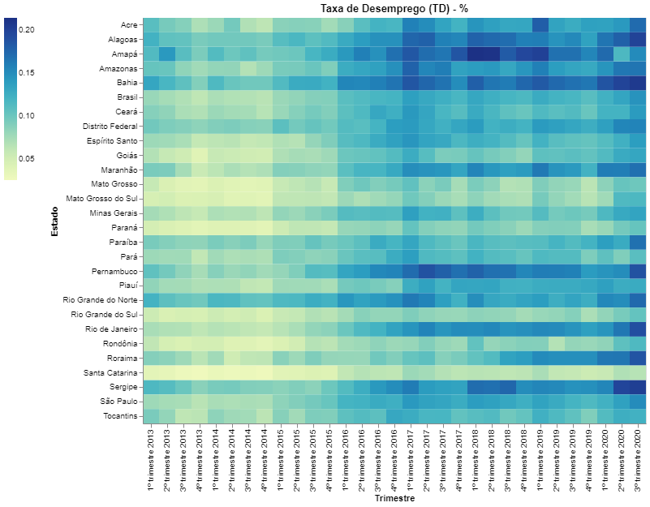
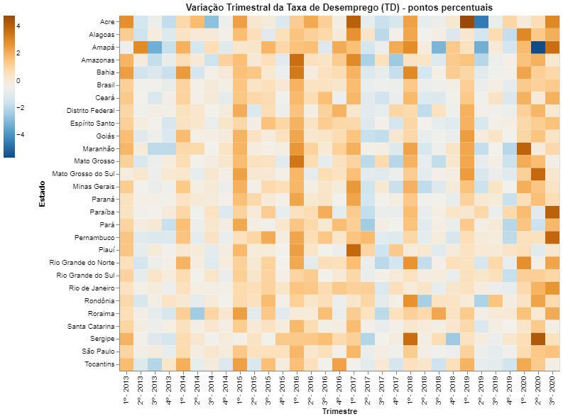
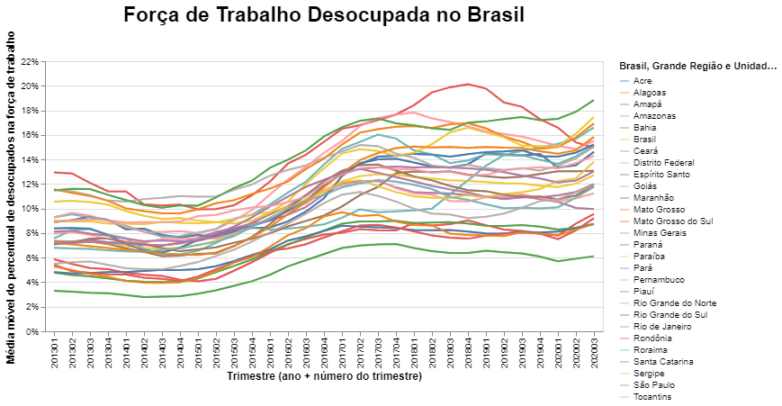
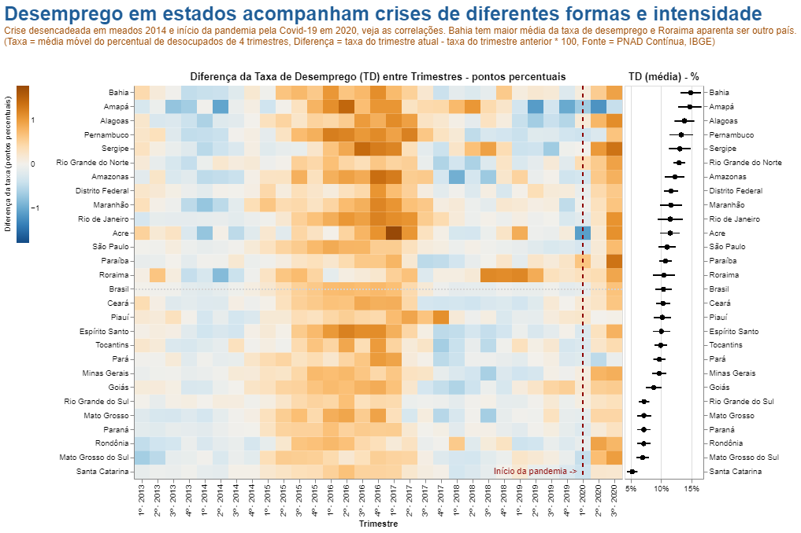

*Explorando a transformação de dados de desemprego no Brasil na busca por uma visualização criativa*

Uma visualização de dados, assim como vários outros produtos criativos, nem sempre é atribuído o devido crédito pois depois de pronto parece que foi simples criá-la. Aquele bolo de chocolate da vovó, por exemplo, somente alguns ingredientes e pronto, maravilhoso! Mas quanto tempo ela não passou testando quais ingredientes usar, quais marcas, sem falar das inúmeras tentativas.

Da mesma forma, visualizações de dados também passam por várias transformações até chegarem na medida certa. O ponto inicial e final: entender qual problema a ser resolvido, realmente empatizar com o público-alvo e descobrir a dor que precisa ser aliviada para finalmente encontrar uma solução visual.

**Identificação do problema**

O IBGE disponibiliza dados sobre o mercado e a força de trabalho, incluindo a taxa de desocupação (desemprego). Vemos que esta taxa tem flutuações ao longo do tempo e que difere entre regiões do país.

O público-alvo deste projeto eram economistas, analistas e tomadores de decisão para entender a situação da força de trabalho durante os anos. Uma dificuldade identificada: conseguir visualizar o comportamento da taxa de desemprego tanto do ponto de vista geográfico quanto temporal.

**Fonte de inspiração**

O gráfico inspirador escolhido foi o mapa de calor publicado pelo The Wall Street Journal sobre o impacto de vacinas no combate a doenças nos estados dos Estados Unidos.

**Exploração e experimentação**

Foram analisados os dados por diferentes aspectos: sazonalidade (os dados têm tendência de cair à medida que se aproxima o último trimestre do ano) e comportamento por região. De posse dos dados, foi realizada uma experimentação com o mapa de calor.

**Reavaliação**

O primeiro mapa de calor mostrava apenas que a taxa de desemprego estava crescendo — o mesmo que um gráfico de linhas já mostrava. Reavaliando para o objetivo exploratório do público-alvo, foi calculada a diferença da taxa de desemprego entre trimestres.

Essa tentativa também não resultou em padrões claros. A solução foi calcular a média móvel (baseada em 4 trimestres) que suaviza flutuações de curto prazo, leva em consideração sazonalidade e destaca tendências de longo prazo.

**Resultado final**

Após validação com economistas, chegou-se à visualização final: um mapa de calor usando a média móvel da diferença entre trimestres, com contextualização de crises econômicas, políticas e sanitária no Brasil, e opção de filtragem por região. O gráfico inclui visão geográfica e temporal.

**Conclusão**

O que fez a diferença foi transformar o dado, misturar com uma escolha gráfica compatível e acrescentar uma perspectiva editorial para torná-la não somente visualmente atraente mas também entregando valor ao público-alvo.

A necessidade de controlar a ansiedade e manter um senso crítico ao longo de toda a jornada é fundamental no processo criativo de visualização de dados.

*Fernando Hannaka é engenheiro de produção, autodidata, com propósito de transformar pessoas e organizações através da liderança empática e cultura analítica.*

---

*Esse post foi originalmente postado no [Medium do datavizbr](https://medium.com/datavizbr/visualizando-dados-não-deixe-a-ansiedade-atrapalhar-seu-processo-criativo-aac962ad1e17) e pode ser encontrado no link acima.*